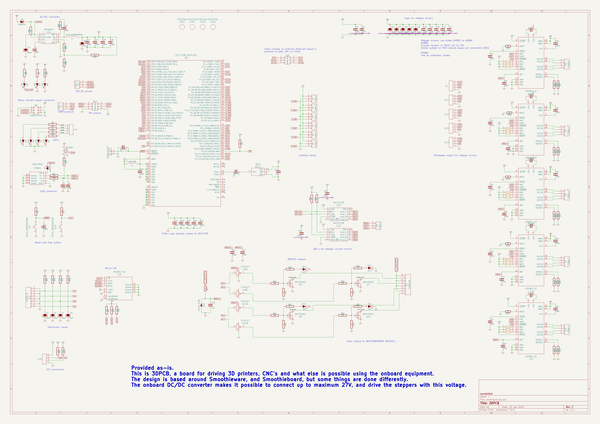
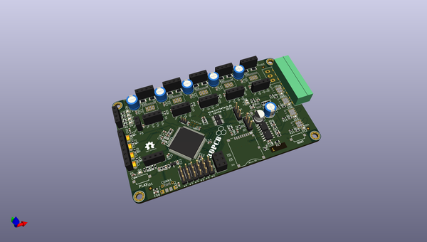
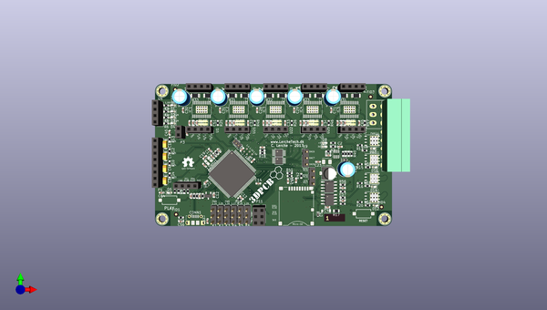
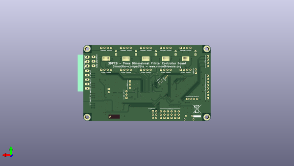

# 3dpcb_4layer
 
## summary 
* id: christianlerche_3dpcb_4layer_3dpcb_4l
* user: christianlerche
* name: 3dpcb_4layer
* board: 3dpcb_4l
* repo: https://github.com/ChristianLerche/3DPCB-4LAYER
* src_file_repo_kicad_pcb: 3DPCB_4L.kicad_pcb
* src_file_repo_kicad_pcb_link: https://github.com/ChristianLerche/3DPCB-4LAYER/tree/A5984_edge/3DPCB_4L.kicad_pcb
* src_file_repo_kicad_sch: 3DPCB_4L.kicad_sch
* src_file_repo_kicad_sch_link: https://github.com/ChristianLerche/3DPCB-4LAYER/tree/A5984_edge/3DPCB_4L.kicad_sch

* src_file_repo_sch: 3DPCB_4L.sch
* src_file_repo_sch_link: https://github.com/ChristianLerche/3DPCB-4LAYER/tree/A5984_edge/3DPCB_4L.sch
* full details link: https://github.com/oomlout/oomlout_oomp_project_bot_v_2/tree/main/projects/christianlerche_3dpcb_4layer_3dpcb_4l/current_version/working  

## schematic  
  
[schematic (pdf)](working_schematic.pdf) 

## pcb  
 
  
  
  
[board (pdf)](working.pdf)  

## working_bom
| Id | Designator | Footprint | Quantity | Designation | Supplier and ref |  | None | 
| --- | --- | --- | --- | --- | --- | --- | --- | 
| 1 | ,,,,,,,,,,,,,,,,,,,, | Lerche_via_0.35_GND | 21 |  |  |  | [''] | 
| 2 | ,,,,,,,,,,,,,,,,,,,,,,,,,,,,,,,,,,,,,,,,,,,,,,,,,,,,,,,,,,,,,,,,,,,,,,,,,,,,,,,,,,,,,,,,,,,, | Lerche_via_0.5mm_GND | 93 |  |  |  | [''] | 
| 3 | ,,, | Lerche_Hole_3mm | 4 |  |  |  | [''] | 
| 4 | , | Lerche_via_0.35mm_GND_MaskOver | 2 |  |  |  | [''] | 
| 5 | G*** | Logo_silk_OSHW_6x6mm | 1 | LOGO |  |  | [''] | 
| 6 | C1,C2,C6,C8,C12,C13,C14,C15,C16,C17,C19,C20,C21,C22,C23,C28,C29,C30,C31,C32,C33,C34,C36,C37,C38,C39,C44,C45,C46,C47,C50,C51,C52,C53,C54,C64,C65,C67,C69,C71,C35 | C_0603_1608Metric | 41 | 0.1uF 50V |  |  | [''] | 
| 7 | C3,C4,C7,C10 | CP_EIA-3216-18_Kemet-A | 4 | 10uF 10V - Tantalum |  |  | [''] | 
| 8 | C5,C9 | C_0603_1608Metric | 2 | 18pF 50V |  |  | [''] | 
| 9 | C11,C24,C25,C26,C27,C70 | CP_Radial_D6.3mm_P2.50mm | 6 | 100uF 35V |  |  | [''] | 
| 10 | C18 | C_0603_1608Metric | 1 | 100pF 50V |  |  | [''] | 
| 11 | C43 | CP_Elec_5x5.8 | 1 | 47uF 16V |  |  | [''] | 
| 12 | C49 | C_0603_1608Metric | 1 | 1uF 50V |  |  | [''] | 
| 13 | D1,D2,D3,D4,D11,D12,D13,D14 | LED_0603_1608Metric | 8 | LED |  |  | [''] | 
| 14 | D6 | LED_0603_1608Metric | 1 | LED_BLUE |  |  | [''] | 
| 15 | D7 | LED_0603_1608Metric | 1 | LED_RED |  |  | [''] | 
| 16 | D8 | LED_0603_1608Metric | 1 | LED_YELLOW |  |  | [''] | 
| 17 | IC6 | Lerche_MP9943 | 1 | MP9943 |  |  | [''] | 
| 18 | J2,J3,J4,J5,J6,J7,J8,J9,J10,J11,J12,J13,J14,J15,J16 | SolderJumper-2_P1.3mm_Open_RoundedPad1.0x1.5mm | 15 |   |  |  | [''] | 
| 19 | K1,K2,K3,K4,K5,K6,K8,K9 | PinHeader_1x03_P2.54mm_Vertical | 8 | CONN_3 |  |  | [''] | 
| 20 | K7 | PinHeader_1x03_P1.27mm_Vertical | 1 | CONN_3 |  |  | [''] | 
| 21 | L1 | L_0603_1608Metric | 1 | INDUCTOR |  |  | [''] | 
| 22 | L2 | Lerche_IHLP-1212BZ-11_Inductor | 1 | IHLP1212BZER2R2M11 |  |  | [''] | 
| 23 | 12MHz1 | Crystal_SMD_2520-4Pin_2.5x2.0mm | 1 | QX2 |  |  | [''] | 
| 24 | P1 | PinSocket_1x08_P2.54mm_Vertical | 1 | CONN_8 |  |  | [''] | 
| 25 | P2 | PhoenixContact_MC_1,5_8-G-3.5_1x08_P3.50mm_Horizontal | 1 | CONN_8 |  |  | [''] | 
| 26 | P5,P6,P7,P9,P13 | PinSocket_1x04_P2.54mm_Vertical | 5 | CONN_4 |  |  | [''] | 
| 27 | P8 | Lerche_2x3P_3.5mm_Molex_UltraFit | 1 | CONN_02X03 |  |  | [''] | 
| 28 | P11 | PinSocket_2x03_P2.54mm_Vertical | 1 | CONN_3X2 |  |  | [''] | 
| 29 | P12 | Lerche_6P_1.6mm_2ROW | 1 | CONN_3X2 |  |  | [''] | 
| 30 | R1,R9,R18,R19,R27,R41,R42,R43 | R_0603_1608Metric | 8 | 10k |  |  | [''] | 
| 31 | R2,R3,R4,R5,R6,R28 | R_0603_1608Metric | 6 | 1k |  |  | [''] | 
| 32 | R7,R8 | R_0603_1608Metric | 2 | 33R |  |  | [''] | 
| 33 | R10,R12,R13,R34 | R_0603_1608Metric | 4 | 4K7 |  |  | [''] | 
| 34 | R11 | R_0603_1608Metric | 1 | 1k5 |  |  | [''] | 
| 35 | R14,R15,R16,R20 | R_0603_1608Metric | 4 | 47k |  |  | [''] | 
| 36 | R21,R22,R23,R24,R29,R30,R31,R32,R33,R37 | R_1206_3216Metric | 10 | 0R05 |  |  | [''] | 
| 37 | R35 | R_0603_1608Metric | 1 | 1M |  |  | [''] | 
| 38 | R36 | R_0603_1608Metric | 1 | 20R |  |  | [''] | 
| 39 | R38 | R_0603_1608Metric | 1 | 51k |  |  | [''] | 
| 40 | R39 | R_0603_1608Metric | 1 | 13k |  |  | [''] | 
| 41 | R40 | R_0603_1608Metric | 1 | 41k2 |  |  | [''] | 
| 42 | R44,R45 | R_0603_1608Metric | 2 | 3k3 |  |  | [''] | 
| 43 | R55 | R_0603_1608Metric | 1 | 5k8 |  |  | [''] | 
| 44 | R56,R57,R58,R59 | R_0603_1608Metric | 4 | 10R |  |  | [''] | 
| 45 | U1,U4,U13,U16,U21,U22,U25 | PinSocket_1x04_P2.54mm_Vertical | 7 | CONN_4_LERCHE |  |  | [''] | 
| 46 | U2,U15 | Lerche_SPST_ITEAD | 2 | SPST_MOMENTARY |  |  | [''] | 
| 47 | U3 | SOT-23 | 1 | BSS84 |  |  | [''] | 
| 48 | U5,U7,U8,U24 | Lerche_PQFN_5x6B | 4 | IRFH5302 |  |  | [''] | 
| 49 | U6 | TQFP-100_14x14mm_P0.5mm | 1 | LPC1768_TQFP100 |  |  | [''] | 
| 50 | U10 | Lerche_Molex_502774-0891 | 1 | MICRO-SD |  |  | [''] | 
| 51 | U12,U23 | MSOP-10_3x3mm_P0.5mm | 2 | MCP4728 |  |  | [''] | 
| 52 | D10 | SOD-123 | 1 | Vz10V/0.5W |  |  | [''] | 
| 53 | R17 | R_0805_2012Metric | 1 | 1k |  |  | [''] | 
| 54 | U9,U11 | SO-8_3.9x4.9mm_P1.27mm | 2 | TC4427 |  |  | [''] | 
| 55 | IC1,IC2,IC3,IC4,IC5 | TSSOP-24-1EP_4.4x7.8mm_P0.65mm_EP3.2x5mm | 5 | A5984_LP |  |  | [''] | 
| 56 | R25,R26,R46,R47,R48 | R_0603_1608Metric | 5 | 0R |  |  | [''] | 
| 57 | R49,R50,R51,R52 | R_0603_1608Metric | 4 | 4k7 |  |  | [''] | 
| 58 | P3 | PinSocket_1x02_P2.54mm_Vertical | 1 | CONN_01X02 |  |  | [''] | 
| 59 | C40,C41,C42,C48,C55 | C_0603_1608Metric | 5 | 220n 50V |  |  | [''] | 
| 60 | G*** | 3DPCB_LOGO | 1 | 3DPCB_LOGO |  |  | [''] | 
| 61 | CONN1 | USB_Micro-B_Molex-105017-0001 | 1 | USB_MINI |  |  | [''] | 
| 62 | D5 | D_SOD-523 | 1 | MSK4010 |  |  | [''] | 
| 63 | D9 | D_SOD-323 | 1 | DIODESCH |  |  | [''] | 
| 64 | R53 | R_0603_1608Metric | 1 | 100R |  |  | [''] | 
| 65 | C56,C57 | C_0603_1608Metric | 2 | np |  |  | [''] | 
| 66 |  | Logo_silk_WEEE_8x10mm | 1 | LOGO |  |  | [''] | 

## bom_schematic
| Ref | Qnty | Value | Cmp name | Footprint | Description | Vendor | DNP | 
| --- | --- | --- | --- | --- | --- | --- | --- | 
| C1, C2, C6, C12, C13, C14, C15, C16, C17, C19, C20, C21, C22, C23, C28, C29, C30, C31, C32, C33, C34, C35, C39, C44, C45, C46, C47, C50, C51, C52, C53, C54, C64, C65, C67, C69, C71 | 37 | 100n | C-RESCUE-3DPCB_4L | LercheTech:Lerche_C0603 |  |  |  | 
| C3, C4, C7, C10 | 4 | 10uF | CP-RESCUE-3DPCB_4L | Capacitors_Tantalum_SMD:TantalC_SizeA_EIA-3216_Reflow |  |  |  | 
| C5, C9 | 2 | 18p | C-RESCUE-3DPCB_4L | LercheTech:Lerche_C0603 |  |  |  | 
| C8, C36, C37 | 3 | 100nF | C-RESCUE-3DPCB_4L | LercheTech:Lerche_C0603 |  |  |  | 
| C11, C24, C25, C26, C27, C70 | 6 | 100uF | CP-RESCUE-3DPCB_4L | Capacitors_ThroughHole:C_Radial_D6.3_L11.2_P2.5 |  |  |  | 
| C18 | 1 | 100pF | C-RESCUE-3DPCB_4L | LercheTech:Lerche_C0603 |  |  |  | 
| C38 | 1 | 10n | C-RESCUE-3DPCB_4L | LercheTech:Lerche_C0603 |  |  |  | 
| C40, C41, C42, C48, C55 | 5 | 220n | C-RESCUE-3DPCB_4L | LercheTech:Lerche_C0603 |  |  |  | 
| C43 | 1 | 47uF | CP-RESCUE-3DPCB_4L | Capacitors_SMD:c_elec_5x5.8 |  |  |  | 
| C49 | 1 | 1uF | C | LercheTech:Lerche_C0603 |  |  |  | 
| CONN1 | 1 | USB_MINI | USB_MINI | LercheTech:Lerche_MINI_USB |  |  |  | 
| D1, D2, D3, D4, D6, D7, D8, D11, D12, D13, D14 | 11 | LED | LED-RESCUE-3DPCB_4L | LEDs:LED_0603 |  |  |  | 
| D5, D9 | 2 | DIODESCH | DIODESCH | LercheTech:Lerche_SOD323 |  |  |  | 
| D10 | 1 | Vz10V/0.5W | ZENERsmall | Diodes_SMD:SMA_Standard |  |  |  | 
| FID1, FID2, FID3, FID4 | 4 | FIDUCIAL | FIDUCIAL | LercheTech:Lerche_Fiducial |  |  |  | 
| IC1, IC2, IC3, IC4, IC5 | 5 | A5984_LP | A5984_LP | LercheTech:Lerche_TSSOP24_EP |  |  |  | 
| IC6 | 1 | MP9943 | MP9943 | LercheTech:Lerche_MP9943 |  |  |  | 
| J2, J3, J4, J5, J6, J7, J8, J9, J10, J11, J12, J13, J14, J15, J16 | 15 |  | SOLDER_JUMPER | LercheTech:Lerche_2PsolderJumper |  |  |  | 
| K1, K2, K3, K4, K5, K6, K8, K9 | 8 | CONN_3 | CONN_3 | Pin_Headers:Pin_Header_Straight_1x03 |  |  |  | 
| K7 | 1 | CONN_3 | CONN_3 | LercheTech:Lerche_3P_1.27MM |  |  |  | 
| L1 | 1 | INDUCTOR | INDUCTOR-RESCUE-3DPCB_4L | LercheTech:Lerche_R0603 |  |  |  | 
| L2 | 1 | IHLP1212BZER2R2M11 | INDUCTOR-RESCUE-3DPCB_4L | LercheTech:Lerche_IHLP-1212BZ-11_Inductor |  |  |  | 
| OSC1 | 1 | QX2 | QX2 | LercheTech:Lerche_Oscillator_2.5x2.0mm |  |  |  | 
| P1 | 1 | CONN_8 | CONN_8 | LercheTech:Lerche_8P_2.54mm |  |  |  | 
| P2 | 1 | CONN_8 | CONN_8 | LercheTech:Lerche_8P_CONN_3,5mm |  |  |  | 
| P3 | 1 | CONN_01X02 | CONN_01X02 | Pin_Headers:Pin_Header_Straight_1x02_Pitch2.54mm |  |  |  | 
| P5, P6, P7, P9, P13 | 5 | CONN_4 | CONN_4 | LercheTech:Lerche_4P_2.54mm |  |  |  | 
| P8 | 1 | CONN_02X03 | CONN_02X03 | LercheTech:Lerche_Molex_Microfit_0430450607 |  |  |  | 
| P11 | 1 | CONN_3X2 | CONN_3X2 | Pin_Headers:Pin_Header_Straight_2x03 |  |  |  | 
| P12 | 1 | CONN_3X2 | CONN_3X2 | LercheTech:Lerche_6P_1.6mm_2ROW |  |  |  | 
| R1, R9, R18, R19, R27, R41, R42, R43 | 8 | 10k | R-RESCUE-3DPCB_4L | LercheTech:Lerche_R0603 |  |  |  | 
| R2, R3, R4, R5, R6, R28 | 6 | 1k | R-RESCUE-3DPCB_4L | LercheTech:Lerche_R0603 |  |  |  | 
| R7, R8 | 2 | 33R | R-RESCUE-3DPCB_4L | LercheTech:Lerche_R0603 |  |  |  | 
| R10, R12, R13, R34 | 4 | 4K7 | R-RESCUE-3DPCB_4L | LercheTech:Lerche_R0603 |  |  |  | 
| R11 | 1 | 1k5 | R-RESCUE-3DPCB_4L | LercheTech:Lerche_R0603 |  |  |  | 
| R14, R15, R16, R20 | 4 | 47k | R-RESCUE-3DPCB_4L | LercheTech:Lerche_R0603 |  |  |  | 
| R17 | 1 | 1k | R | Resistors_SMD:R_0805 |  |  |  | 
| R21, R22, R23, R24, R29, R30, R31, R32, R33, R37 | 10 | 0R05 | R-RESCUE-3DPCB_4L | LercheTech:Lerche_R1206 |  |  |  | 
| R25, R26, R46, R47, R48 | 5 | 0R | R | LercheTech:Lerche_R0603 |  |  |  | 
| R35 | 1 | 1M | R-RESCUE-3DPCB_4L | LercheTech:Lerche_R0603 |  |  |  | 
| R36 | 1 | 20R | R-RESCUE-3DPCB_4L | LercheTech:Lerche_R0603 |  |  |  | 
| R38 | 1 | 51k | R-RESCUE-3DPCB_4L | LercheTech:Lerche_R0603 |  |  |  | 
| R39 | 1 | 13k | R-RESCUE-3DPCB_4L | LercheTech:Lerche_R0603 |  |  |  | 
| R40 | 1 | 41k2 | R-RESCUE-3DPCB_4L | LercheTech:Lerche_R0603 |  |  |  | 
| R44, R45 | 2 | 3k3 | R-RESCUE-3DPCB_4L | LercheTech:Lerche_R0603 |  |  |  | 
| R49, R50, R51, R52 | 4 | 4k7 | R-RESCUE-3DPCB_4L | LercheTech:Lerche_R0603 |  |  |  | 
| R55 | 1 | 5k8 | R-RESCUE-3DPCB_4L | LercheTech:Lerche_R0603 |  |  |  | 
| R56, R57, R58, R59 | 4 | 10R | R-RESCUE-3DPCB_4L | LercheTech:Lerche_R0603 |  |  |  | 
| U1, U4, U13, U16, U21, U22, U25 | 7 | CONN_4_LERCHE | CONN_4_LERCHE | LercheTech:Lerche_4P_2.54mm |  |  |  | 
| U2, U15 | 2 | SPST_MOMENTARY | SPST_MOMENTARY | LercheTech:Lerche_SPST_ITEAD |  |  |  | 
| U3 | 1 | BSS84 | BSS84-RESCUE-3DPCB_4L | LercheTech:Lerche_SOT23-3 |  |  |  | 
| U5, U7, U8, U24 | 4 | IRFH5302 | MOS_NFET | LercheTech:Lerche_PQFN_5x6B |  |  |  | 
| U6 | 1 | LPC1768_TQFP100 | LPC1768_TQFP100 | Housings_QFP:TQFP-100_14x14mm_Pitch0.5mm |  |  |  | 
| U9, U11 | 2 | TC4427 | TC4427 | SMD_Packages:SOIC-8-N |  |  |  | 
| U10 | 1 | MICRO-SD | MICRO-SD | LercheTech:Lerche_Molex_502774-0891 |  |  |  | 
| U12, U23 | 2 | MCP4728 | MCP4728-RESCUE-3DPCB_4L | LercheTech:Lerche_MSOP-10 |  |  |  | 

