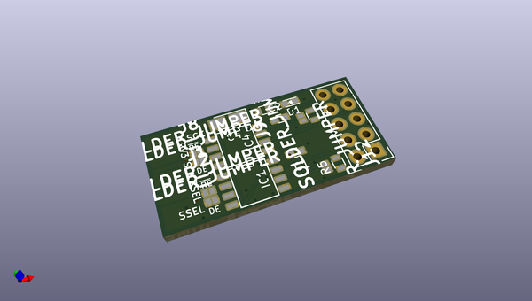

# diff_transceiver
 
## summary 
* id: christianlerche_diff_transceiver_diff_tran
* user: christianlerche
* name: diff_transceiver
* board: diff_tran
* repo: https://github.com/ChristianLerche/Diff_transceiver
* src_file_repo_kicad_pcb: diff_tran.kicad_pcb
* src_file_repo_kicad_pcb_link: https://github.com/ChristianLerche/Diff_transceiver/tree/master/diff_tran.kicad_pcb

* src_file_repo_sch: diff_tran.sch
* src_file_repo_sch_link: https://github.com/ChristianLerche/Diff_transceiver/tree/master/diff_tran.sch
* full details link: https://github.com/oomlout/oomlout_oomp_project_bot_v_2/tree/main/projects/christianlerche_diff_transceiver_diff_tran/current_version/working  

## schematic  
  
[schematic (pdf)](working_schematic.pdf) 

## pcb  
 
  
  
  
[board (pdf)](working.pdf)  

## working_bom
| Id | Designator | Footprint | Quantity | Designation | Supplier and ref |  | None | 
| --- | --- | --- | --- | --- | --- | --- | --- | 
| 1 | C1,C2,C3,C5 | C_0603 | 4 | 100nF |  |  | [''] | 
| 2 | C4 | Tantalum_Case-A_EIA-3216-18_Reflow | 1 | 10uF |  |  | [''] | 
| 3 | D1 | LED_0603 | 1 | RED_LED |  |  | [''] | 
| 4 | IC1,IC4,IC2,IC3 | SOIC-8-N | 4 | SN65LVDM176 |  |  | [''] | 
| 5 | J1,J2,J7,J8,J9,J12,J3,J4,J5,J6,J10,J11 | Lerche_2PsolderJumper | 12 | SOLDER_JUMPER |  |  | [''] | 
| 6 | P2 | Pin_Header_Straight_2x05 | 1 | CONN_02X05 |  |  | [''] | 
| 7 | R1 | R_0603 | 1 | 330 |  |  | [''] | 
| 8 | R2,R5,R3,R4 | R_0603 | 4 | 100 |  |  | [''] | 
| 9 | ,,,,,,,,,,,,,,,,,,,,,,,,,,,,,, | Lerche_via_0.35_GND_MaskOver | 31 |  |  |  | [''] | 
| 10 | P1 | Lerche_2x3p_2.54mm_PCBedge | 1 | CONN_02X03 |  |  | [''] | 

## bom_schematic
| Ref | Qnty | Value | Cmp name | Footprint | Description | Vendor | DNP | 
| --- | --- | --- | --- | --- | --- | --- | --- | 
| C1, C2, C3, C5 | 4 | 100nF | C | Capacitors_SMD:C_0603 |  |  |  | 
| C4 | 1 | 10uF | CP | Capacitors_Tantalum_SMD:Tantalum_Case-A_EIA-3216-18_Reflow |  |  |  | 
| D1 | 1 | RED_LED | LED | LEDs:LED_0603 |  |  |  | 
| IC1, IC2, IC3, IC4 | 4 | SN65LVDM176 | SN65LVDM176 | SMD_Packages:SOIC-8-N |  |  |  | 
| J1, J2, J3, J4, J5, J6, J7, J8, J9, J10, J11, J12 | 12 | SOLDER_JUMPER | SOLDER_JUMPER | LercheTech:Lerche_2PsolderJumper |  |  |  | 
| P1 | 1 | CONN_02X03 | CONN_02X03 | Pin_Headers:Pin_Header_Straight_2x03 |  |  |  | 
| P2 | 1 | CONN_02X05 | CONN_02X05 | Pin_Headers:Pin_Header_Straight_2x05 |  |  |  | 
| R1 | 1 | 330 | R | Resistors_SMD:R_0603 |  |  |  | 
| R2, R3, R4, R5 | 4 | 100 | R | Resistors_SMD:R_0603 |  |  |  | 

