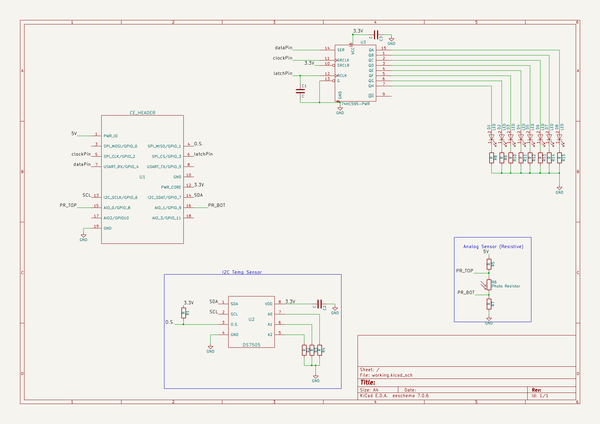

# ce_header
 
## summary 
* id: contextualelectronics_ce_header_sensorboard
* user: contextualelectronics
* name: ce_header
* board: sensorboard
* repo: https://github.com/ContextualElectronics/CE-Header
* src_file_repo_kicad_pcb: SensorBoard1/SensorBoard.kicad_pcb
* src_file_repo_kicad_pcb_link: https://github.com/ContextualElectronics/CE-Header/tree/master/SensorBoard1/SensorBoard.kicad_pcb

* src_file_repo_sch: SensorBoard1/SensorBoard.sch
* src_file_repo_sch_link: https://github.com/ContextualElectronics/CE-Header/tree/master/SensorBoard1/SensorBoard.sch
* full details link: https://github.com/oomlout/oomlout_oomp_project_bot_v_2/tree/main/projects/contextualelectronics_ce_header_sensorboard/current_version/working  

## schematic  
  
[schematic (pdf)](working_schematic.pdf)  

## pcb  
 
  
  
  
[board (pdf)](working.pdf)  

## working_bom
| Id | Designator | Footprint | Quantity | Designation | Supplier and ref |  | None | 
| --- | --- | --- | --- | --- | --- | --- | --- | 
| 1 | C1,C2,C3 | C_0805 | 3 | C |  |  | [''] | 
| 2 | D1,D2,D3,D4,D5,D6,D7,D8 | LED_0805 | 8 | LED |  |  | [''] | 
| 3 | R1,R2,R3,R4,R5,R7,R8,R9,R10,R11,R12,R13,R14,R15 | R_0805 | 14 | R |  |  | [''] | 
| 4 | R6 | CP_Radial_Tantal_D5.5mm_P5.00mm | 1 | Photo Resistor |  |  | [''] | 
| 5 | U1 | CE_Header | 1 | CE_HEADER |  |  | [''] | 
| 6 | U2 | SOIC-8-1EP_3.9x4.9mm_Pitch1.27mm | 1 | DS7505 |  |  | [''] | 
| 7 | U3 | SOIC-16_3.9x9.9mm_Pitch1.27mm | 1 | 74HC595-PWR |  |  | [''] | 

## bom_schematic
| Ref | Qnty | Value | Cmp name | Footprint | Description | Vendor | DNP | 
| --- | --- | --- | --- | --- | --- | --- | --- | 
| C1, C2, C3 | 3 | C | C | Capacitors_SMD:C_0805 |  |  |  | 
| D1, D2, D3, D4, D5, D6, D7, D8 | 8 | LED | LED | LEDs:LED_0805 |  |  |  | 
| R1, R2, R3, R4, R5, R7, R8, R9, R10, R11, R12, R13, R14, R15 | 14 | R | R | Resistors_SMD:R_0805 |  |  |  | 
| R6 | 1 | Photo Resistor | R_PHOTO | Capacitors_ThroughHole:CP_Radial_Tantal_D5.5mm_P5.00mm |  |  |  | 
| U1 | 1 | CE_HEADER | CE_HEADER | SensorBoard:CE_Header |  |  |  | 
| U2 | 1 | DS7505 | DS7505 | Housings_SOIC:SOIC-8-1EP_3.9x4.9mm_Pitch1.27mm |  |  |  | 
| U3 | 1 | 74HC595-PWR | 74HC595-PWR | Housings_SOIC:SOIC-16_3.9x9.9mm_Pitch1.27mm | 8 bits serial in // out Shift Register 3 State Out |  |  | 

