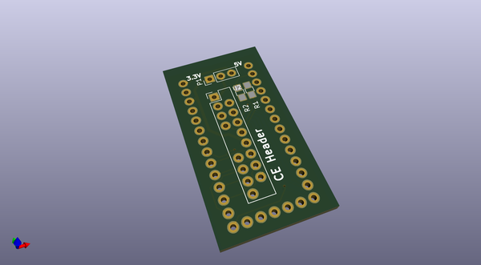

# ce_header
 
## summary 
* id: contextualelectronics_ce_header_teensyconverter
* user: contextualelectronics
* name: ce_header
* board: teensyconverter
* repo: https://github.com/ContextualElectronics/CE-Header
* src_file_repo_kicad_pcb: TeensyConverter/TeensyConverter.kicad_pcb
* src_file_repo_kicad_pcb_link: https://github.com/ContextualElectronics/CE-Header/tree/master/TeensyConverter/TeensyConverter.kicad_pcb

* src_file_repo_sch: TeensyConverter/TeensyConverter.sch
* src_file_repo_sch_link: https://github.com/ContextualElectronics/CE-Header/tree/master/TeensyConverter/TeensyConverter.sch
* full details link: https://github.com/oomlout/oomlout_oomp_project_bot_v_2/tree/main/projects/contextualelectronics_ce_header_teensyconverter/current_version/working  

## schematic  
  
[schematic (pdf)](working_schematic.pdf)  

## pcb  
 
  
  
  
[board (pdf)](working.pdf)  

## working_bom
| Id | Designator | Footprint | Quantity | Designation | Supplier and ref |  | None | 
| --- | --- | --- | --- | --- | --- | --- | --- | 
| 1 | P1 | Pin_Header_Straight_1x03_Pitch2.54mm | 1 | CONN_01X03 |  |  | [''] | 
| 2 | R1,R2 | R_0805_HandSoldering | 2 | 0 |  |  | [''] | 
| 3 | U2 | CE_Header | 1 | CE_HEADER |  |  | [''] | 
| 4 | U1 | Teensy-32 | 1 | Teensy-3.2 |  |  | [''] | 

## bom_schematic
| Ref | Qnty | Value | Cmp name | Footprint | Description | Vendor | DNP | 
| --- | --- | --- | --- | --- | --- | --- | --- | 
| P1 | 1 | CONN_01X03 | CONN_01X03 | Pin_Headers:Pin_Header_Straight_1x03_Pitch2.54mm |  |  |  | 
| R1, R2 | 2 | 0 | R | Resistors_SMD:R_0805_HandSoldering |  |  |  | 
| U1 | 1 | Teensy-3.2 | Teensy-3.2 | TeensyConverter:Teensy-32 |  |  |  | 
| U2 | 1 | CE_HEADER | CE_HEADER | TeensyConverter:CE_Header |  |  |  | 

