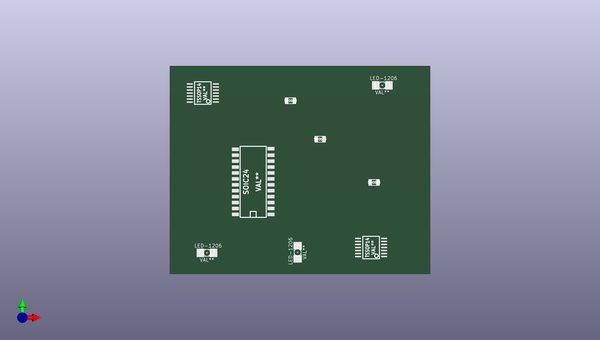

# ce_soldering_practice
 
## summary 
* id: contextualelectronics_ce_soldering_practice_cesp
* user: contextualelectronics
* name: ce_soldering_practice
* board: cesp
* repo: https://github.com/ContextualElectronics/CE_Soldering_Practice
* src_file_repo_kicad_pcb: CESP.kicad_pcb
* src_file_repo_kicad_pcb_link: https://github.com/ContextualElectronics/CE_Soldering_Practice/tree/master/CESP.kicad_pcb

* src_file_repo_sch: CESP.sch
* src_file_repo_sch_link: https://github.com/ContextualElectronics/CE_Soldering_Practice/tree/master/CESP.sch
* full details link: https://github.com/oomlout/oomlout_oomp_project_bot_v_2/tree/main/projects/contextualelectronics_ce_soldering_practice_cesp/current_version/working  

## pcb  
 
  
  
  
[board (pdf)](working.pdf)  

## working_bom
| Id | Designator | Footprint | Quantity | Designation | Supplier and ref |  | None | 
| --- | --- | --- | --- | --- | --- | --- | --- | 
| 1 | TSSOP14,TSSOP14 | TSSOP14 | 2 | VAL** |  |  | [''] | 
| 2 | SOIC24 | SOIC24 | 1 | VAL** |  |  | [''] | 
| 3 | SM0603,SM0603,SM0603 | SM0603 | 3 | Val** |  |  | [''] | 
| 4 | LED-1206,LED-1206,LED-1206 | LED-1206 | 3 | VAL** |  |  | [''] | 

## bom_schematic
| Ref | Qnty | Value | Cmp name | Footprint | Description | Vendor | DNP | 
| --- | --- | --- | --- | --- | --- | --- | --- | 
| U1 | 1 | LTC1594CS | LTC1594CS | TSSOP14 |  |  |  | 
| U2 | 1 | TL074 | TL074 | TSSOP14 |  |  |  | 
| U3, U4 | 2 | TL074 | TL074 |  |  |  |  | 

