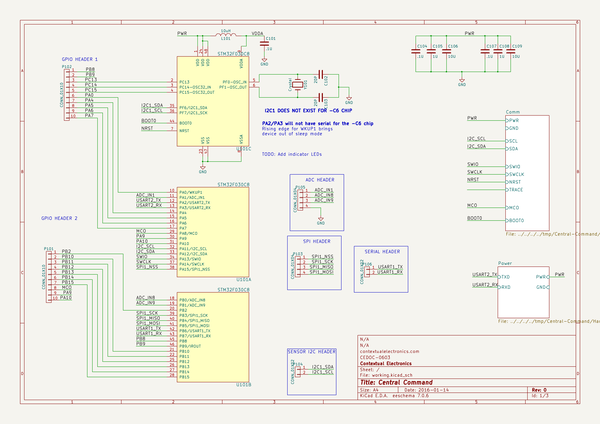
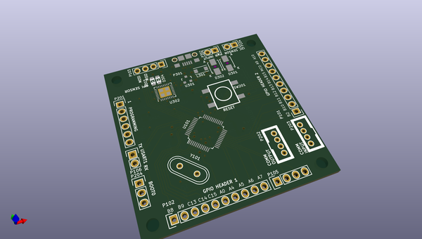
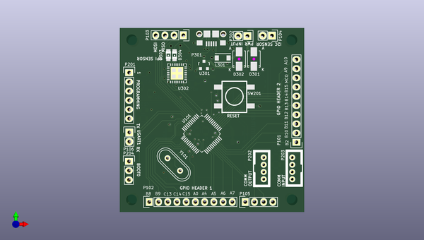
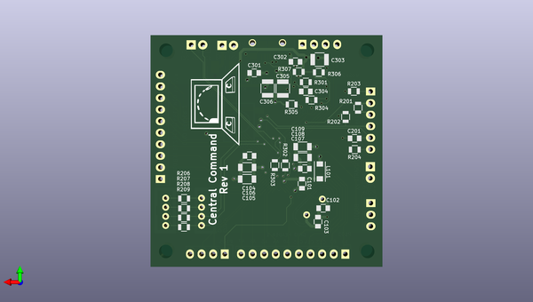

# central_command
 
## summary 
* id: contextualelectronics_central_command_centralcommand
* user: contextualelectronics
* name: central_command
* board: centralcommand
* repo: https://github.com/ContextualElectronics/Central-Command
* src_file_repo_kicad_pcb: Hardware/CentralCommand.kicad_pcb
* src_file_repo_kicad_pcb_link: https://github.com/ContextualElectronics/Central-Command/tree/master/Hardware/CentralCommand.kicad_pcb

* src_file_repo_sch: Hardware/CentralCommand.sch
* src_file_repo_sch_link: https://github.com/ContextualElectronics/Central-Command/tree/master/Hardware/CentralCommand.sch
* full details link: https://github.com/oomlout/oomlout_oomp_project_bot_v_2/tree/main/projects/contextualelectronics_central_command_centralcommand/current_version/working  

## schematic  
  
[schematic (pdf)](working_schematic.pdf)  

## pcb  
 
  
  
  
[board (pdf)](working.pdf)  

## working_bom
| Id | Designator | Footprint | Quantity | Designation | Supplier and ref |  | None | 
| --- | --- | --- | --- | --- | --- | --- | --- | 
| 1 | D301,D302 | Diode-SMA_Standard | 2 | D_Schottky |  |  | [''] | 
| 2 | D303,D304 | LED-0805 | 2 | LED |  |  | [''] | 
| 3 | L301 | Neosid_Inductor_SM1206 | 1 | FERRITE |  |  | [''] | 
| 4 | P101,P102 | Pin_Header_Straight_1x10 | 2 | CONN_01X10 |  |  | [''] | 
| 5 | P103,P105 | Pin_Header_Straight_1x04 | 2 | CONN_01X04 |  |  | [''] | 
| 6 | P104,P106,P302 | Pin_Header_Straight_1x02 | 3 | CONN_01X02 |  |  | [''] | 
| 7 | P201 | Pin_Header_Straight_1x06 | 1 | CONN_01X06 |  |  | [''] | 
| 8 | P204 | Pin_Header_Straight_1x03 | 1 | CONN_01X03 |  |  | [''] | 
| 9 | U101 | LQFP-48_7x7mm_Pitch0.5mm | 1 | STM32F030C8 |  |  | [''] | 
| 10 | U301 | SOT-23 | 1 | MCP1700T-3302E/TT_ |  |  | [''] | 
| 11 | U302 | QFN-32-1EP_5x5mm_Pitch0.5mm | 1 | FT232RQ |  |  | [''] | 
| 12 | Y101 | Crystal_HC49-U_Vertical | 1 | Crystal |  |  | [''] | 
| 13 | P301 | 10118193 | 1 | USB_B |  |  | [''] | 
| 14 | P202,P203 | Grove-2mm | 2 | CONN_01X04 |  |  | [''] | 
| 15 | SW201 | FSM2JSMAA-ND | 1 | FSM2JSMAA-ND |  |  | [''] | 
| 16 | REF**,REF**,REF**,REF** | MountingHole_3mm | 4 | MountingHole_3mm |  |  | [''] | 
| 17 | C101,C201 | C_0805 | 2 | C |  |  | [''] | 
| 18 | C102,C103 | C_0805 | 2 | 20P |  |  | [''] | 
| 19 | C301,C302,C304,C104,C107 | C_0805 | 5 | .1U |  |  | [''] | 
| 20 | C303 | C_1210 | 1 | 4.7U |  |  | [''] | 
| 21 | C305,C306 | C_1210 | 2 | 10U |  |  | [''] | 
| 22 | L101 | Neosid_Inductor_SM1206 | 1 | INDUCTOR |  |  | [''] | 
| 23 | R201,R202,R204 | R_0805 | 3 | R |  |  | [''] | 
| 24 | R203,R301,R302,R303,R206,R207,R208,R209 | R_0805 | 8 | 0 |  |  | [''] | 
| 25 | R304,R305 | R_0805 | 2 | NOPE |  |  | [''] | 
| 26 | R306,R307 | R_0805 | 2 | 270 |  |  | [''] | 
| 27 | C105,C108 | C_1206 | 2 | 1U |  |  | [''] | 
| 28 | C106,C109 | C_1206 | 2 | 10U |  |  | [''] | 
| 29 | G*** | CClogo-small | 1 | LOGO |  |  | [''] | 

## bom_schematic
| Ref | Qnty | Value | Cmp name | Footprint | Description | Vendor | DNP | 
| --- | --- | --- | --- | --- | --- | --- | --- | 
| C101, C104, C107 | 3 | .1U | C | Capacitors_SMD:C_0805 |  |  |  | 
| C102, C103 | 2 | 20P | C | Capacitors_SMD:C_0805 |  |  |  | 
| C105, C108 | 2 | 1U | C | Capacitors_SMD:C_1206 |  |  |  | 
| C106, C109 | 2 | 10U | C | Capacitors_SMD:C_1206 |  |  |  | 
| L101 | 1 | 10uH | INDUCTOR | Inductors_NEOSID:Neosid_Inductor_SM1206 |  |  |  | 
| P101, P102 | 2 | CONN_01X10 | CONN_01X10 | Pin_Headers:Pin_Header_Straight_1x10 |  |  |  | 
| P103, P105 | 2 | CONN_01X04 | CONN_01X04 | Pin_Headers:Pin_Header_Straight_1x04 |  |  |  | 
| P104, P106 | 2 | CONN_01X02 | CONN_01X02 | Pin_Headers:Pin_Header_Straight_1x02 |  |  |  | 
| U101 | 1 | STM32F030C8 | STM32F030C8 | Housings_QFP:LQFP-48_7x7mm_Pitch0.5mm |  |  |  | 
| Y101 | 1 | Crystal | Crystal | Crystals:Crystal_HC49-U_Vertical |  |  |  | 

## mounting_holes
| x | y | package | value | ref | size | 
| --- | --- | --- | --- | --- | --- | 
| 0.06350000000000477 | 44.17060000000001 | MountingHole_3mm | MountingHole_3mm | REF** | m3 | 
| 0.0 | 0.0 | MountingHole_3mm | MountingHole_3mm | REF** | m3 | 
| 44.2341 | 0.0 | MountingHole_3mm | MountingHole_3mm | REF** | m3 | 
| 44.18330000000002 | 44.1452 | MountingHole_3mm | MountingHole_3mm | REF** | m3 | 

