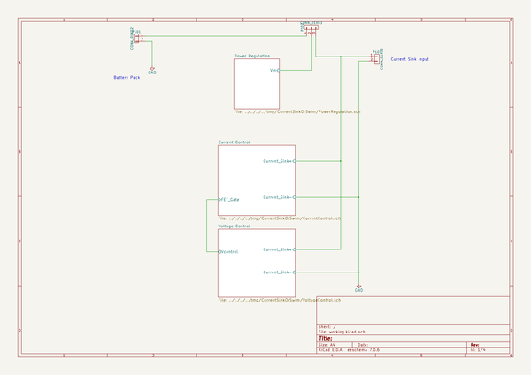
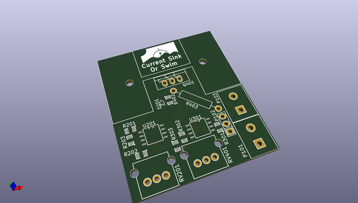
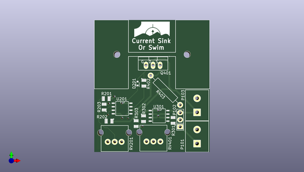
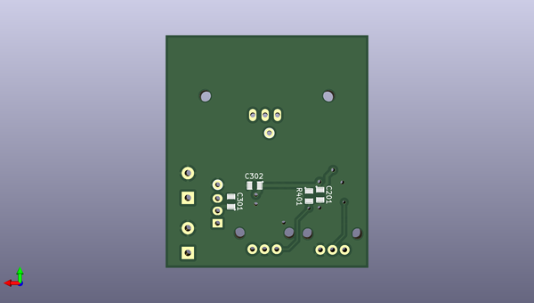

# currentsinkorswim
 
## summary 
* id: contextualelectronics_currentsinkorswim_currentsinkorswim
* user: contextualelectronics
* name: currentsinkorswim
* board: currentsinkorswim
* repo: https://github.com/ContextualElectronics/CurrentSinkOrSwim
* src_file_repo_kicad_pcb: CurrentSinkOrSwim.kicad_pcb
* src_file_repo_kicad_pcb_link: https://github.com/ContextualElectronics/CurrentSinkOrSwim/tree/master/CurrentSinkOrSwim.kicad_pcb

* src_file_repo_sch: 
* src_file_repo_sch_link: https://github.com/ContextualElectronics/CurrentSinkOrSwim/tree/master/
* full details link: https://github.com/oomlout/oomlout_oomp_project_bot_v_2/tree/main/projects/contextualelectronics_currentsinkorswim_currentsinkorswim/current_version/working  

## schematic  
  
[schematic (pdf)](working_schematic.pdf) 

## pcb  
 
  
  
  
[board (pdf)](working.pdf)  

## working_bom
| Id | Designator | Footprint | Quantity | Designation | Supplier and ref |  | None | 
| --- | --- | --- | --- | --- | --- | --- | --- | 
| 1 | D201 | SOD-523 | 1 | DIODE |  |  | [''] | 
| 2 | Q401 | TO-220_FET-GDS_Vertical | 1 | BUK9575 |  |  | [''] | 
| 3 | R201 | SMD-0805 | 1 | 28.7K |  |  | [''] | 
| 4 | R202 | SMD-0805 | 1 | 9K |  |  | [''] | 
| 5 | R301 | SMD-0805 | 1 | 0 |  |  | [''] | 
| 6 | R302 | SMD-0805 | 1 | 27K |  |  | [''] | 
| 7 | R403 | Resistor_Horizontal_RM15mm | 1 | .1 |  |  | [''] | 
| 8 | U201 | SOIC-8-N | 1 | LMV358 |  |  | [''] | 
| 9 | U301 | SOIC-8-N | 1 | LM2931D-R |  |  | [''] | 
| 10 | P1 | FA-T220-38E | 1 | CONN_01X01 |  |  | [''] | 
| 11 | P101,P103 | Terminal_Block_200_mil | 2 | CONN_01X02 |  |  | [''] | 
| 12 | P102 | Pin_Header_Straight_1x03 | 1 | CONN_01X03 |  |  | [''] | 
| 13 | RV201,RV401 | P090L-02F25BR10K | 2 | 10K |  |  | [''] | 
| 14 | R203,R402 | SMD-0805 | 2 | 1K |  |  | [''] | 
| 15 | R303 | SMD-0805 | 1 | 21.6K |  |  | [''] | 
| 16 | G*** | CSOS | 1 | LOGO |  |  | [''] | 
| 17 | C201,C301,C302 | SMD-0805 | 3 | C |  |  | [''] | 
| 18 | R401 | SMD-0805 | 1 | 68K |  |  | [''] | 

## bom_schematic
| Ref | Qnty | Value | Cmp name | Footprint | Description | Vendor | DNP | 
| --- | --- | --- | --- | --- | --- | --- | --- | 
| P101, P103 | 2 | CONN_01X02 | CONN_01X02 | Current:Terminal_Block_200_mil |  |  |  | 
| P102 | 1 | CONN_01X03 | CONN_01X03 | Pin_Headers:Pin_Header_Straight_1x03 |  |  |  | 

