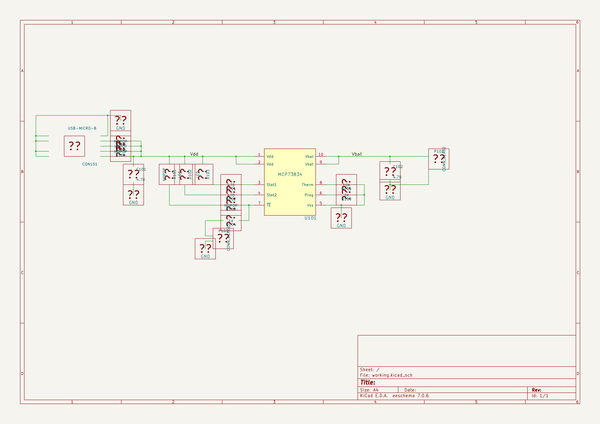

# full_charge_ahead
 
## summary 
* id: contextualelectronics_full_charge_ahead_fullchargeahead
* user: contextualelectronics
* name: full_charge_ahead
* board: fullchargeahead
* repo: https://github.com/ContextualElectronics/Full-Charge-Ahead
* src_file_repo_kicad_pcb: FullChargeAhead/FullChargeAhead.kicad_pcb
* src_file_repo_kicad_pcb_link: https://github.com/ContextualElectronics/Full-Charge-Ahead/tree/master/FullChargeAhead/FullChargeAhead.kicad_pcb

* src_file_repo_sch: FullChargeAhead/FullChargeAhead.sch
* src_file_repo_sch_link: https://github.com/ContextualElectronics/Full-Charge-Ahead/tree/master/FullChargeAhead/FullChargeAhead.sch
* full details link: https://github.com/oomlout/oomlout_oomp_project_bot_v_2/tree/main/projects/contextualelectronics_full_charge_ahead_fullchargeahead/current_version/working  

## schematic  
  
[schematic (pdf)](working_schematic.pdf) 

## pcb  
 
  
  
  
[board (pdf)](working.pdf)  

## working_bom
| Id | Designator | Footprint | Quantity | Designation | Supplier and ref |  | None | 
| --- | --- | --- | --- | --- | --- | --- | --- | 
| 1 | C101,C102 | C_1206_HandSoldering | 2 | 4.7U |  |  | [''] | 
| 2 | CON101 | 10118193 | 1 | USB-MICRO-B |  |  | [''] | 
| 3 | D101 | LED-0805 | 1 | NOPOP |  |  | [''] | 
| 4 | D102,D103 | LED-0805 | 2 | LED |  |  | [''] | 
| 5 | R101,R102 | R_0805_HandSoldering | 2 | 470 |  |  | [''] | 
| 6 | R103,R107,R108,R109 | R_0805_HandSoldering | 4 | NOPOP |  |  | [''] | 
| 7 | R104 | R_0805_HandSoldering | 1 | 1K |  |  | [''] | 
| 8 | R105 | Resistor_Horizontal_RM10mm | 1 | 10K |  |  | [''] | 
| 9 | R106 | R_0805_HandSoldering | 1 | 2K |  |  | [''] | 
| 10 | U101 | MSOP-10_3x3mm_Pitch0.5mm | 1 | MCP73834-FCI/UN |  |  | [''] | 
| 11 | P101 | Pin_Header_Straight_1x02 | 1 | CONN_01X02 |  |  | [''] | 
| 12 | P102 | JST_2pin | 1 | CONN_01X02 |  |  | [''] | 
| 13 | G*** | FCA-TINY | 1 | FCA-TINY |  |  | [''] | 

## bom_schematic
| Ref | Qnty | Value | Cmp name | Footprint | Description | Vendor | DNP | 
| --- | --- | --- | --- | --- | --- | --- | --- | 
| U101 | 1 | MCP73834 | MCP73834-FCI/UN | Housings_SSOP:MSOP-10_3x3mm_Pitch0.5mm |  |  |  | 

