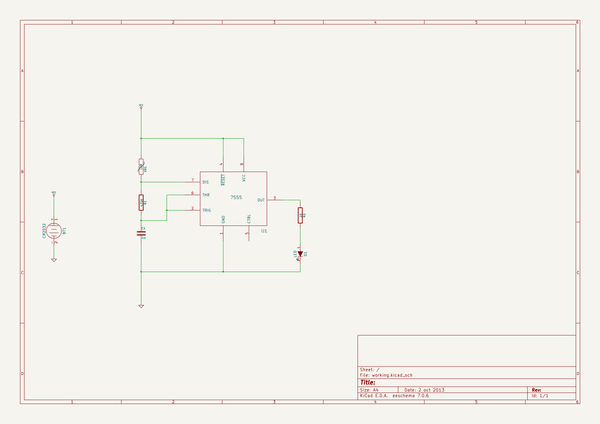

# gettingtoblinky
 
## summary 
* id: contextualelectronics_gettingtoblinky_gtb
* user: contextualelectronics
* name: gettingtoblinky
* board: gtb
* repo: https://github.com/ContextualElectronics/GettingToBlinky
* src_file_repo_kicad_pcb: GTB.kicad_pcb
* src_file_repo_kicad_pcb_link: https://github.com/ContextualElectronics/GettingToBlinky/tree/master/GTB.kicad_pcb

* src_file_repo_sch: GTB.sch
* src_file_repo_sch_link: https://github.com/ContextualElectronics/GettingToBlinky/tree/master/GTB.sch
* full details link: https://github.com/oomlout/oomlout_oomp_project_bot_v_2/tree/main/projects/contextualelectronics_gettingtoblinky_gtb/current_version/working  

## schematic  
  
[schematic (pdf)](working_schematic.pdf)  

## pcb  
 
  
  
  
[board (pdf)](working.pdf)  

## working_bom
| Id | Designator | Footprint | Quantity | Designation | Supplier and ref |  | None | 
| --- | --- | --- | --- | --- | --- | --- | --- | 
| 1 | U1 | SO8N | 1 | 7555 |  |  | [''] | 
| 2 | R1 | SM1206 | 1 | 470K |  |  | [''] | 
| 3 | R2 | SM1206 | 1 | 1K |  |  | [''] | 
| 4 | VR1 | R1 | 1 | LDR |  |  | [''] | 
| 5 | D1 | LED-1206 | 1 | LED |  |  | [''] | 
| 6 | C1 | SM1206 | 1 | 1U |  |  | [''] | 
| 7 | BT1 | CR2032 | 1 | CR2032 |  |  | [''] | 

## bom_schematic
| Ref | Qnty | Value | Cmp name | Footprint | Description | Vendor | DNP | 
| --- | --- | --- | --- | --- | --- | --- | --- | 
| BT1 | 1 | CR2032 | BATTERY |  |  |  |  | 
| C1 | 1 | 1U | C |  |  |  |  | 
| D1 | 1 | LED | LED |  |  |  |  | 
| R1 | 1 | 470K | R |  |  |  |  | 
| R2 | 1 | 1K | R |  |  |  |  | 
| U1 | 1 | 7555 | 7555 |  |  |  |  | 
| VR1 | 1 | LDR | VR |  |  |  |  | 

