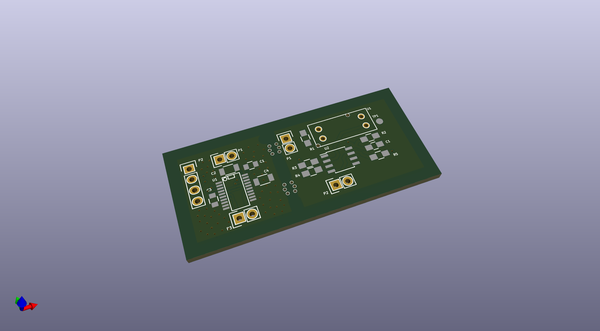
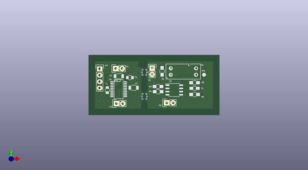
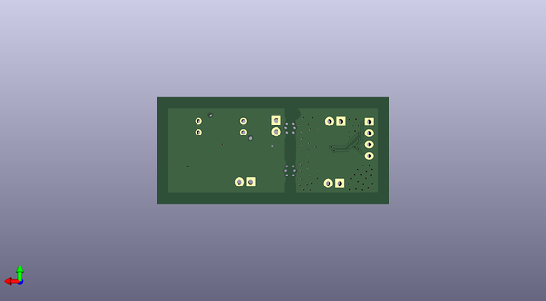

# gogogo
 
## summary 
* id: contextualelectronics_gogogo_combo
* user: contextualelectronics
* name: gogogo
* board: combo
* repo: https://github.com/ContextualElectronics/GoGoGo
* src_file_repo_kicad_pcb: Combo.kicad_pcb
* src_file_repo_kicad_pcb_link: https://github.com/ContextualElectronics/GoGoGo/tree/master/Combo.kicad_pcb

* src_file_repo_sch: 
* src_file_repo_sch_link: https://github.com/ContextualElectronics/GoGoGo/tree/master/
* full details link: https://github.com/oomlout/oomlout_oomp_project_bot_v_2/tree/main/projects/contextualelectronics_gogogo_combo/current_version/working  

## pcb  
 
  
  
  
[board (pdf)](working.pdf)  

## working_bom
| Id | Designator | Footprint | Quantity | Designation | Supplier and ref |  | None | 
| --- | --- | --- | --- | --- | --- | --- | --- | 
| 1 | C1,C3 | C_0805 | 2 | .1U |  |  | [''] | 
| 2 | C2,C4 | C_1206 | 2 | 10U |  |  | [''] | 
| 3 | P1,P3,P1,P2 | Pin_Header_Straight_1x02 | 4 | CONN_01X02 |  |  | [''] | 
| 4 | P2 | Pin_Header_Straight_1x04 | 1 | CONN_01X04 |  |  | [''] | 
| 5 | U1 | SSOP-20 | 1 | TB6593FNG |  |  | [''] | 
| 6 | C1 | C_0805_HandSoldering | 1 | C |  |  | [''] | 
| 7 | R1 | R_0805_HandSoldering | 1 | 100 |  |  | [''] | 
| 8 | R2,R3,R4,R5 | R_0805_HandSoldering | 4 | 1K |  |  | [''] | 
| 9 | TP1 | Measurement_Point_Round-SMD-Pad_Small | 1 | OptoOut |  |  | [''] | 
| 10 | U2 | SOIC-8_3.9x4.9mm_Pitch1.27mm | 1 | LM311N |  |  | [''] | 
| 11 | U1 | RPI-579N1 | 1 | RPI-579N1 |  |  | [''] | 
| 12 | REF**,REF** | MouseBite | 2 | MouseBite |  |  | [''] | 

