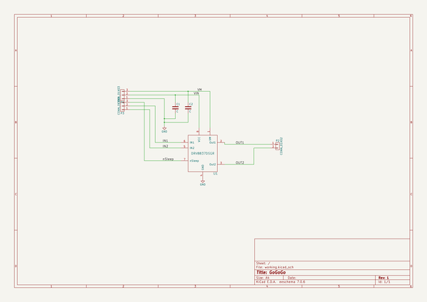

# gogogo
 
## summary 
* id: contextualelectronics_gogogo_gogogo_rev1
* user: contextualelectronics
* name: gogogo
* board: gogogo_rev1
* repo: https://github.com/ContextualElectronics/GoGoGo
* src_file_repo_kicad_pcb: MotorDriver-DRV8837/GoGoGo-Rev1.kicad_pcb
* src_file_repo_kicad_pcb_link: https://github.com/ContextualElectronics/GoGoGo/tree/master/MotorDriver-DRV8837/GoGoGo-Rev1.kicad_pcb

* src_file_repo_sch: MotorDriver-DRV8837/GoGoGo-Rev1.sch
* src_file_repo_sch_link: https://github.com/ContextualElectronics/GoGoGo/tree/master/MotorDriver-DRV8837/GoGoGo-Rev1.sch
* full details link: https://github.com/oomlout/oomlout_oomp_project_bot_v_2/tree/main/projects/contextualelectronics_gogogo_gogogo_rev1/current_version/working  

## schematic  
  
[schematic (pdf)](working_schematic.pdf) 

## pcb  
 
  
  
  
[board (pdf)](working.pdf)  

## working_bom
| Id | Designator | Footprint | Quantity | Designation | Supplier and ref |  | None | 
| --- | --- | --- | --- | --- | --- | --- | --- | 
| 1 | P2 | Pin_Header_Straight_1x02 | 1 | CONN_01X02 |  |  | [''] | 
| 2 | U1 | PWSON-N8 | 1 | DRV8837DSGR |  |  | [''] | 
| 3 | C1,C2 | C_0603 | 2 | C |  |  | [''] | 
| 4 | P1,P3 | Pin_Header_Straight_1x03 | 2 | CONN_01X03 |  |  | [''] | 

## bom_schematic
| Ref | Qnty | Value | Cmp name | Footprint | Description | Vendor | DNP | 
| --- | --- | --- | --- | --- | --- | --- | --- | 
| C1, C2 | 2 | C | C | Capacitors_SMD:C_0603 |  |  |  | 
| P1, P3 | 2 | CONN_01X03 | CONN_01X03 | Pin_Headers:Pin_Header_Straight_1x03 |  |  |  | 
| P2 | 1 | CONN_01X02 | CONN_01X02 | Pin_Headers:Pin_Header_Straight_1x02 |  |  |  | 
| U1 | 1 | DRV8837DSGR | DRV8837DSGR | GoGoGo:PWSON-N8 |  |  |  | 

