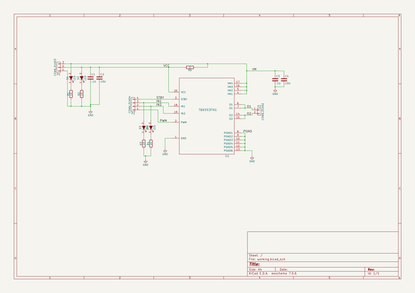
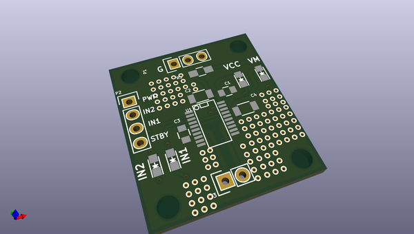
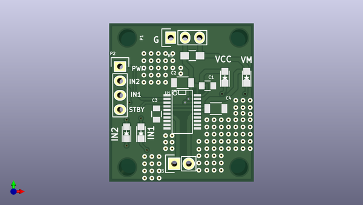
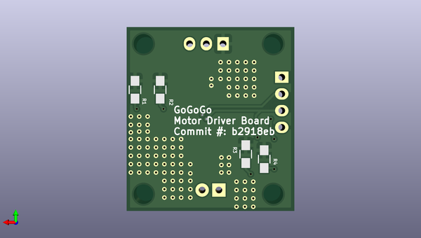

# gogogo
 
## summary 
* id: contextualelectronics_gogogo_gogogo_tb
* user: contextualelectronics
* name: gogogo
* board: gogogo_tb
* repo: https://github.com/ContextualElectronics/GoGoGo
* src_file_repo_kicad_pcb: MotorDriver-TB6593/GoGoGo-TB.kicad_pcb
* src_file_repo_kicad_pcb_link: https://github.com/ContextualElectronics/GoGoGo/tree/master/MotorDriver-TB6593/GoGoGo-TB.kicad_pcb

* src_file_repo_sch: MotorDriver-TB6593/GoGoGo-TB.sch
* src_file_repo_sch_link: https://github.com/ContextualElectronics/GoGoGo/tree/master/MotorDriver-TB6593/GoGoGo-TB.sch
* full details link: https://github.com/oomlout/oomlout_oomp_project_bot_v_2/tree/main/projects/contextualelectronics_gogogo_gogogo_tb/current_version/working  

## schematic  
  
[schematic (pdf)](working_schematic.pdf) 

## pcb  
 
  
  
  
[board (pdf)](working.pdf)  

## working_bom
| Id | Designator | Footprint | Quantity | Designation | Supplier and ref |  | None | 
| --- | --- | --- | --- | --- | --- | --- | --- | 
| 1 | C1,C3 | C_0805 | 2 | .1U |  |  | [''] | 
| 2 | C2,C4 | C_1206 | 2 | 10U |  |  | [''] | 
| 3 | P2 | Pin_Header_Straight_1x04 | 1 | CONN_01X04 |  |  | [''] | 
| 4 | P3 | Pin_Header_Straight_1x02 | 1 | CONN_01X02 |  |  | [''] | 
| 5 | U1 | SSOP-20 | 1 | TB6593FNG |  |  | [''] | 
| 6 | D1,D2,D3,D4 | LED-0805 | 4 | LED |  |  | [''] | 
| 7 | R5 | R_0805_HandSoldering | 1 | 0 |  |  | [''] | 
| 8 | P1 | Pin_Header_Straight_1x03 | 1 | CONN_01X03 |  |  | [''] | 
| 9 | REF**,REF**11,REF**11,REF** | MountingHole_3mm | 4 | MountingHole_3mm |  |  | [''] | 
| 10 | REF**111,REF**121,REF**131,REF**141,REF**151,REF**112,REF**122,REF**132,REF**142,REF**152,REF**113,REF**123,REF**133,REF**143,REF**153,REF**114,REF**124,REF**134,REF**144,REF**154,REF**115,REF**125,REF**135,REF**145,REF**155,REF**1511,REF**1521,REF**1531,REF**1541,REF**1551,REF**1561,REF**1571,REF**1581,REF**1512,REF**1522,REF**1532,REF**1542,REF**1552,REF**1562,REF**1572,REF**1582,REF**1513,REF**1523,REF**1533,REF**1543,REF**1553,REF**1563,REF**1573,REF**1583,REF**1514,REF**1524,REF**1534,REF**1544,REF**1554,REF**1564,REF**1574,REF**1584,REF**1515,REF**1525,REF**1535,REF**1545,REF**1555,REF**1565,REF**1575,REF**1585,REF**1516,REF**1526,REF**1536,REF**1546,REF**1556,REF**1566,REF**1576,REF**1586,REF**1517,REF**1527,REF**1537,REF**1547,REF**1557,REF**1567,REF**1577,REF**1587,REF**1518,REF**1528,REF**1538,REF**1548,REF**1558,REF**1568,REF**1578,REF**1588,REF**155111,REF**155121,REF**155131,REF**155112,REF**155122,REF**155132,REF**155113,REF**155123,REF**155133,REF**155114,REF**155124,REF**155134 | Via | 101 | Via |  |  | [''] | 
| 11 | R1,R2,R3,R4 | R_0805_HandSoldering | 4 | 1K |  |  | [''] | 

## bom_schematic
| Ref | Qnty | Value | Cmp name | Footprint | Description | Vendor | DNP | 
| --- | --- | --- | --- | --- | --- | --- | --- | 
| C1, C3 | 2 | .1U | C | Capacitors_SMD:C_0805 |  |  |  | 
| C2, C4 | 2 | 10U | C | Capacitors_SMD:C_1206 |  |  |  | 
| D1, D2, D3, D4 | 4 | LED | LED | LEDs:LED-0805 |  |  |  | 
| P1 | 1 | CONN_01X03 | CONN_01X03 | Pin_Headers:Pin_Header_Straight_1x03 |  |  |  | 
| P2 | 1 | CONN_01X04 | CONN_01X04 | Pin_Headers:Pin_Header_Straight_1x04 |  |  |  | 
| P3 | 1 | CONN_01X02 | CONN_01X02 | Pin_Headers:Pin_Header_Straight_1x02 |  |  |  | 
| R1, R2, R3, R4 | 4 | 1K | R | Resistors_SMD:R_0805_HandSoldering |  |  |  | 
| R5 | 1 | 0 | R | Resistors_SMD:R_0805_HandSoldering |  |  |  | 
| U1 | 1 | TB6593FNG | TB6593FNG | SMD_Packages:SSOP-20 |  |  |  | 

## mounting_holes
| x | y | package | value | ref | size | 
| --- | --- | --- | --- | --- | --- | 
| 19.69 | 22.86 | MountingHole_3mm | MountingHole_3mm | REF** | m3 | 
| 19.69 | 0.0 | MountingHole_3mm | MountingHole_3mm | REF** | m3 | 
| 0.0 | 22.86 | MountingHole_3mm | MountingHole_3mm | REF**11 | m3 | 
| 0.0 | 0.0 | MountingHole_3mm | MountingHole_3mm | REF**11 | m3 | 

