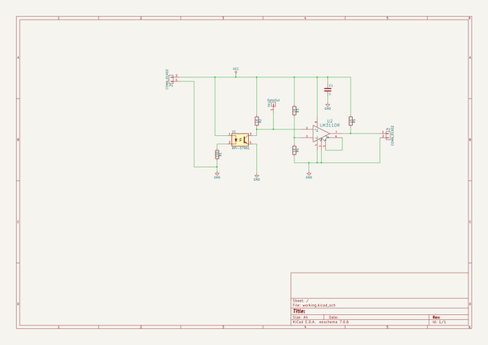
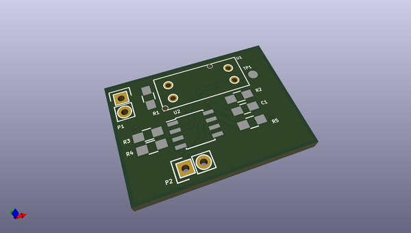
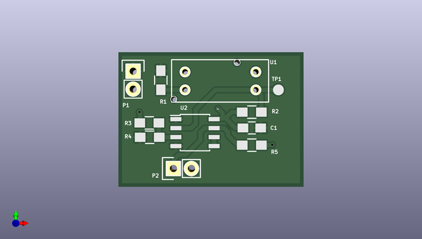
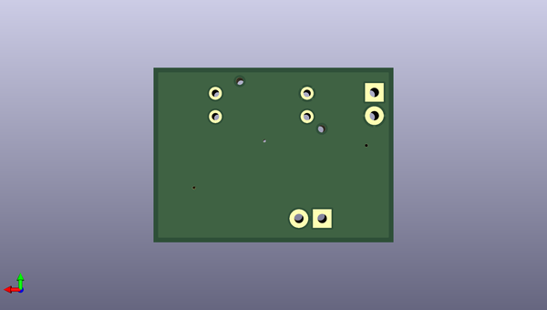

# gogogo
 
## summary 
* id: contextualelectronics_gogogo_motorencoderboard
* user: contextualelectronics
* name: gogogo
* board: motorencoderboard
* repo: https://github.com/ContextualElectronics/GoGoGo
* src_file_repo_kicad_pcb: MotorEncoderBoard/MotorEncoderBoard.kicad_pcb
* src_file_repo_kicad_pcb_link: https://github.com/ContextualElectronics/GoGoGo/tree/master/MotorEncoderBoard/MotorEncoderBoard.kicad_pcb

* src_file_repo_sch: MotorEncoderBoard/MotorEncoderBoard.sch
* src_file_repo_sch_link: https://github.com/ContextualElectronics/GoGoGo/tree/master/MotorEncoderBoard/MotorEncoderBoard.sch
* full details link: https://github.com/oomlout/oomlout_oomp_project_bot_v_2/tree/main/projects/contextualelectronics_gogogo_motorencoderboard/current_version/working  

## schematic  
  
[schematic (pdf)](working_schematic.pdf) 

## pcb  
 
  
  
  
[board (pdf)](working.pdf)  

## working_bom
| Id | Designator | Footprint | Quantity | Designation | Supplier and ref |  | None | 
| --- | --- | --- | --- | --- | --- | --- | --- | 
| 1 | C1 | C_0805_HandSoldering | 1 | C |  |  | [''] | 
| 2 | P1,P2 | Pin_Header_Straight_1x02 | 2 | CONN_01X02 |  |  | [''] | 
| 3 | R1 | R_0805_HandSoldering | 1 | 100 |  |  | [''] | 
| 4 | R2,R3,R4,R5 | R_0805_HandSoldering | 4 | 1K |  |  | [''] | 
| 5 | TP1 | Measurement_Point_Round-SMD-Pad_Small | 1 | OptoOut |  |  | [''] | 
| 6 | U2 | SOIC-8_3.9x4.9mm_Pitch1.27mm | 1 | LM311N |  |  | [''] | 
| 7 | U1 | RPI-579N1 | 1 | RPI-579N1 |  |  | [''] | 

## bom_schematic
| Ref | Qnty | Value | Cmp name | Footprint | Description | Vendor | DNP | 
| --- | --- | --- | --- | --- | --- | --- | --- | 
| C1 | 1 | C | C | Capacitors_SMD:C_0805_HandSoldering |  |  |  | 
| P1, P2 | 2 | CONN_01X02 | CONN_01X02 | Pin_Headers:Pin_Header_Straight_1x02 |  |  |  | 
| R1 | 1 | 100 | R | Resistors_SMD:R_0805_HandSoldering |  |  |  | 
| R2, R3, R4, R5 | 4 | 1K | R | Resistors_SMD:R_0805_HandSoldering |  |  |  | 
| TP1 | 1 | OptoOut | CONN_01X01 | Measurement_Points:Measurement_Point_Round-SMD-Pad_Big |  |  |  | 
| U1 | 1 | RPI-579N1 | RPI-579N1 | MotorEncoder:RPI-579N1 | LTV-817, DIP-4, DC Optocoupler, Vce 35V, CTR 50% |  |  | 
| U2 | 1 | LM311DR | LM311N | Housings_SOIC:SOIC-8_3.9x4.9mm_Pitch1.27mm |  |  |  | 

