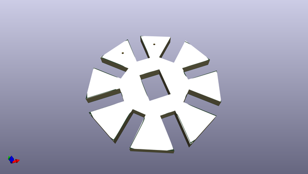
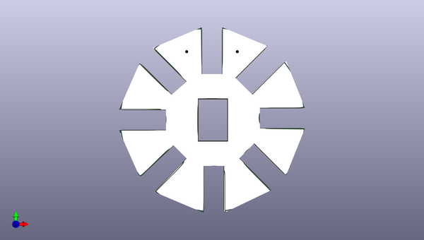
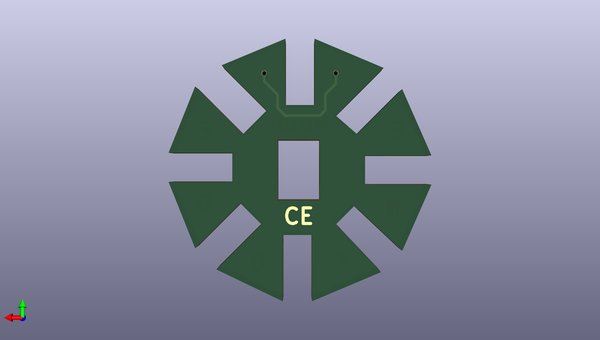

# gogogo
 
## summary 
* id: contextualelectronics_gogogo_motorencoderdisk
* user: contextualelectronics
* name: gogogo
* board: motorencoderdisk
* repo: https://github.com/ContextualElectronics/GoGoGo
* src_file_repo_kicad_pcb: MotorEncoderDisk/MotorEncoderDisk.kicad_pcb
* src_file_repo_kicad_pcb_link: https://github.com/ContextualElectronics/GoGoGo/tree/master/MotorEncoderDisk/MotorEncoderDisk.kicad_pcb

* src_file_repo_sch: MotorEncoderDisk/MotorEncoderDisk.sch
* src_file_repo_sch_link: https://github.com/ContextualElectronics/GoGoGo/tree/master/MotorEncoderDisk/MotorEncoderDisk.sch
* full details link: https://github.com/oomlout/oomlout_oomp_project_bot_v_2/tree/main/projects/contextualelectronics_gogogo_motorencoderdisk/current_version/working  

## schematic  
  
[schematic (pdf)](working_schematic.pdf)  

## pcb  
 
  
  
  
[board (pdf)](working.pdf)  

## working_bom
| Id | Designator | Footprint | Quantity | Designation | Supplier and ref |  | None | 
| --- | --- | --- | --- | --- | --- | --- | --- | 
| 1 | G*** | MED | 1 | LOGO |  |  | [''] | 

## bom_schematic
no data

