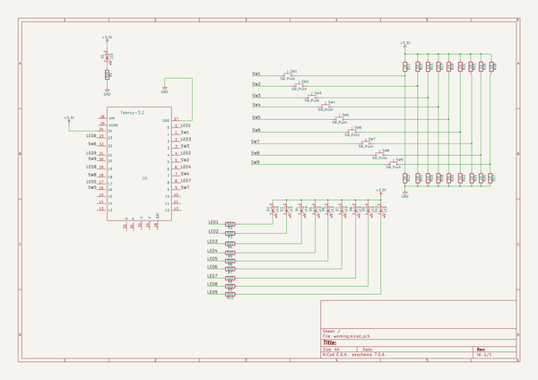
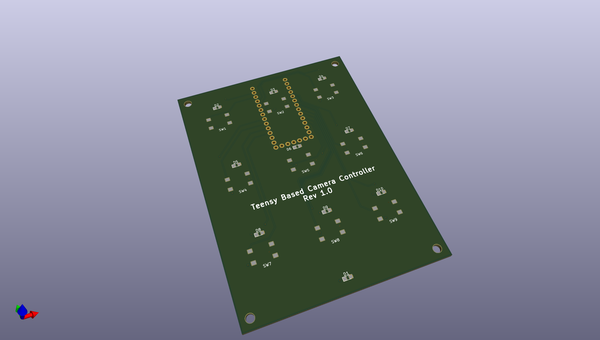
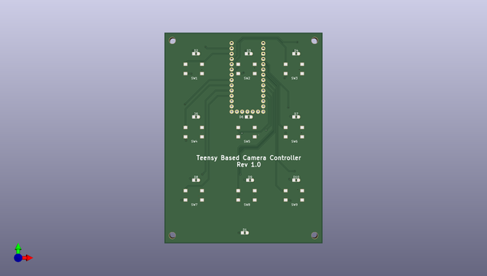
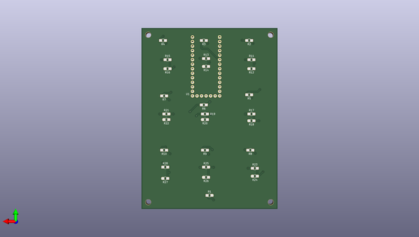

# keyboard_controller
 
## summary 
* id: contextualelectronics_keyboard_controller_keyboard_controller
* user: contextualelectronics
* name: keyboard_controller
* board: keyboard_controller
* repo: https://github.com/ContextualElectronics/Keyboard-Controller
* src_file_repo_kicad_pcb: Hardware/Keyboard Controller.kicad_pcb
* src_file_repo_kicad_pcb_link: https://github.com/ContextualElectronics/Keyboard-Controller/tree/master/Hardware/Keyboard Controller.kicad_pcb

* src_file_repo_sch: Hardware/Keyboard Controller.sch
* src_file_repo_sch_link: https://github.com/ContextualElectronics/Keyboard-Controller/tree/master/Hardware/Keyboard Controller.sch
* full details link: https://github.com/oomlout/oomlout_oomp_project_bot_v_2/tree/main/projects/contextualelectronics_keyboard_controller_keyboard_controller/current_version/working  

## schematic  
  
[schematic (pdf)](working_schematic.pdf)  

## pcb  
 
  
  
  
[board (pdf)](working.pdf)  

## working_bom
| Id | Designator | Footprint | Quantity | Designation | Supplier and ref |  | None | 
| --- | --- | --- | --- | --- | --- | --- | --- | 
| 1 | D1,D2,D3,D4,D5,D6,D7,D8,D9,D10 | LED_0805 | 10 | LED |  |  | [''] | 
| 2 | SW1,SW2,SW3,SW4,SW5,SW6,SW7,SW8,SW9 | PTS645SK43SMTR92 | 9 | SW_Push |  |  | [''] | 
| 3 | REF**,REF**,REF**,REF** | MountingHole_3mm | 4 | MountingHole_3mm |  |  | [''] | 
| 4 | R1,R2,R3,R4,R5,R6,R7,R8,R9,R10 | R_0805_HandSoldering | 10 | 500 |  |  | [''] | 
| 5 | R11,R12,R13,R14,R15,R16,R17,R18,R19,R20,R21,R22,R23,R24,R25,R26,R27,R28 | R_0805_HandSoldering | 18 | 1K |  |  | [''] | 
| 6 | U1 | Teensy-32 | 1 | Teensy-3.2 |  |  | [''] | 

## bom_schematic
| Ref | Qnty | Value | Cmp name | Footprint | Description | Vendor | DNP | 
| --- | --- | --- | --- | --- | --- | --- | --- | 
| D1, D2, D3, D4, D5, D6, D7, D8, D9, D10 | 10 | LED | LED | LEDs:LED_0805 |  |  |  | 
| R1, R2, R3, R4, R5, R6, R7, R8, R9, R10 | 10 | 500 | R | Resistors_SMD:R_0805_HandSoldering |  |  |  | 
| R11, R12, R13, R14, R15, R16, R17, R18, R19, R20, R21, R22, R23, R24, R25, R26, R27, R28 | 18 | 1K | R | Resistors_SMD:R_0805_HandSoldering |  |  |  | 
| SW1, SW2, SW3, SW4, SW5, SW6, SW7, SW8, SW9 | 9 | SW_Push | SW_Push | Key:PTS645SK43SMTR92 |  |  |  | 
| U1 | 1 | Teensy-3.2 | Teensy-3.2 | Key:Teensy-32 |  |  |  | 

## mounting_holes
| x | y | package | value | ref | size | 
| --- | --- | --- | --- | --- | --- | 
| 68.58 | 93.98 | MountingHole_3mm | MountingHole_3mm | REF** | m3 | 
| 0.0 | 93.98 | MountingHole_3mm | MountingHole_3mm | REF** | m3 | 
| 0.0 | 0.0 | MountingHole_3mm | MountingHole_3mm | REF** | m3 | 
| 68.58 | 0.0 | MountingHole_3mm | MountingHole_3mm | REF** | m3 | 

