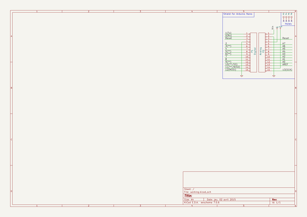

# kicad_library
 
## summary 
* id: contextualelectronics_kicad_library_arduino_nano
* user: contextualelectronics
* name: kicad_library
* board: arduino_nano
* repo: https://github.com/ContextualElectronics/kicad-library
* src_file_repo_kicad_pcb: template/Arduino_Nano/Arduino_Nano.kicad_pcb
* src_file_repo_kicad_pcb_link: https://github.com/ContextualElectronics/kicad-library/tree/master/template/Arduino_Nano/Arduino_Nano.kicad_pcb

* src_file_repo_sch: template/Arduino_Nano/Arduino_Nano.sch
* src_file_repo_sch_link: https://github.com/ContextualElectronics/kicad-library/tree/master/template/Arduino_Nano/Arduino_Nano.sch
* full details link: https://github.com/oomlout/oomlout_oomp_project_bot_v_2/tree/main/projects/contextualelectronics_kicad_library_arduino_nano/current_version/working  

## schematic  
  
[schematic (pdf)](working_schematic.pdf) 

## pcb  
 
  
  
  
[board (pdf)](working.pdf)  

## working_bom
| Id | Designator | Footprint | Quantity | Designation | Supplier and ref |  | None | 
| --- | --- | --- | --- | --- | --- | --- | --- | 
| 1 | P1 | Socket_Strip_Arduino_1x15 | 1 | Digital |  |  | [''] | 
| 2 | P2 | Socket_Strip_Arduino_1x15 | 1 | Analog |  |  | [''] | 
| 3 | P3,P4,P5,P6 | 1pin_Nano | 4 | CONN_1 |  |  | [''] | 

## bom_schematic
| Ref | Qnty | Value | Cmp name | Footprint | Description | Vendor | DNP | 
| --- | --- | --- | --- | --- | --- | --- | --- | 
| P1 | 1 | Digital | CONN_15 | Socket_Arduino_Nano:Socket_Strip_Arduino_1x15 |  |  |  | 
| P2 | 1 | Analog | CONN_15 | Socket_Arduino_Nano:Socket_Strip_Arduino_1x15 |  |  |  | 
| P3, P4, P5, P6 | 4 | CONN_1 | CONN_1 | Socket_Arduino_Nano:1pin_Nano |  |  |  | 

