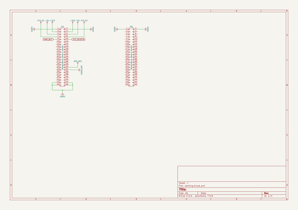

# kicad_library
 
## summary 
* id: contextualelectronics_kicad_library_beaglebone_black_cape
* user: contextualelectronics
* name: kicad_library
* board: beaglebone_black_cape
* repo: https://github.com/ContextualElectronics/kicad-library
* src_file_repo_kicad_pcb: template/BeagleBone-Black-Cape/BeagleBone-Black-Cape.kicad_pcb
* src_file_repo_kicad_pcb_link: https://github.com/ContextualElectronics/kicad-library/tree/master/template/BeagleBone-Black-Cape/BeagleBone-Black-Cape.kicad_pcb

* src_file_repo_sch: template/BeagleBone-Black-Cape/BeagleBone-Black-Cape.sch
* src_file_repo_sch_link: https://github.com/ContextualElectronics/kicad-library/tree/master/template/BeagleBone-Black-Cape/BeagleBone-Black-Cape.sch
* full details link: https://github.com/oomlout/oomlout_oomp_project_bot_v_2/tree/main/projects/contextualelectronics_kicad_library_beaglebone_black_cape/current_version/working  

## schematic  
  
[schematic (pdf)](working_schematic.pdf)  

## pcb  
 
  
  
  
[board (pdf)](working.pdf)  

## working_bom
| Id | Designator | Footprint | Quantity | Designation | Supplier and ref |  | None | 
| --- | --- | --- | --- | --- | --- | --- | --- | 
| 1 | P8,P9 | Socket_BeagleBone_Black | 2 | BeagleBone_Black_Header |  |  | [''] | 

## bom_schematic
| Ref | Qnty | Value | Cmp name | Footprint | Description | Vendor | DNP | 
| --- | --- | --- | --- | --- | --- | --- | --- | 
| P8, P9 | 2 | BeagleBone_Black_Header | BeagleBone_Black_Header | Socket_BeagleBone_Black:Socket_BeagleBone_Black |  |  |  | 

