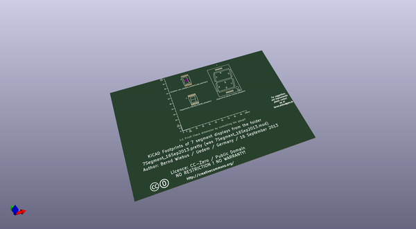
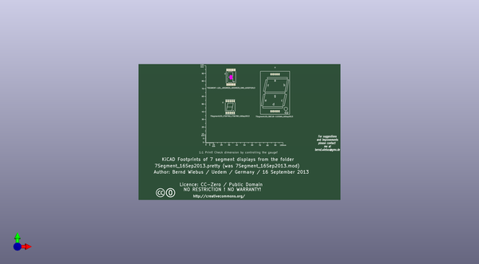
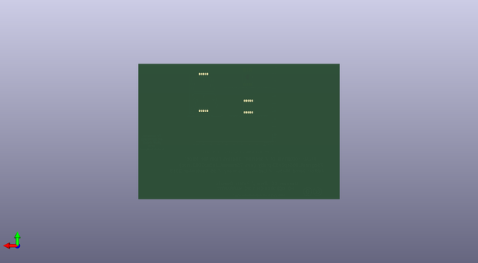

# kicad_library
 
## summary 
* id: contextualelectronics_kicad_library_connect2
* user: contextualelectronics
* name: kicad_library
* board: connect2
* repo: https://github.com/ContextualElectronics/kicad-library
* src_file_repo_kicad_pcb: modules/7Segment_16Sep2013.kicad_pcb
* src_file_repo_kicad_pcb_link: https://github.com/ContextualElectronics/kicad-library/tree/master/modules/7Segment_16Sep2013.kicad_pcb

* src_file_repo_sch: 
* src_file_repo_sch_link: https://github.com/ContextualElectronics/kicad-library/tree/master/
* full details link: https://github.com/oomlout/oomlout_oomp_project_bot_v_2/tree/main/projects/contextualelectronics_kicad_library_connect2/current_version/working  

## pcb  
 
  
  
  
[board (pdf)](working.pdf)  

## working_bom
| Id | Designator | Footprint | Quantity | Designation | Supplier and ref |  | None | 
| --- | --- | --- | --- | --- | --- | --- | --- | 
| 1 | MSC | Gauge_100mm_Type2_SilkScreenTop_RevA_Date22Jun2010 | 1 | Gauge_100mm_Type2_SilkScreenTop_RevA_Date22Jun2010 |  |  | [''] | 
| 2 | Sym | Symbol_CreativeCommons_SilkScreenTop_Type2_Big | 1 | Symbol_CreativeCommons_Typ2_SilkScreenTop_Big |  |  | [''] | 
| 3 | Sym | Symbol_CC-PublicDomain_SilkScreenTop_Big | 1 | Symbol_CC-PublicDomain_SilkScreenTop_Big |  |  | [''] | 
| 4 | U | 7SegmentLED_LTS6760_LTS6780_16Sep2013 | 1 | 7SegmentLED_LTS6760_LTS6780_16Sep2013 |  |  | [''] | 
| 5 | U | 7SegmentLED_SBC18-11EGWA_16Sep2013 | 1 | 7SegmentLED_SBC18-11EGWA_16Sep2013 |  |  | [''] | 
| 6 | U | 7SEGMENT-LED__HDSM531_HDSM533_SMD_16SEP2013 | 1 | 7SEGMENT-LED__HDSM531_HDSM533_SMD_16SEP2013 |  |  | [''] | 

