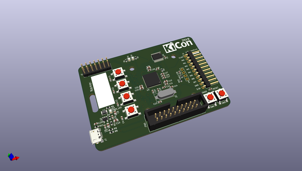
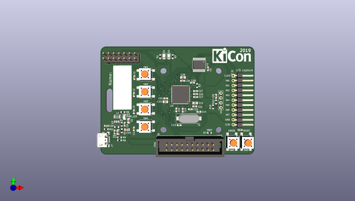
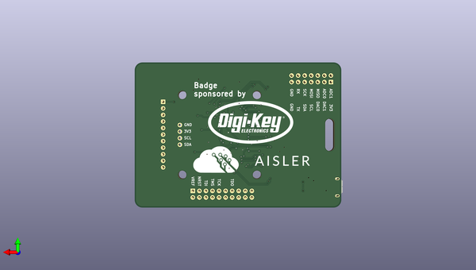

# kicon19_badge_hw
 
## summary 
* id: contextualelectronics_kicon19_badge_hw_kicon19_badge
* user: contextualelectronics
* name: kicon19_badge_hw
* board: kicon19_badge
* repo: https://github.com/ContextualElectronics/kicon19-badge-hw
* src_file_repo_kicad_pcb: kicon19-badge.kicad_pcb
* src_file_repo_kicad_pcb_link: https://github.com/ContextualElectronics/kicon19-badge-hw/tree/master/kicon19-badge.kicad_pcb

* src_file_repo_sch: kicon19-badge.sch
* src_file_repo_sch_link: https://github.com/ContextualElectronics/kicon19-badge-hw/tree/master/kicon19-badge.sch
* full details link: https://github.com/oomlout/oomlout_oomp_project_bot_v_2/tree/main/projects/contextualelectronics_kicon19_badge_hw_kicon19_badge/current_version/working  

## schematic  
  
[schematic (pdf)](working_schematic.pdf) 

## pcb  
 
  
  
  
[board (pdf)](working.pdf)  

## working_bom
| Id | Designator | Footprint | Quantity | Designation | Supplier and ref |  | None | 
| --- | --- | --- | --- | --- | --- | --- | --- | 
| 1 | J6 | IDC-Header_2x10_P2.54mm_Vertical | 1 | Conn_ARM_JTAG_SWD_20 |  |  | [''] | 
| 2 | C5,C6,C11,C17,C19,C21,C22,C23,C24,C25,C27,C16,C26,C4,C3,C2,C18,C1 | C_0603_1608Metric | 18 | 100n |  |  | [''] | 
| 3 | C7,C9,C10 | C_0805_2012Metric | 3 | 22u/6.3V |  |  | [''] | 
| 4 | C8,C13,C14 | C_0603_1608Metric | 3 | 22p |  |  | [''] | 
| 5 | C12,C15,C28 | C_0805_2012Metric | 3 | 4.7u |  |  | [''] | 
| 6 | C20 | C_0603_1608Metric | 1 | 1n |  |  | [''] | 
| 7 | D1,D2,D3 | LED_0805_2012Metric | 3 | LED |  |  | [''] | 
| 8 | H1 | ClipHole | 1 | Clip |  |  | [''] | 
| 9 | J7 | 10118193-0001LF | 1 | USB_B_Micro |  |  | [''] | 
| 10 | L1 | L_1007_2518Metric | 1 | 2.2u |  |  | [''] | 
| 11 | R1,R2,R6 | R_0603_1608Metric | 3 | 120 |  |  | [''] | 
| 12 | R3,R8,R9 | R_0603_1608Metric | 3 | 22 |  |  | [''] | 
| 13 | R4 | R_0603_1608Metric | 1 | 300k |  |  | [''] | 
| 14 | R5 | R_0603_1608Metric | 1 | 68k |  |  | [''] | 
| 15 | R11 | R_0603_1608Metric | 1 | 1M |  |  | [''] | 
| 16 | SW5 | SW_SPST_PTS645 | 1 | Reset |  |  | [''] | 
| 17 | U2 | TSOT-23-5 | 1 | AP3429A |  |  | [''] | 
| 18 | U3 | QFN-64-1EP_9x9mm_P0.5mm_EP7.25x7.25mm | 1 | ATSAM4SD16BA-MU |  |  | [''] | 
| 19 | Y1 | Crystal_SMD_HC49-SD | 1 | 12M |  |  | [''] | 
| 20 | J1 | PinHeader_1x11_P2.54mm_Horizontal | 1 | LogicProbes |  |  | [''] | 
| 21 | U1 | TSSOP-20_4.4x6.5mm_P0.65mm | 1 | 74LCX244MTC |  |  | [''] | 
| 22 | SW2 | SW_SPST_PTS645 | 1 | BTN2 |  |  | [''] | 
| 23 | SW1 | SW_SPST_PTS645 | 1 | BTN1 |  |  | [''] | 
| 24 | SW3 | SW_SPST_PTS645 | 1 | BTN3 |  |  | [''] | 
| 25 | J2 | PinHeader_2x07_P2.54mm_Vertical | 1 | Ports |  |  | [''] | 
| 26 | R7 | R_0603_1608Metric | 1 | DNF_22 |  |  | [''] | 
| 27 | SW6 | SW_SPST_PTS645 | 1 | Erase |  |  | [''] | 
| 28 | U4 | OLED_SSD1306 | 1 | OLED_SSD1306 |  |  | [''] | 
| 29 | SW4 | SW_SPST_PTS645 | 1 | BTN4 |  |  | [''] | 
| 30 | R10,R12 | R_0603_1608Metric | 2 | 1k5 |  |  | [''] | 
| 31 | G*** | Aisler_Logo_Large | 1 | LOGO |  |  | [''] | 
| 32 | G*** | DigiKey_Logo_Large | 1 | LOGO |  |  | [''] | 

## bom_schematic
| Ref | Qnty | Value | Cmp name | Footprint | Description | Vendor | DNP | 
| --- | --- | --- | --- | --- | --- | --- | --- | 
| C1, C2, C3, C4, C5, C6, C11, C16, C17, C18, C19, C21, C22, C23, C24, C25, C26, C27 | 18 | 100n | C | Capacitor_SMD:C_0603_1608Metric | Unpolarized capacitor |  |  | 
| C7, C9, C10 | 3 | 22u/6.3V | C | Capacitor_SMD:C_0805_2012Metric | Unpolarized capacitor |  |  | 
| C8, C13, C14 | 3 | 22p | C | Capacitor_SMD:C_0603_1608Metric | Unpolarized capacitor |  |  | 
| C12, C15, C28 | 3 | 4.7u | C | Capacitor_SMD:C_0805_2012Metric | Unpolarized capacitor |  |  | 
| C20 | 1 | 1n | C | Capacitor_SMD:C_0603_1608Metric | Unpolarized capacitor |  |  | 
| D1, D2, D3 | 3 | LED | LED | LED_SMD:LED_0805_2012Metric | Light emitting diode |  |  | 
| H1 | 1 | Clip | MountingHole | kicon_badge:ClipHole | Mounting Hole without connection |  |  | 
| J1 | 1 | LogicProbes | Conn_01x11 | Connector_PinHeader_2.54mm:PinHeader_1x11_P2.54mm_Horizontal | Generic connector, single row, 01x11, script generated (kicad-library-utils/schlib/autogen/connector/) |  |  | 
| J2 | 1 | Ports | Conn_02x07_Odd_Even | Connector_PinHeader_2.54mm:PinHeader_2x07_P2.54mm_Vertical | Generic connector, double row, 02x07, odd/even pin numbering scheme (row 1 odd numbers, row 2 even numbers), script generated (kicad-library-utils/schlib/autogen/connector/) |  |  | 
| J6 | 1 | Conn_ARM_JTAG_SWD_20 | Conn_ARM_JTAG_SWD_20 | Connector_IDC:IDC-Header_2x10_P2.54mm_Vertical | Standard IDC20 Pinheader Connector, ARM legacy JTAG and SWD interface |  |  | 
| J7 | 1 | USB_B_Micro | USB_B_Micro-Connector | kicon_badge:10118193-0001LF |  |  |  | 
| L1 | 1 | 2.2u | L | Inductor_SMD:L_1007_2518Metric | Inductor |  |  | 
| R1, R2, R6 | 3 | 120 | R | Resistor_SMD:R_0603_1608Metric | Resistor |  |  | 
| R3, R8, R9 | 3 | 22 | R | Resistor_SMD:R_0603_1608Metric | Resistor |  |  | 
| R4 | 1 | 300k | R | Resistor_SMD:R_0603_1608Metric | Resistor |  |  | 
| R5 | 1 | 68k | R | Resistor_SMD:R_0603_1608Metric | Resistor |  |  | 
| R7 | 1 | DNF_22 | R | Resistor_SMD:R_0603_1608Metric | Resistor |  |  | 
| R10, R12 | 2 | 1k5 | R | Resistor_SMD:R_0603_1608Metric | Resistor |  |  | 
| R11 | 1 | 1M | R | Resistor_SMD:R_0603_1608Metric | Resistor |  |  | 
| SW1 | 1 | BTN1 | SW_Push | Button_Switch_SMD:SW_SPST_PTS645 | Push button switch, generic, two pins |  |  | 
| SW2 | 1 | BTN2 | SW_Push | Button_Switch_SMD:SW_SPST_PTS645 | Push button switch, generic, two pins |  |  | 
| SW3 | 1 | BTN3 | SW_Push | Button_Switch_SMD:SW_SPST_PTS645 | Push button switch, generic, two pins |  |  | 
| SW4 | 1 | BTN4 | SW_Push | Button_Switch_SMD:SW_SPST_PTS645 | Push button switch, generic, two pins |  |  | 
| SW5 | 1 | Reset | SW_Push | Button_Switch_SMD:SW_SPST_PTS645 | Push button switch, generic, two pins |  |  | 
| SW6 | 1 | Erase | SW_Push | Button_Switch_SMD:SW_SPST_PTS645 | Push button switch, generic, two pins |  |  | 
| U1 | 1 | 74LCX244MTC | 74HC244-74xx | Package_SO:TSSOP-20_4.4x6.5mm_P0.65mm |  |  |  | 
| U2 | 1 | AP3429A | AP3429A | Package_TO_SOT_SMD:TSOT-23-5 | DC/DC converter; Uin: 2.7-5.5V; Uout: 0.6-5.5V; buck |  |  | 
| U3 | 1 | ATSAM4SD16BA-MU | ATSAM4SD16BA-MU | Package_DFN_QFN:QFN-64-1EP_9x9mm_P0.5mm_EP7.25x7.25mm |  |  |  | 
| U4 | 1 | OLED_SSD1306 | OLED_SSD1306 | kicon_badge:OLED_SSD1306 |  |  |  | 
| Y1 | 1 | 12M | Crystal | Crystal:Crystal_SMD_HC49-SD | Two pin crystal |  |  | 

