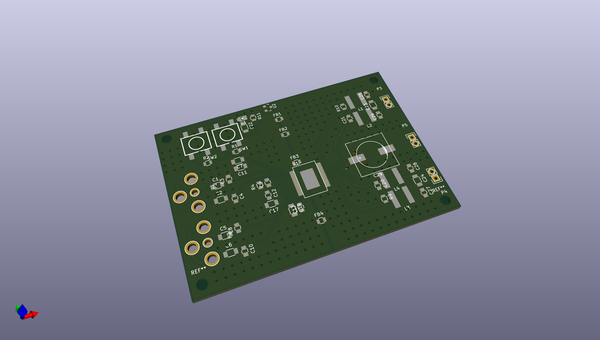
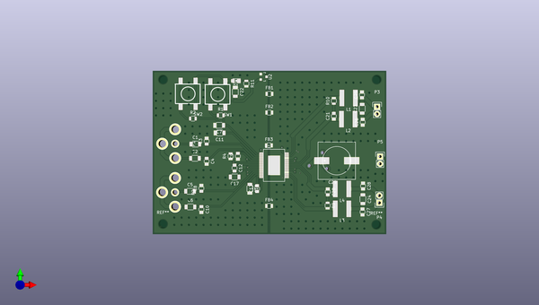
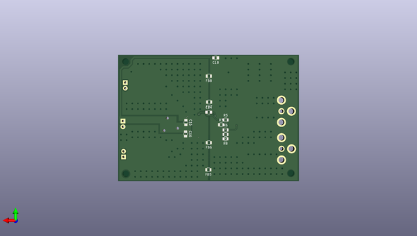

# loudmouth
 
## summary 
* id: contextualelectronics_loudmouth_classd
* user: contextualelectronics
* name: loudmouth
* board: classd
* repo: https://github.com/ContextualElectronics/LoudMouth
* src_file_repo_kicad_pcb: ClassD/hw/ClassD.kicad_pcb
* src_file_repo_kicad_pcb_link: https://github.com/ContextualElectronics/LoudMouth/tree/master/ClassD/hw/ClassD.kicad_pcb

* src_file_repo_sch: ClassD/hw/ClassD.sch
* src_file_repo_sch_link: https://github.com/ContextualElectronics/LoudMouth/tree/master/ClassD/hw/ClassD.sch
* full details link: https://github.com/oomlout/oomlout_oomp_project_bot_v_2/tree/main/projects/contextualelectronics_loudmouth_classd/current_version/working  

## schematic  
  
[schematic (pdf)](working_schematic.pdf) 

## pcb  
 
  
  
  
[board (pdf)](working.pdf)  

## working_bom
| Id | Designator | Footprint | Quantity | Designation | Supplier and ref |  | None | 
| --- | --- | --- | --- | --- | --- | --- | --- | 
| 1 | REF**,REF**,REF**,REF** | MountingHole_3mm | 4 | MountingHole_3mm |  |  | [''] | 
| 2 | C1,C2,C5,C6,C23,C24 | C_1206 | 6 | 470N |  |  | [''] | 
| 3 | C3,C4,C8,C10 | C_0805 | 4 | 1N |  |  | [''] | 
| 4 | C7,C11,C17,C19,C22 | C_1206 | 5 | 2.2U |  |  | [''] | 
| 5 | C9,C12,C13,C25,C26,C27,C28,C14,C15,C16,C18 | C_0805 | 11 | 100N |  |  | [''] | 
| 6 | C20,C21 | C_0805 | 2 | 330P |  |  | [''] | 
| 7 | C29 | c_elec_13.6x13.6 | 1 | 1000U |  |  | [''] | 
| 8 | L1,L2,L3,L4 | NRS6045T150MMGK | 4 | 15U |  |  | [''] | 
| 9 | P1 | RCJ1x | 1 | RedRCA |  |  | [''] | 
| 10 | P2 | RCJ1x | 1 | WhiteRCA |  |  | [''] | 
| 11 | P3,P4,P5 | Pin_Header_Straight_1x02 | 3 | CONN_01X02 |  |  | [''] | 
| 12 | R1,R2 | R_0805 | 2 | 33K |  |  | [''] | 
| 13 | R4 | R_0805 | 1 | 39K |  |  | [''] | 
| 14 | R9,R10,R5 | R_0805 | 3 | 22 |  |  | [''] | 
| 15 | SW1,SW2 | FSM2JSMAA-ND | 2 | SW_PUSH |  |  | [''] | 
| 16 | U1 | PowerSSO36-EPD | 1 | TDA7491LP |  |  | [''] | 
| 17 | U2 | SOT-23 | 1 | MCP1700T |  |  | [''] | 
| 18 | D1 | LED_0805 | 1 | LED |  |  | [''] | 
| 19 | R11 | R_0805 | 1 | 499 |  |  | [''] | 
| 20 | FB1,FB2,FB3,FB4,FB5,FB6,FB7,FB8 | R_0805 | 8 | Ferrite |  |  | [''] | 
| 21 | REF**11111111,REF**11111121,REF**11111131,REF**11111141,REF**11111151,REF**11111161,REF**11111171,REF**11111181,REF**11111112,REF**11111122,REF**11111132,REF**11111142,REF**11111152,REF**11111162,REF**11111172,REF**11111182,REF**11111192,REF**111111102,REF**111111112,REF**111111122,REF**111111132,REF**111111111,REF**111111121,REF**111111131,REF**111111141,REF**111111151,REF**111111161,REF**111111171,REF**111111112,REF**111111122,REF**111111132,REF**111111142,REF**111111152,REF**111111162,REF**11111121,REF**11111111,REF**111111111,REF**111111121,REF**111111131,REF**11111131,REF**11111141,REF**111111141,REF**111111152,REF**111111121,REF**11111122,REF**111111111,REF**11111112,REF**111111121,REF**11111122,REF**11111112,REF**111111121,REF**11111122,REF**111111111,REF**11111112,REF**111111121,REF**11111122,REF**111111111,REF**11111112,REF**111111121,REF**11111122,REF**111111111,REF**11111112,REF**111111121,REF**11111122,REF**111111111,REF**11111112,REF**11111122,REF**111111121,REF**111111121,REF**11111122,REF**11111122,REF**111111121,REF**111111121,REF**11111122,REF**11111122,REF**111111121,REF**11111122,REF**111111121,REF**11111122,REF**111111121,REF**111111121,REF**111111121,REF**111111121,REF**111111121,REF**111111121,REF**111111121,REF**111111121,REF**111111121,REF**111111121,REF**111111121,REF**111111121,REF**111111121,REF**111111121,REF**111111121,REF**111111121,REF**111111121,REF**111111121,REF**111111121,REF**11111122,REF**11111122,REF**111111121,REF**11111122,REF**11111122,REF**111111121,REF**111111121,REF**111111121,REF**11111122,REF**11111122,REF**111111121,REF**11111122,REF**11111122,REF**111111121,REF**111111121,REF**111111121,REF**11111122,REF**11111122,REF**111111121,REF**11111122,REF**11111122,REF**11111122,REF**11111122,REF**11111122,REF**11111122,REF**11111122,REF**11111122,REF**11111122,REF**11111122,REF**11111122,REF**11111122,REF**11111122,REF**11111122,REF**11111122,REF**11111122,REF**11111122,REF**11111122,REF**11111111,REF**11111111,REF**11111111,REF**11111111,REF**11111111,REF**11111111,REF**11111111,REF**11111111,REF**11111111,REF**11111111,REF**11111111,REF**11111111,REF**11111111,REF**11111111,REF**11111111,REF**11111111,REF**11111111,REF**11111111,REF**11111111,REF**11111111,REF**11111111,REF**11111111,REF**11111111,REF**11111111,REF**11111111,REF**11111111,REF**11111111,REF**11111111,REF**11111111,REF**11111111,REF**11111111,REF**11111111,REF**11111111,REF**11111111,REF**11111111,REF**11111111,REF**11111111,REF**11111111,REF**11111111,REF**11111111,REF**11111111,REF**11111111,REF**11111111,REF**11111111,REF**11111111,REF**11111111,REF**11111111,REF**11111111,REF**11111111,REF**11111111,REF**11111111,REF**11111111,REF**11111111,REF**11111111,REF**11111111,REF**11111111,REF**11111111,REF**11111111,REF**11111111,REF**11111111,REF**11111111,REF**11111111,REF**11111111,REF**11111111,REF**11111111,REF**11111111,REF**11111111,REF**11111111,REF**11111111,REF**11111111,REF**11111111,REF**11111111,REF**11111111,REF**11111111,REF**11111111,REF**11111111,REF**11111111,REF**11111111,REF**11111111,REF**11111111,REF**11111111,REF**11111111,REF**11111111,REF**11111111,REF**11111111,REF**11111111,REF**11111111,REF**11111111,REF**11111111,REF**11111111,REF**11111111,REF**11111111,REF**11111111,REF**11111111,REF**11111111,REF**11111111,REF**11111111,REF**11111111,REF**11111111,REF**11111111,REF**11111111,REF**11111111,REF**11111111,REF**11111111,REF**11111111,REF**11111111,REF**11111111,REF**11111111,REF**11111111 | STITCH-VIA | 244 | STITCH-VIA |  |  | [''] | 
| 22 | R3 | R_0805 | 1 | NOPE |  |  | [''] | 
| 23 | R6 | R_0805 | 1 | 100K |  |  | [''] | 
| 24 | R7,R8 | R_0805 | 2 | 0 |  |  | [''] | 

## bom_schematic
| Ref | Qnty | Value | Cmp name | Footprint | Description | Vendor | DNP | 
| --- | --- | --- | --- | --- | --- | --- | --- | 
| C1 | 1 | 470N | C | Capacitors_SMD:C_1206_HandSoldering |  |  |  | 
| C2, C5, C6, C23, C24 | 5 | 470N | C | Capacitors_SMD:C_1206 |  |  |  | 
| C3, C4, C8, C10 | 4 | 1N | C | Capacitors_SMD:C_0805 |  |  |  | 
| C7, C11, C17, C19, C22 | 5 | 2.2U | C | Capacitors_SMD:C_1206 |  |  |  | 
| C9, C12, C13, C14, C15, C16, C18, C25, C26, C27, C28 | 11 | 100N | C | Capacitors_SMD:C_0805 |  |  |  | 
| C20, C21 | 2 | 330P | C | Capacitors_SMD:C_0805 |  |  |  | 
| C29, C30 | 2 | 1000U | CP | ClassD:c_elec_13.6x13.6 |  |  |  | 
| D1 | 1 | LED | LED | LEDs:LED_0805 |  |  |  | 
| FB1, FB2, FB3, FB4, FB5, FB6, FB7, FB8 | 8 | Ferrite | INDUCTOR_SMALL | Resistors_SMD:R_0805 |  |  |  | 
| L1, L2, L3, L4 | 4 | 15U | INDUCTOR-POL | ClassD:NRS6045T150MMGK |  |  |  | 
| P1 | 1 | RedRCA | CONN_01X02 | ClassD:RCJ1x |  |  |  | 
| P2 | 1 | WhiteRCA | CONN_01X02 | ClassD:RCJ1x |  |  |  | 
| P3, P4, P5 | 3 | CONN_01X02 | CONN_01X02 | Pin_Headers:Pin_Header_Straight_1x02 |  |  |  | 
| R1, R2 | 2 | 33K | R | Resistors_SMD:R_0805 |  |  |  | 
| R3 | 1 | NOPE | R | Resistors_SMD:R_0805 |  |  |  | 
| R4 | 1 | 39K | R | Resistors_SMD:R_0805 |  |  |  | 
| R5, R9, R10 | 3 | 22 | R | Resistors_SMD:R_0805 |  |  |  | 
| R6 | 1 | 100K | R | Resistors_SMD:R_0805 |  |  |  | 
| R7, R8 | 2 | 0 | R | Resistors_SMD:R_0805 |  |  |  | 
| R11 | 1 | 499 | R | Resistors_SMD:R_0805 |  |  |  | 
| SW1, SW2 | 2 | SW_PUSH | SW_PUSH | ClassD:FSM2JSMAA-ND |  |  |  | 
| U1 | 1 | TDA7491LP | TDA7491LP | ClassD:PowerSSO36-EPD |  |  |  | 
| U2 | 1 | MCP1700T | MCP1700T | TO_SOT_Packages_SMD:SOT-23 |  |  |  | 

## mounting_holes
| x | y | package | value | ref | size | 
| --- | --- | --- | --- | --- | --- | 
| 0.0 | 0.25 | MountingHole_3mm | MountingHole_3mm | REF** | m3 | 
| 0.0 | 50.55 | MountingHole_3mm | MountingHole_3mm | REF** | m3 | 
| 74.3 | 50.55 | MountingHole_3mm | MountingHole_3mm | REF** | m3 | 
| 74.17 | 0.0 | MountingHole_3mm | MountingHole_3mm | REF** | m3 | 

