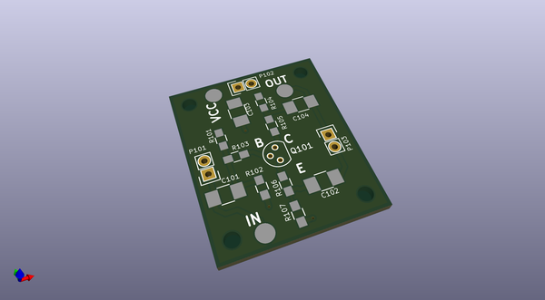
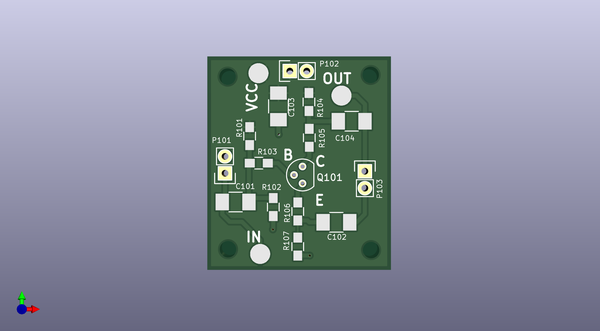

# loudmouth
 
## summary 
* id: contextualelectronics_loudmouth_loudmouth
* user: contextualelectronics
* name: loudmouth
* board: loudmouth
* repo: https://github.com/ContextualElectronics/LoudMouth
* src_file_repo_kicad_pcb: ClassA/LoudMouth.kicad_pcb
* src_file_repo_kicad_pcb_link: https://github.com/ContextualElectronics/LoudMouth/tree/master/ClassA/LoudMouth.kicad_pcb

* src_file_repo_sch: ClassA/LoudMouth.sch
* src_file_repo_sch_link: https://github.com/ContextualElectronics/LoudMouth/tree/master/ClassA/LoudMouth.sch
* full details link: https://github.com/oomlout/oomlout_oomp_project_bot_v_2/tree/main/projects/contextualelectronics_loudmouth_loudmouth/current_version/working  

## schematic  
  
[schematic (pdf)](working_schematic.pdf) 

## pcb  
 
  
  
  
[board (pdf)](working.pdf)  

## working_bom
| Id | Designator | Footprint | Quantity | Designation | Supplier and ref |  | None | 
| --- | --- | --- | --- | --- | --- | --- | --- | 
| 1 | C101,C102,C103,C104 | C_1210_HandSoldering | 4 | C |  |  | [''] | 
| 2 | P101,P102,P103 | Pin_Header_Straight_1x02 | 3 | CONN_01X02 |  |  | [''] | 
| 3 | R101,R102,R104,R107 | R_0805_HandSoldering | 4 | R |  |  | [''] | 
| 4 | R103,R105,R106 | R_0805_HandSoldering | 3 | 0 |  |  | [''] | 
| 5 | TP101,TP102,TP103 | Measurement_Point_Round-SMD-Pad_Big | 3 | CONN_01X01 |  |  | [''] | 
| 6 | Q101 | TO-92_Molded_Narrow | 1 | Q_NPN_EBC |  |  | [''] | 
| 7 | REF**,REF**,REF**,REF** | MountingHole_2-5mm | 4 | MountingHole_2-5mm |  |  | [''] | 

## bom_schematic
| Ref | Qnty | Value | Cmp name | Footprint | Description | Vendor | DNP | 
| --- | --- | --- | --- | --- | --- | --- | --- | 
| C101, C102, C103, C104 | 4 | C | C | Capacitors_SMD:C_1210_HandSoldering |  |  |  | 
| P101, P102, P103 | 3 | CONN_01X02 | CONN_01X02 | Pin_Headers:Pin_Header_Straight_1x02 |  |  |  | 
| Q101 | 1 | Q_NPN_EBC | Q_NPN_EBC | Housings_TO-92:TO-92_Molded_Narrow |  |  |  | 
| R101, R102, R104, R107 | 4 | R | R | Resistors_SMD:R_0805_HandSoldering |  |  |  | 
| R103, R105, R106 | 3 | 0 | R | Resistors_SMD:R_0805_HandSoldering |  |  |  | 
| TP101, TP102, TP103 | 3 | CONN_01X01 | CONN_01X01 | Measurement_Points:Measurement_Point_Round-SMD-Pad_Big |  |  |  | 

## mounting_holes
| x | y | package | value | ref | size | 
| --- | --- | --- | --- | --- | --- | 
| 21.46 | 26.35 | MountingHole_2-5mm | MountingHole_2-5mm | REF** | m3 | 
| 0.0 | 26.1 | MountingHole_2-5mm | MountingHole_2-5mm | REF** | m3 | 
| 0.06 | 0.13 | MountingHole_2-5mm | MountingHole_2-5mm | REF** | m3 | 
| 21.53 | 0.0 | MountingHole_2-5mm | MountingHole_2-5mm | REF** | m3 | 

