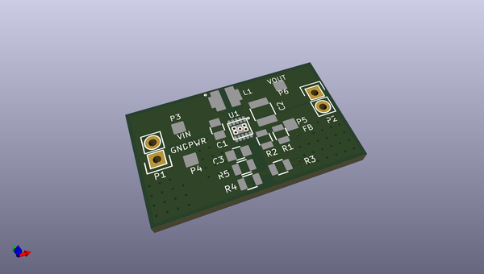
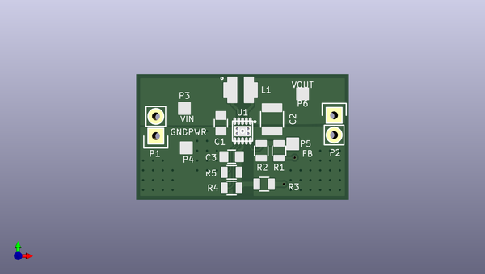
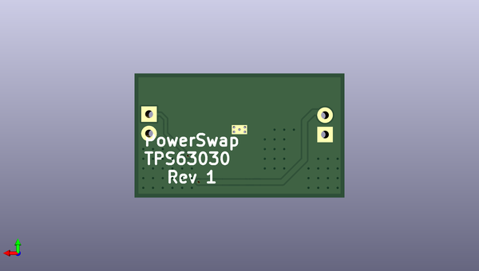

# powerswap
 
## summary 
* id: contextualelectronics_powerswap_powerswap
* user: contextualelectronics
* name: powerswap
* board: powerswap
* repo: https://github.com/ContextualElectronics/PowerSwap
* src_file_repo_kicad_pcb: buck-boost/PowerSwap.kicad_pcb
* src_file_repo_kicad_pcb_link: https://github.com/ContextualElectronics/PowerSwap/tree/master/buck-boost/PowerSwap.kicad_pcb

* src_file_repo_brd: boost/Eagle/2015-10-22_20-31-01.brd
* src_file_repo_brd_link: https://github.com/ContextualElectronics/PowerSwap/tree/master/boost/Eagle/2015-10-22_20-31-01.brd
* src_file_repo_sch: buck-boost/PowerSwap.sch
* src_file_repo_sch_link: https://github.com/ContextualElectronics/PowerSwap/tree/master/buck-boost/PowerSwap.sch
* full details link: https://github.com/oomlout/oomlout_oomp_project_bot_v_2/tree/main/projects/contextualelectronics_powerswap_powerswap/current_version/working  

## schematic  
  
[schematic (pdf)](working_schematic.pdf)  

## pcb  
 
  
  
  
[board (pdf)](working.pdf)  

## working_bom
| Id | Designator | Footprint | Quantity | Designation | Supplier and ref |  | None | 
| --- | --- | --- | --- | --- | --- | --- | --- | 
| 1 | C1 | C_0805 | 1 | 4.7UF |  |  | [''] | 
| 2 | C2 | C_1210 | 1 | 22UF |  |  | [''] | 
| 3 | C3 | C_0805 | 1 | 0.1UF |  |  | [''] | 
| 4 | L1 | LQH3NPN2R2MM0L | 1 | 2.2uH |  |  | [''] | 
| 5 | P1,P2 | Pin_Header_Straight_1x02 | 2 | CONN_01X02 |  |  | [''] | 
| 6 | P3,P4,P5,P6 | Measurement_Point_Square-SMD-Pad_Small | 4 | TST |  |  | [''] | 
| 7 | R1 | R_0805 | 1 | 1.2M |  |  | [''] | 
| 8 | R2 | R_0805 | 1 | 215K |  |  | [''] | 
| 9 | R3,R4,R5 | R_0805 | 3 | 0 |  |  | [''] | 
| 10 | U1 | TPS63030 | 1 | TPS63030 |  |  | [''] | 
| 11 | G*** | PS_Logo | 1 | LOGO |  |  | [''] | 
| 12 | REF**1111,REF**1121,REF**1131,REF**1141,REF**1151,REF**1161,REF**1112,REF**1122,REF**1132,REF**1142,REF**1152,REF**1162,REF**1113,REF**1123,REF**1133,REF**1143,REF**1153,REF**1163,REF**1131,REF**1131,REF**1131,REF**1131,REF**1131,REF**1131,REF**1131,REF**111111,REF**111121,REF**111131,REF**111141,REF**111112,REF**111122,REF**111132,REF**111142,REF**111113,REF**111123,REF**111133,REF**111143,REF**111111,REF**111111,REF**111111,REF**111111,REF**111111,REF**111111,REF**11111111,REF**11111121,REF**11111131,REF**11111112,REF**11111122,REF**11111132,REF**11111113,REF**11111123,REF**11111133,REF**11111114,REF**11111124,REF**11111134 | VIA-0.6mm | 55 | VIA-0.6mm |  |  | [''] | 

