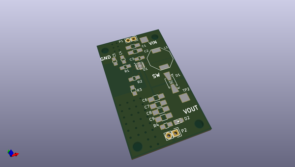
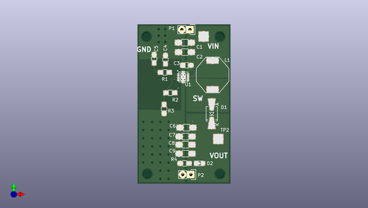
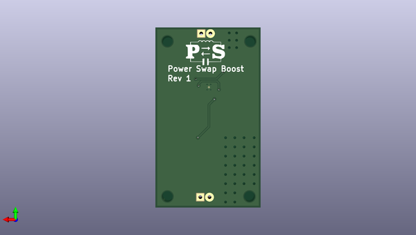

# powerswap
 
## summary 
* id: contextualelectronics_powerswap_referencecircuit
* user: contextualelectronics
* name: powerswap
* board: referencecircuit
* repo: https://github.com/ContextualElectronics/PowerSwap
* src_file_repo_kicad_pcb: boost/Boost.kicad_pcb
* src_file_repo_kicad_pcb_link: https://github.com/ContextualElectronics/PowerSwap/tree/master/boost/Boost.kicad_pcb

* src_file_repo_brd: boost/Eagle/2015-10-22_20-31-01.brd
* src_file_repo_brd_link: https://github.com/ContextualElectronics/PowerSwap/tree/master/boost/Eagle/2015-10-22_20-31-01.brd
* src_file_repo_sch: boost/Boost.sch
* src_file_repo_sch_link: https://github.com/ContextualElectronics/PowerSwap/tree/master/boost/Boost.sch
* full details link: https://github.com/oomlout/oomlout_oomp_project_bot_v_2/tree/main/projects/contextualelectronics_powerswap_referencecircuit/current_version/working  

## schematic  
  
[schematic (pdf)](working_schematic.pdf)  

## pcb  
 
  
  
  
[board (pdf)](working.pdf)  

## working_bom
| Id | Designator | Footprint | Quantity | Designation | Supplier and ref |  | None | 
| --- | --- | --- | --- | --- | --- | --- | --- | 
| 1 | C1,C2,C6,C7,C8,C9 | C_1206_HandSoldering | 6 | 10U |  |  | [''] | 
| 2 | C3 | C_0805_HandSoldering | 1 | 1U |  |  | [''] | 
| 3 | C4 | C_0805_HandSoldering | 1 | 100nF |  |  | [''] | 
| 4 | C5 | C_0805_HandSoldering | 1 | 820pF |  |  | [''] | 
| 5 | D1 | SMA-SMB_Universal_Handsoldering | 1 | B340LA-13-F |  |  | [''] | 
| 6 | L1 | SRU1048 | 1 | SRU1048 |  |  | [''] | 
| 7 | P1,P2 | Pin_Header_Straight_1x02 | 2 | CONN_01X02 |  |  | [''] | 
| 8 | R1 | R_0805_HandSoldering | 1 | 57K6 |  |  | [''] | 
| 9 | R2 | R_0805_HandSoldering | 1 | 150K |  |  | [''] | 
| 10 | R3 | R_0805_HandSoldering | 1 | 39K |  |  | [''] | 
| 11 | TP1,TP2 | Measurement_Point_Square-SMD-Pad_Big | 2 | CONN_01X01 |  |  | [''] | 
| 12 | U1 | TPS61087 | 1 | TPS61087 |  |  | [''] | 
| 13 | REF**111121,REF**111131,REF**111122,REF**111132,REF**111123,REF**111133,REF**1111111,REF**1111121,REF**1111131,REF**1111112,REF**1111122,REF**1111132,REF**1111113,REF**1111123,REF**1111133,REF**1111114,REF**1111124,REF**1111134,REF**1111115,REF**1111125,REF**1111135,REF**1111116,REF**1111126,REF**1111136,REF**1111127,REF**1111137,REF**1111128,REF**1111138,REF**1111111,REF**1111113,REF**1111112,REF**1111116,REF**1111115,REF**1111114 | STITCH-VIA | 34 | STITCH-VIA |  |  | [''] | 
| 14 | REF**,REF**,REF**,REF** | MountingHole_3mm | 4 | MountingHole_3mm |  |  | [''] | 
| 15 | D2 | LED-0805 | 1 | LED |  |  | [''] | 
| 16 | R4 | R_0805_HandSoldering | 1 | 500 |  |  | [''] | 
| 17 | G*** | PS | 1 | LOGO |  |  | [''] | 

## bom_schematic
no data

## mounting_holes
| x | y | package | value | ref | size | 
| --- | --- | --- | --- | --- | --- | 
| 0.2539999999999907 | 0.0 | MountingHole_3mm | MountingHole_3mm | REF** | m3 | 
| 0.0 | 42.926 | MountingHole_3mm | MountingHole_3mm | REF** | m3 | 
| 22.86 | 42.926 | MountingHole_3mm | MountingHole_3mm | REF** | m3 | 
| 22.86 | 0.0 | MountingHole_3mm | MountingHole_3mm | REF** | m3 | 

