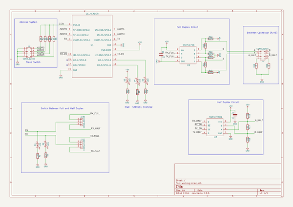
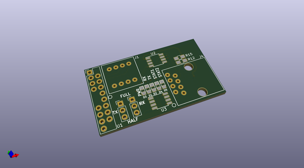
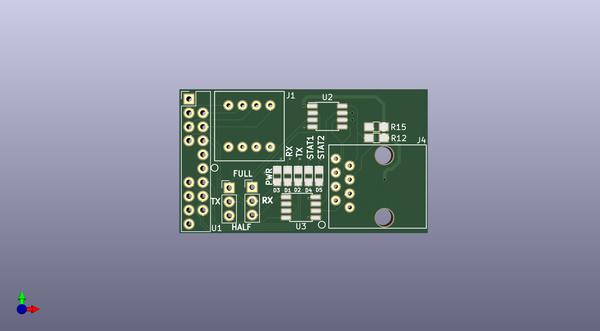
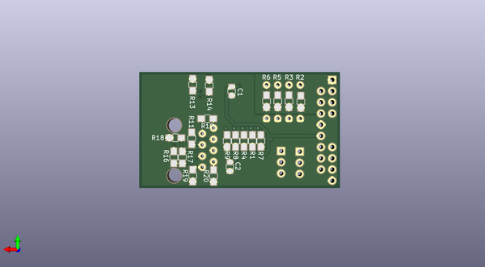

# really_synced_485
 
## summary 
* id: contextualelectronics_really_synced_485_really_synced_485
* user: contextualelectronics
* name: really_synced_485
* board: really_synced_485
* repo: https://github.com/ContextualElectronics/Really-Synced-485
* src_file_repo_kicad_pcb: Really Synced 485.kicad_pcb
* src_file_repo_kicad_pcb_link: https://github.com/ContextualElectronics/Really-Synced-485/tree/master/Really Synced 485.kicad_pcb

* src_file_repo_sch: Really Synced 485.sch
* src_file_repo_sch_link: https://github.com/ContextualElectronics/Really-Synced-485/tree/master/Really Synced 485.sch
* full details link: https://github.com/oomlout/oomlout_oomp_project_bot_v_2/tree/main/projects/contextualelectronics_really_synced_485_really_synced_485/current_version/working  

## schematic  
  
[schematic (pdf)](working_schematic.pdf) 

## pcb  
 
  
  
  
[board (pdf)](working.pdf)  

## working_bom
| Id | Designator | Footprint | Quantity | Designation | Supplier and ref |  | None | 
| --- | --- | --- | --- | --- | --- | --- | --- | 
| 1 | D1,D2,D3,D4,D5 | LED_0805 | 5 | LED |  |  | [''] | 
| 2 | J1 | 195-4MST | 1 | CONN_02X04 |  |  | [''] | 
| 3 | J2,J3 | Pin_Header_Straight_1x03_Pitch2.54mm | 2 | CONN_01X03 |  |  | [''] | 
| 4 | J4 | 54602-908LF | 1 | CONN_02X04 |  |  | [''] | 
| 5 | R12,R15,R13,R14 | R_0805_HandSoldering | 4 | NOPE |  |  | [''] | 
| 6 | U1 | CE_Header | 1 | CE_HEADER |  |  | [''] | 
| 7 | U2 | SOIC-8_3.9x4.9mm_Pitch1.27mm | 1 | SN75179B |  |  | [''] | 
| 8 | U3 | SOIC-8_3.9x4.9mm_Pitch1.27mm | 1 | SN65HVD82 |  |  | [''] | 
| 9 | C1,C2 | C_0805 | 2 | .1U |  |  | [''] | 
| 10 | R1,R4,R7,R8,R9 | R_0805_HandSoldering | 5 | 220 |  |  | [''] | 
| 11 | R2,R3,R5,R6 | R_0805_HandSoldering | 4 | 5K |  |  | [''] | 
| 12 | R10,R11 | R_0805_HandSoldering | 2 | 120 |  |  | [''] | 
| 13 | R16,R18 | R_0805_HandSoldering | 2 | 375 |  |  | [''] | 
| 14 | R17 | R_0805_HandSoldering | 1 | 60 |  |  | [''] | 
| 15 | R19,R20 | R_0805_HandSoldering | 2 | 0 |  |  | [''] | 

## bom_schematic
| Ref | Qnty | Value | Cmp name | Footprint | Description | Vendor | DNP | 
| --- | --- | --- | --- | --- | --- | --- | --- | 
| C1, C2 | 2 | .1U | C | Capacitors_SMD:C_0805 |  |  |  | 
| D1, D2, D3, D4, D5 | 5 | LED | LED | LEDs:LED_0805 |  |  |  | 
| J1 | 1 | CONN_02X04 | CONN_02X04 | ReallySynced:195-4MST |  |  |  | 
| J2, J3 | 2 | CONN_01X03 | CONN_01X03 | Pin_Headers:Pin_Header_Straight_1x03_Pitch2.54mm |  |  |  | 
| J4 | 1 | CONN_02X04 | CONN_02X04 | ReallySynced:54602-908LF |  |  |  | 
| R1, R4, R7, R8, R9 | 5 | 220 | R | Resistors_SMD:R_0805_HandSoldering |  |  |  | 
| R2, R3, R5, R6 | 4 | 5K | R | Resistors_SMD:R_0805_HandSoldering |  |  |  | 
| R10, R11 | 2 | 120 | R | Resistors_SMD:R_0805_HandSoldering |  |  |  | 
| R12, R13, R14, R15 | 4 | NOPE | R | Resistors_SMD:R_0805_HandSoldering |  |  |  | 
| R16, R18 | 2 | 375 | R | Resistors_SMD:R_0805_HandSoldering |  |  |  | 
| R17 | 1 | 60 | R | Resistors_SMD:R_0805_HandSoldering |  |  |  | 
| R19, R20 | 2 | 0 | R | Resistors_SMD:R_0805_HandSoldering |  |  |  | 
| U1 | 1 | CE_HEADER | CE_HEADER | ReallySynced:CE_Header |  |  |  | 
| U2 | 1 | SN75179B | SN75179B | Housings_SOIC:SOIC-8_3.9x4.9mm_Pitch1.27mm |  |  |  | 
| U3 | 1 | SN65HVD82 | SN65HVD82 | Housings_SOIC:SOIC-8_3.9x4.9mm_Pitch1.27mm |  |  |  | 

