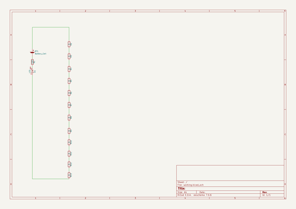

# soldering_obstacle_course
 
## summary 
* id: contextualelectronics_soldering_obstacle_course_obstacle_course
* user: contextualelectronics
* name: soldering_obstacle_course
* board: obstacle_course
* repo: https://github.com/ContextualElectronics/Soldering-Obstacle-Course
* src_file_repo_kicad_pcb: Obstacle Course.kicad_pcb
* src_file_repo_kicad_pcb_link: https://github.com/ContextualElectronics/Soldering-Obstacle-Course/tree/master/Obstacle Course.kicad_pcb

* src_file_repo_sch: Obstacle Course.sch
* src_file_repo_sch_link: https://github.com/ContextualElectronics/Soldering-Obstacle-Course/tree/master/Obstacle Course.sch
* full details link: https://github.com/oomlout/oomlout_oomp_project_bot_v_2/tree/main/projects/contextualelectronics_soldering_obstacle_course_obstacle_course/current_version/working  

## schematic  
  
[schematic (pdf)](working_schematic.pdf) 

## pcb  
 
  
  
  
[board (pdf)](working.pdf)  

## bom_schematic
| Ref | Qnty | Value | Cmp name | Footprint | Description | Vendor | DNP | 
| --- | --- | --- | --- | --- | --- | --- | --- | 
| BT1 | 1 | Battery_Cell | Battery_Cell |  |  |  |  | 
| D1 | 1 | LED | LED | LEDs:LED_0805 |  |  |  | 
| R1 | 1 | 100 | R | Resistors_SMD:R_0805 |  |  |  | 
| R2, R3, R4, R5, R6, R7, R8, R9, R10, R11, R12, R13 | 12 | 0 | R | Resistors_SMD:R_0603 |  |  |  | 

