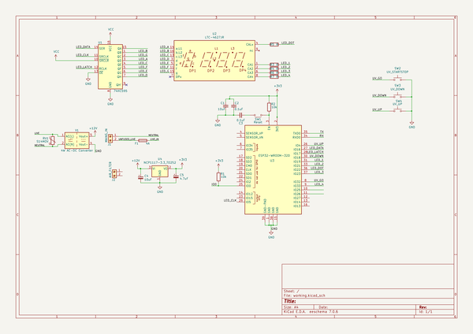

# printer_cabinet
 
## summary 
* id: cylindric3d_printer_cabinet_printercabinet
* user: cylindric3d
* name: printer_cabinet
* board: printercabinet
* repo: https://github.com/Cylindric3D/printer_cabinet
* src_file_repo_kicad_pcb: Hardware/PrinterCabinet/PrinterCabinet.kicad_pcb
* src_file_repo_kicad_pcb_link: https://github.com/Cylindric3D/printer_cabinet/tree/master/Hardware/PrinterCabinet/PrinterCabinet.kicad_pcb

* src_file_repo_sch: Hardware/PrinterCabinet/PrinterCabinet.sch
* src_file_repo_sch_link: https://github.com/Cylindric3D/printer_cabinet/tree/master/Hardware/PrinterCabinet/PrinterCabinet.sch
* full details link: https://github.com/oomlout/oomlout_oomp_project_bot_v_2/tree/main/projects/cylindric3d_printer_cabinet_printercabinet/current_version/working  

## schematic  
  
[schematic (pdf)](working_schematic.pdf)  

## pcb  
 
  
  
  
[board (pdf)](working.pdf)  

## working_bom
| Id | Designator | Footprint | Quantity | Designation | Supplier and ref |  | None | 
| --- | --- | --- | --- | --- | --- | --- | --- | 
| 1 | SW2 | TerminalBlock_Phoenix_PT-1,5-2-5.0-H_1x02_P5.00mm_Horizontal | 1 | UV_STARTSTOP |  |  | [''] | 
| 2 | SW3 | TerminalBlock_Phoenix_PT-1,5-2-5.0-H_1x02_P5.00mm_Horizontal | 1 | UV_DOWN |  |  | [''] | 
| 3 | SW4 | TerminalBlock_Phoenix_PT-1,5-2-5.0-H_1x02_P5.00mm_Horizontal | 1 | UV_UP |  |  | [''] | 
| 4 | U2 | DIP-16_W7.62mm_Socket | 1 | LTC-4627JR |  |  | [''] | 
| 5 | F1 | Fuseholder_Glass_5mmx20mm | 1 | 4A |  |  | [''] | 
| 6 | J1 | TerminalBlock_Phoenix_PT-1,5-2-5.0-H_1x02_P5.00mm_Horizontal | 1 | MAINS_IN |  |  | [''] | 
| 7 | RV1 | RV_Disc_D15.5mm_W6.1mm_P7.5mm | 1 | S14MOV |  |  | [''] | 
| 8 | V1 | Converter_ACDC_RECOM_RAC04-xxSGx_THT | 1 | 4W AC-DC Converter |  |  | [''] | 
| 9 | J2 | TerminalBlock_Phoenix_PT-1,5-2-5.0-H_1x02_P5.00mm_Horizontal | 1 | AIR_FILTER |  |  | [''] | 
| 10 | C4 | CP_Elec_6.3x5.4_Nichicon | 1 | 10uF |  |  | [''] | 
| 11 | U4 | TO-252-2 | 1 | NCP1117-3.3_TO252 |  |  | [''] | 
| 12 | C5 | CP_Elec_5x5.4 | 1 | 4.7uF |  |  | [''] | 
| 13 | C1 | C_0603_1608Metric_Pad1.05x0.95mm_HandSolder | 1 | 10uF |  |  | [''] | 
| 14 | R1,R2 | R_0603_1608Metric_Pad1.05x0.95mm_HandSolder | 2 | 10k |  |  | [''] | 
| 15 | R4,R7,R5,R6,R3 | R_0603_1608Metric_Pad1.05x0.95mm_HandSolder | 5 | R |  |  | [''] | 
| 16 | U1 | SOIC-16W_5.3x10.2mm_P1.27mm | 1 | 74HC595 |  |  | [''] | 
| 17 | C3,C2 | C_0603_1608Metric_Pad1.05x0.95mm_HandSolder | 2 | 0.1uF |  |  | [''] | 
| 18 | SW1 | SW_SPST_B3S-1000 | 1 | Reset |  |  | [''] | 
| 19 | U3 | Espressif_ESP32_WROOM_32D_SMT | 1 | ESP32-WROOM-32D |  |  | [''] | 

## bom_schematic
| Ref | Qnty | Value | Cmp name | Footprint | Description | Vendor | DNP | 
| --- | --- | --- | --- | --- | --- | --- | --- | 
| C1 | 1 | 10uF | C_Small | Capacitor_SMD:C_0603_1608Metric_Pad1.05x0.95mm_HandSolder | Unpolarized capacitor, small symbol |  |  | 
| C2, C3 | 2 | 0.1uF | C_Small | Capacitor_SMD:C_0603_1608Metric_Pad1.05x0.95mm_HandSolder | Unpolarized capacitor, small symbol |  |  | 
| C4 | 1 | 10uF | CP_Small-Device | Capacitor_SMD:CP_Elec_6.3x5.4_Nichicon |  |  |  | 
| C5 | 1 | 4.7uF | CP_Small-Device | Capacitor_SMD:CP_Elec_5x5.4 |  |  |  | 
| F1 | 1 | 4A | Fuse | Fuse:Fuseholder_Glass_5mmx20mm | Fuse | Mouser |  | 
| J1 | 1 | MAINS_IN | Screw_Terminal_01x02 | TerminalBlock_Phoenix:TerminalBlock_Phoenix_PT-1,5-2-5.0-H_1x02_P5.00mm_Horizontal | Generic screw terminal, single row, 01x02, script generated (kicad-library-utils/schlib/autogen/connector/) | Mouser |  | 
| J2 | 1 | AIR_FILTER | Screw_Terminal_01x02 | TerminalBlock_Phoenix:TerminalBlock_Phoenix_PT-1,5-2-5.0-H_1x02_P5.00mm_Horizontal | Generic screw terminal, single row, 01x02, script generated (kicad-library-utils/schlib/autogen/connector/) | Mouser |  | 
| R1, R2 | 2 | 10k | R | Resistor_SMD:R_0603_1608Metric_Pad1.05x0.95mm_HandSolder | Resistor |  |  | 
| R3, R4, R5, R6, R7 | 5 | R | R | Resistor_SMD:R_0603_1608Metric_Pad1.05x0.95mm_HandSolder | Resistor |  |  | 
| RV1 | 1 | S14MOV | Varistor | Varistor:RV_Disc_D15.5mm_W6.1mm_P7.5mm | Voltage dependent resistor | Mouser |  | 
| SW1 | 1 | Reset | SW_CK_D6R_SPST-Switch | Button_Switch_SMD:SW_SPST_B3S-1000 |  |  |  | 
| SW2 | 1 | UV_STARTSTOP | SW_Push | TerminalBlock_Phoenix:TerminalBlock_Phoenix_PT-1,5-2-5.0-H_1x02_P5.00mm_Horizontal | Push button switch, generic, two pins |  |  | 
| SW3 | 1 | UV_DOWN | SW_Push | TerminalBlock_Phoenix:TerminalBlock_Phoenix_PT-1,5-2-5.0-H_1x02_P5.00mm_Horizontal | Push button switch, generic, two pins |  |  | 
| SW4 | 1 | UV_UP | SW_Push | TerminalBlock_Phoenix:TerminalBlock_Phoenix_PT-1,5-2-5.0-H_1x02_P5.00mm_Horizontal | Push button switch, generic, two pins |  |  | 
| U1 | 1 | 74HC595 | 74HC595 | Package_SO:SOIC-16W_5.3x10.2mm_P1.27mm | 8-bit serial in/out Shift Register 3-State Outputs |  |  | 
| U2 | 1 | LTC-4627JR | LTC-4627JR-Display_Character | Package_DIP:DIP-16_W7.62mm_Socket |  |  |  | 
| U3 | 1 | ESP32-WROOM-32D | ESP32-WROOM-32D-MCU_Espressif | Module:Espressif_ESP32_WROOM_32D_SMT |  |  |  | 
| U4 | 1 | NCP1117-3.3_TO252 | NCP1117-3.3_TO252 | Package_TO_SOT_SMD:TO-252-2 | 1A Low drop-out regulator, Fixed Output 3.3V, TO-252 (DPAK) |  |  | 
| V1 | 1 | 4W AC-DC Converter | RAC04-xxSGA-Converter_ACDC | Converter_ACDC:Converter_ACDC_RECOM_RAC04-xxSGx_THT |  |  |  | 

