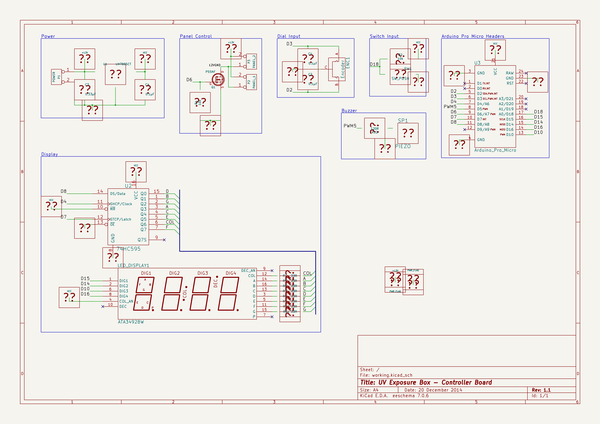

# uv_box
 
## summary 
* id: cylindric3d_uv_box_controller
* user: cylindric3d
* name: uv_box
* board: controller
* repo: https://github.com/Cylindric3D/uv-box
* src_file_repo_kicad_pcb: Electronics/controller/controller.kicad_pcb
* src_file_repo_kicad_pcb_link: https://github.com/Cylindric3D/uv-box/tree/master/Electronics/controller/controller.kicad_pcb

* src_file_repo_sch: Electronics/controller/controller.sch
* src_file_repo_sch_link: https://github.com/Cylindric3D/uv-box/tree/master/Electronics/controller/controller.sch
* full details link: https://github.com/oomlout/oomlout_oomp_project_bot_v_2/tree/main/projects/cylindric3d_uv_box_controller/current_version/working  

## schematic  
  
[schematic (pdf)](working_schematic.pdf)  

## working_bom
| Id | Designator | Footprint | Quantity | Designation | Supplier and ref |  | None | 
| --- | --- | --- | --- | --- | --- | --- | --- | 
| 1 | C1,C2,C4 | Capacitor4x3RM2.5 | 3 | 0.1µF |  |  | [''] | 
| 2 | ENC1 | ALPS_Encoder-EC12E2420404 | 1 | Encoder |  |  | [''] | 
| 3 | SW1 | SW_PUSH-12mm | 1 | SW_PUSH |  |  | [''] | 
| 4 | R4,R2 | R3 | 2 | 10k |  |  | [''] | 
| 5 | 1pin,1pin,1pin,1pin | 1pin | 4 | VAL** |  |  | [''] | 
| 6 | LED_DISPLAY1 | 4_Digit-7_Segment_LED-ATA3492BW | 1 | ATA3492BW |  |  | [''] | 
| 7 | R12 | R3 | 1 | 120R |  |  | [''] | 
| 8 | SP1 | Pin_Header_Angled_1x02 | 1 | PIEZO |  |  | [''] | 
| 9 | P1 | Pin_Header_Angled_1x02 | 1 | POWER |  |  | [''] | 
| 10 | P2 | Pin_Header_Angled_1x02 | 1 | PANEL_1 |  |  | [''] | 
| 11 | P3 | Pin_Header_Angled_1x02 | 1 | PANEL_2 |  |  | [''] | 
| 12 | U1 | TO-220_Neutral123_Horizontal | 1 | LM7805CT |  |  | [''] | 
| 13 | C3 | Capacitor4x3RM2.5 | 1 | 0.33µF |  |  | [''] | 
| 14 | Q1 | TO-220_FET-GDS_Horizontal | 1 | P55NF |  |  | [''] | 
| 15 | U2 | DIP-16__300 | 1 | 74HC595 |  |  | [''] | 
| 16 | U3 | ArduinoProMicro | 1 | Arduino_Pro_Micro |  |  | [''] | 
| 17 | R10,R1,R9,R7,R5,R11,R6,R8 | R3 | 8 | 33R |  |  | [''] | 
| 18 | Symbol_OSHW-Logo_CopperTop | Symbol_OSHW-Logo_CopperTop | 1 | VAL** |  |  | [''] | 

## bom_schematic
| Ref | Qnty | Value | Cmp name | Footprint | Description | Vendor | DNP | 
| --- | --- | --- | --- | --- | --- | --- | --- | 
| ENC1 | 1 | Encoder | Encoder | Cylindric:ALPS_Encoder-EC12E2420404 |  |  |  | 
| LED_DISPLAY1 | 1 | ATA3492BW | ATA3492BW | Cylindric:4_Digit-7_Segment_LED-ATA3492BW | 4 Digit 7 Segment Led Common Anode Module |  |  | 
| P1 | 1 | POWER | CONN_2 | Pin_Headers:Pin_Header_Angled_1x02 | Symbole general de connecteur |  |  | 
| P2 | 1 | PANEL_1 | CONN_2 | Pin_Headers:Pin_Header_Angled_1x02 | Symbole general de connecteur |  |  | 
| P3 | 1 | PANEL_2 | CONN_2 | Pin_Headers:Pin_Header_Angled_1x02 | Symbole general de connecteur |  |  | 
| Q1 | 1 | P55NF | STB55NF | Transistors_TO-220:TO-220_FET-GDS_Horizontal | STB55NF06, 50V Vds, 30A Id, N-Channel Power MOSFET, TO220 |  |  | 
| U2 | 1 | 74HC595 | 74HC595 | Sockets_DIP:DIP-16__300 | 8 bits serial in // out Shift Register 3 State Out |  |  | 
| U3 | 1 | Arduino_Pro_Micro | Arduino_Pro_Micro | Cylindric:ArduinoProMicro | Arduino Pro Micro |  |  | 

