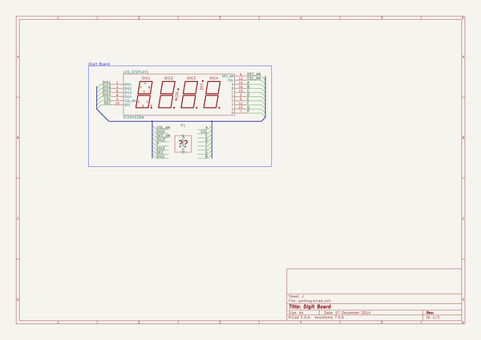

# uv_box
 
## summary 
* id: cylindric3d_uv_box_digit_board
* user: cylindric3d
* name: uv_box
* board: digit_board
* repo: https://github.com/Cylindric3D/uv-box
* src_file_repo_kicad_pcb: Electronics/digit_board/digit_board.kicad_pcb
* src_file_repo_kicad_pcb_link: https://github.com/Cylindric3D/uv-box/tree/master/Electronics/digit_board/digit_board.kicad_pcb

* src_file_repo_sch: Electronics/digit_board/digit_board.sch
* src_file_repo_sch_link: https://github.com/Cylindric3D/uv-box/tree/master/Electronics/digit_board/digit_board.sch
* full details link: https://github.com/oomlout/oomlout_oomp_project_bot_v_2/tree/main/projects/cylindric3d_uv_box_digit_board/current_version/working  

## schematic  
  
[schematic (pdf)](working_schematic.pdf)  

## pcb  
 
  
  
  
[board (pdf)](working.pdf)  

## working_bom
| Id | Designator | Footprint | Quantity | Designation | Supplier and ref |  | None | 
| --- | --- | --- | --- | --- | --- | --- | --- | 
| 1 | LED_DISPLAY1 | 4DIG_7SEG_ATA3492BW | 1 | ATA3492BW |  |  | [''] | 
| 2 | P1 | Pin_Header_Straight_2x08 | 1 | LED_DISPLAY |  |  | [''] | 

## bom_schematic
| Ref | Qnty | Value | Cmp name | Footprint | Description | Vendor | DNP | 
| --- | --- | --- | --- | --- | --- | --- | --- | 
| LED_DISPLAY1 | 1 | ATA3492BW | ATA3492BW | Cylindric:4DIG_7SEG_ATA3492BW | 4 Digit 7 Segment Led Common Anode Module |  |  | 

