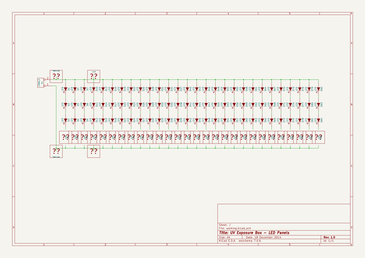

# uv_box
 
## summary 
* id: cylindric3d_uv_box_led_panels
* user: cylindric3d
* name: uv_box
* board: led_panels
* repo: https://github.com/Cylindric3D/uv-box
* src_file_repo_kicad_pcb: Electronics/led_panels/led_panels.kicad_pcb
* src_file_repo_kicad_pcb_link: https://github.com/Cylindric3D/uv-box/tree/master/Electronics/led_panels/led_panels.kicad_pcb

* src_file_repo_sch: Electronics/led_panels/led_panels.sch
* src_file_repo_sch_link: https://github.com/Cylindric3D/uv-box/tree/master/Electronics/led_panels/led_panels.sch
* full details link: https://github.com/oomlout/oomlout_oomp_project_bot_v_2/tree/main/projects/cylindric3d_uv_box_led_panels/current_version/working  

## schematic  
  
[schematic (pdf)](working_schematic.pdf)  

## working_bom
| Id | Designator | Footprint | Quantity | Designation | Supplier and ref |  | None | 
| --- | --- | --- | --- | --- | --- | --- | --- | 
| 1 | D1,D2,D3,D7,D8,D9,D13,D14,D15,D19,D20,D21,D25,D26,D27,D31,D32,D33,D37,D38,D39,D43,D44,D45,D49,D50,D51,D55,D56,D57,D61,D62,D63,D67,D68,D69,D73,D74,D75,D79,D80,D81,D4,D5,D6,D10,D11,D12,D16,D17,D18,D22,D23,D24,D28,D29,D30,D34,D35,D36,D40,D41,D42,D46,D47,D48,D52,D53,D54,D58,D59,D60,D64,D65,D66,D70,D71,D72,D76,D77,D78,D82,D83,D84 | LED-5MM | 84 | LED |  |  | [''] | 
| 2 | R3,R5,R7,R9,R11,R13,R15,R17,R19,R21,R23,R25,R27,R4,R6,R8,R10,R12,R14,R16,R18,R20,R24,R26,R28,R1,R2,R22 | R3 | 28 | 120 |  |  | [''] | 
| 3 | P1 | bornier2 | 1 | CONN_2 |  |  | [''] | 
| 4 | MountingHole_3mm,MountingHole_3mm,MountingHole_3mm,MountingHole_3mm | MountingHole_3mm | 4 | VAL** |  |  | [''] | 
| 5 | Symbol_OSHW-Logo_CopperTop | Symbol_OSHW-Logo_CopperTop | 1 | VAL** |  |  | [''] | 

## bom_schematic
| Ref | Qnty | Value | Cmp name | Footprint | Description | Vendor | DNP | 
| --- | --- | --- | --- | --- | --- | --- | --- | 
| D1, D2, D3, D4, D5, D6, D7, D8, D9, D10, D11, D12, D13, D14, D15, D16, D17, D18, D19, D20, D21, D22, D23, D24, D25, D26, D27, D28, D29, D30, D31, D32, D33, D34, D35, D36, D37, D38, D39, D40, D41, D42, D43, D44, D45, D46, D47, D48, D49, D50, D51, D52, D53, D54, D55, D56, D57, D58, D59, D60, D61, D62, D63, D64, D65, D66, D67, D68, D69, D70, D71, D72, D73, D74, D75, D76, D77, D78, D79, D80, D81, D82, D83, D84 | 84 | LED | LED | LEDs:LED-5MM |  |  |  | 
| P1 | 1 | CONN_2 | CONN_2 | Connect:bornier2 | Symbole general de connecteur |  |  | 

## mounting_holes
| x | y | package | value | ref | size | 
| --- | --- | --- | --- | --- | --- | 
| 150.0 | 90.0 | MountingHole_3mm | VAL** | MountingHole_3mm | m3 | 
| 150.0 | 0.0 | MountingHole_3mm | VAL** | MountingHole_3mm | m3 | 
| 0.0 | 0.0 | MountingHole_3mm | VAL** | MountingHole_3mm | m3 | 
| 0.0 | 90.0 | MountingHole_3mm | VAL** | MountingHole_3mm | m3 | 

