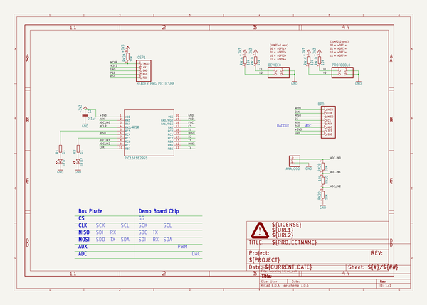
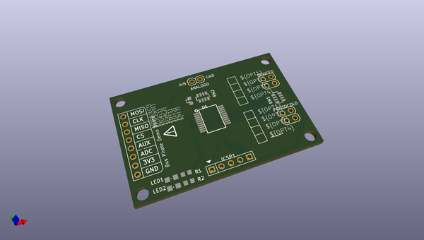
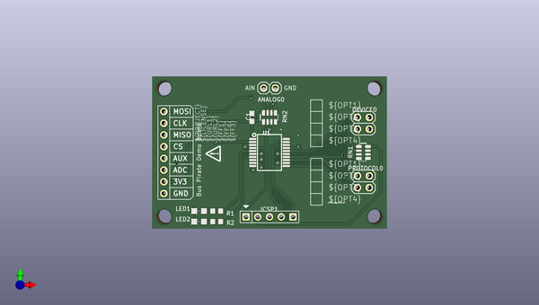
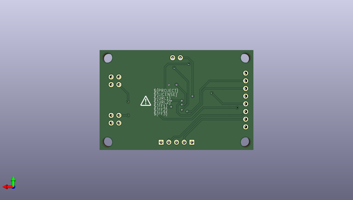

# breakout_boards
 
## summary 
* id: dangerousprototypes_breakout_boards_bp_demo_v5a
* user: dangerousprototypes
* name: breakout_boards
* board: bp_demo_v5a
* repo: https://github.com/DangerousPrototypes/Breakout_Boards

* src_file_repo_sch: 
* src_file_repo_sch_link: https://github.com/DangerousPrototypes/Breakout_Boards/tree/master/
* full details link: https://github.com/oomlout/oomlout_oomp_project_bot_v_2/tree/main/projects/dangerousprototypes_breakout_boards_bp_demo_v5a/current_version/working  

## schematic  
  
[schematic (pdf)](working_schematic.pdf) 

## pcb  
 
  
  
  
[board (pdf)](working.pdf)  

## working_bom
| Id | Designator | Footprint | Quantity | Designation | Supplier and ref |  | None | 
| --- | --- | --- | --- | --- | --- | --- | --- | 
| 1 | @HOLE2,@HOLE0,@HOLE3,@HOLE1 |  | 4 |  |  |  | [''] | 
| 2 | RN1,RN2 | RN8P-4R-CRA06S | 2 | 10k |  |  | [''] | 
| 3 | LED2,LED1 | LED-805 | 2 |  |  |  | [''] | 
| 4 | R2,R1 | R603 | 2 | 1k |  |  | [''] | 
| 5 | DEVICE0,PROTOCOL0 | 2X02 | 2 |  |  |  | [''] | 
| 6 | U$9,U$10 | JUMP2X2_DESC | 2 | JUMP2X2_DESC |  |  | [''] | 
| 7 | U1 | SSOP20 | 1 | PIC16F1829SS |  |  | [''] | 
| 8 | ICSP1 | HEADER_PRG_1X05_ICSP_B | 1 | HEADER_PRG_PIC_ICSPB |  |  | [''] | 
| 9 | ANALOG0 | 1X02 | 1 |  |  |  | [''] | 
| 10 | C1 | C603 | 1 | 0.1uF |  |  | [''] | 
| 11 | U$1,U$2 | DP_LOGO | 2 | DINA4_L |  |  | [''] | 
| 12 | BP0 | HDR-BUSPIRATE | 1 |  |  |  | [''] | 

## bom_schematic
| Ref | Qnty | Value | Cmp name | Footprint | Description | Vendor | DNP | 
| --- | --- | --- | --- | --- | --- | --- | --- | 
| ANALOG0 | 1 | PINHD-1X2 | PINHD-1X2 | working:1X02 |  |  |  | 
| BP0 | 1 | HDR-BUSPIRATE | HDR-BUSPIRATE | working:HDR-BUSPIRATE |  |  |  | 
| C1 | 1 | 0.1uF | CAPC603 | working:C603 |  |  |  | 
| DEVICE0 | 1 | PINHD-2X2 | PINHD-2X2 | working:2X02 |  |  |  | 
| ICSP1 | 1 | HEADER_PRG_PIC_ICSPB | HEADER_PRG_PIC_ICSPB | working:HEADER_PRG_1X05_ICSP_B |  |  |  | 
| LED1, LED2 | 2 | LED805 | LED805 | working:LED-805 |  |  |  | 
| PROTOCOL0 | 1 | PINHD-2X2 | PINHD-2X2 | working:2X02 |  |  |  | 
| R1, R2 | 2 | 1k | RESISTORR603 | working:R603 |  |  |  | 
| RN1, RN2 | 2 | 10k | RNETWORK | working:RN8P-4R-CRA06S |  |  |  | 
| U1 | 1 | PIC16F1829SS | PIC16F1829SS | working:SSOP20 |  |  |  | 
| U$1 | 1 | DINA4_L | DINA4_L | working:DP_LOGO |  |  |  | 
| U$9, U$10 | 2 | JUMP2X2_DESC | JUMP2X2_DESC | working:JUMP2X2_DESC |  |  |  | 

