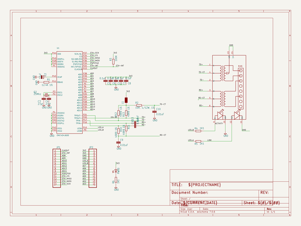

# breakout_boards
 
## summary 
* id: dangerousprototypes_breakout_boards_enc424j600_breakout
* user: dangerousprototypes
* name: breakout_boards
* board: enc424j600_breakout
* repo: https://github.com/DangerousPrototypes/Breakout_Boards

* src_file_repo_sch: 
* src_file_repo_sch_link: https://github.com/DangerousPrototypes/Breakout_Boards/tree/master/
* full details link: https://github.com/oomlout/oomlout_oomp_project_bot_v_2/tree/main/projects/dangerousprototypes_breakout_boards_enc424j600_breakout/current_version/working  

## schematic  
  
[schematic (pdf)](working_schematic.pdf)  

## pcb  
 
  
  
  
[board (pdf)](working.pdf)  

## working_bom
| Id | Designator | Footprint | Quantity | Designation | Supplier and ref |  | None | 
| --- | --- | --- | --- | --- | --- | --- | --- | 
| 1 | R2 | R0603 | 1 | 10R, 1/12W, 1% |  |  | [''] | 
| 2 | C6,C11,C8,C5,C7 | C0603 | 5 | 0.1uF |  |  | [''] | 
| 3 | C3,C4 | C0603 | 2 | 27pf |  |  | [''] | 
| 4 | U$1,U$2 | DP_LOGO | 2 |  |  |  | [''] | 
| 5 | R12,R11,R13,R10 | R0603 | 4 | 49R9 1% |  |  | [''] | 
| 6 | Q2 | HC49UP | 1 | 25Mhz |  |  | [''] | 
| 7 | C10,C9 | C0603 | 2 | 0.01uF |  |  | [''] | 
| 8 | JP2,JP1 | 1X14 | 2 |  |  |  | [''] | 
| 9 | R5,R4 | R0603 | 2 | 1K1 |  |  | [''] | 
| 10 | C13,C12 | C0603 | 2 | 6.8nF |  |  | [''] | 
| 11 | R6 | R0603 | 1 | 1k1 |  |  | [''] | 
| 12 | L1 | WE-KI_0805_B | 1 |  |  |  | [''] | 
| 13 | J1 | HR911105A | 1 | HR911105A |  |  | [''] | 
| 14 | PWR0 | LED-805 | 1 |  |  |  | [''] | 
| 15 | C2 | SMC_A | 1 | 10uF |  |  | [''] | 
| 16 | U1 | TQFP44 | 1 | ENC424J600 |  |  | [''] | 
| 17 | R3 | R0603 | 1 | 100K |  |  | [''] | 
| 18 | R1 | R0603 | 1 | 12.4K 1% |  |  | [''] | 

## bom_schematic
| Ref | Qnty | Value | Cmp name | Footprint | Description | Vendor | DNP | 
| --- | --- | --- | --- | --- | --- | --- | --- | 
| C2 | 1 | 10uF | CPOL-EUSMCA | working:SMC_A |  |  |  | 
| C3, C4 | 2 | 27pf | C-EUC0603 | working:C0603 |  |  |  | 
| C5, C6, C7, C8, C11 | 5 | 0.1uF | C-EUC0603 | working:C0603 |  |  |  | 
| C9, C10 | 2 | 0.01uF | C-EUC0603 | working:C0603 |  |  |  | 
| C12, C13 | 2 | 6.8nF | C-EUC0603 | working:C0603 |  |  |  | 
| J1 | 1 | HR911105A | HR911105A | working:HR911105A |  |  |  | 
| JP1, JP2 | 2 | PINHD-1X14 | PINHD-1X14 | working:1X14 |  |  |  | 
| L1 | 1 | WE-KIL_0805 | WE-KIL_0805 | working:WE-KI_0805_B |  |  |  | 
| PWR0 | 1 | LED805 | LED805 | working:LED-805 |  |  |  | 
| Q2 | 1 | 25Mhz | CRYSTALHC49UP | working:HC49UP |  |  |  | 
| R1 | 1 | 12.4K 1% | R-EU_R0603 | working:R0603 |  |  |  | 
| R2 | 1 | 10R, 1/12W, 1% | R-EU_R0603 | working:R0603 |  |  |  | 
| R3 | 1 | 100K | R-EU_R0603 | working:R0603 |  |  |  | 
| R4, R5 | 2 | 1K1 | R-EU_R0603 | working:R0603 |  |  |  | 
| R6 | 1 | 1k1 | R-EU_R0603 | working:R0603 |  |  |  | 
| R10, R11, R12, R13 | 4 | 49R9 1% | R-EU_R0603 | working:R0603 |  |  |  | 
| U1 | 1 | ENC424J600 | ENC424J600 | working:TQFP44 |  |  |  | 

