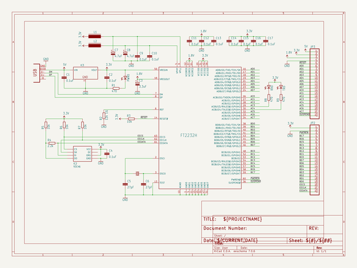

# breakout_boards
 
## summary 
* id: dangerousprototypes_breakout_boards_ft2232h_breakout_v1
* user: dangerousprototypes
* name: breakout_boards
* board: ft2232h_breakout_v1
* repo: https://github.com/DangerousPrototypes/Breakout_Boards

* src_file_repo_sch: 
* src_file_repo_sch_link: https://github.com/DangerousPrototypes/Breakout_Boards/tree/master/
* full details link: https://github.com/oomlout/oomlout_oomp_project_bot_v_2/tree/main/projects/dangerousprototypes_breakout_boards_ft2232h_breakout_v1/current_version/working  

## schematic  
  
[schematic (pdf)](working_schematic.pdf)  

## pcb  
 
  
  
  
[board (pdf)](working.pdf)  

## working_bom
| Id | Designator | Footprint | Quantity | Designation | Supplier and ref |  | None | 
| --- | --- | --- | --- | --- | --- | --- | --- | 
| 1 | C3 | SMC_A | 1 | 3.3uF |  |  | [''] | 
| 2 | L2,L1 | FB805 | 2 |  |  |  | [''] | 
| 3 | C6,C5 | C805 | 2 | 27pF |  |  | [''] | 
| 4 | C12,C11,C14,C17,C10,C1,C9,C15,C16,C4,C13,C2 | C805 | 12 | 0.1uF |  |  | [''] | 
| 5 | IC1 | LQFP64 | 1 | FT2232H |  |  | [''] | 
| 6 | R1,R9,R8 | R805 | 3 | 470 |  |  | [''] | 
| 7 | IC2 | SOIC8 | 1 | 93C46 |  |  | [''] | 
| 8 | RX0,PWR0,TX0 | LED-805 | 3 |  |  |  | [''] | 
| 9 | R7,R5,R3,R6 | R805 | 4 | 10k |  |  | [''] | 
| 10 | X1 | 4X6 | 1 | 12MHz |  |  | [''] | 
| 11 | IC3 | SOT223 | 1 |  |  |  | [''] | 
| 12 | C7,C8 | SMC_A | 2 | 4.7uF |  |  | [''] | 
| 13 | R4 | R805 | 1 | 2.2k |  |  | [''] | 
| 14 | CONN1 | CONN_USB_MINI-B | 1 | CONN_USB |  |  | [''] | 
| 15 | U$7,U$8 | DP_LOGO | 2 |  |  |  | [''] | 
| 16 | JP2,JP3 | 1X22 | 2 |  |  |  | [''] | 
| 17 | R2 | R805 | 1 | 12k 1% |  |  | [''] | 

## bom_schematic
| Ref | Qnty | Value | Cmp name | Footprint | Description | Vendor | DNP | 
| --- | --- | --- | --- | --- | --- | --- | --- | 
| C1, C2, C4, C9, C10, C11, C12, C13, C14, C15, C16, C17 | 12 | 0.1uF | CAPC805 | working:C805 |  |  |  | 
| C3 | 1 | 3.3uF | CAP_POLSMC_A | working:SMC_A |  |  |  | 
| C5, C6 | 2 | 27pF | CAPC805 | working:C805 |  |  |  | 
| C7, C8 | 2 | 4.7uF | CAP_POLSMC_A | working:SMC_A |  |  |  | 
| CONN1 | 1 | CONN_USB | CONN_USB | working:CONN_USB_MINI-B |  |  |  | 
| IC1 | 1 | FT2232H | FT2232H | working:LQFP64 |  |  |  | 
| IC2 | 1 | 93C46 | 93C46 | working:SOIC8 |  |  |  | 
| IC3 | 1 | LD1117-3.3SOT223 | LD1117-3.3SOT223 | working:SOT223 |  |  |  | 
| JP2, JP3 | 2 | PINHD-1X22 | PINHD-1X22 | working:1X22 |  |  |  | 
| L1, L2 | 2 | FERRITE_BEAD805 | FERRITE_BEAD805 | working:FB805 |  |  |  | 
| PWR0 | 1 | LED805 | LED805 | working:LED-805 |  |  |  | 
| R1, R8, R9 | 3 | 470 | RESISTORR805 | working:R805 |  |  |  | 
| R2 | 1 | 12k 1% | RESISTORR805 | working:R805 |  |  |  | 
| R3, R5, R6, R7 | 4 | 10k | RESISTORR805 | working:R805 |  |  |  | 
| R4 | 1 | 2.2k | RESISTORR805 | working:R805 |  |  |  | 
| RX0 | 1 | LED805 | LED805 | working:LED-805 |  |  |  | 
| TX0 | 1 | LED805 | LED805 | working:LED-805 |  |  |  | 
| X1 | 1 | CRYSTAL_212M_ | CRYSTAL_212M_ | working:4X6 |  |  |  | 

