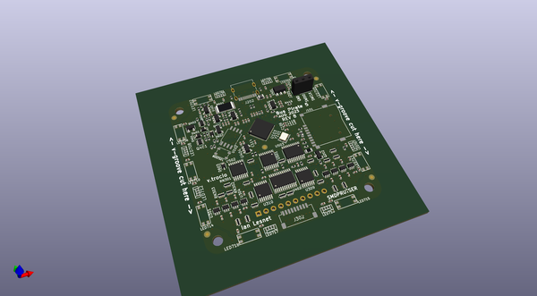

# buspirate5_hardware
 
## summary 
* id: dangerousprototypes_buspirate5_hardware_buspirate_5_rev8
* user: dangerousprototypes
* name: buspirate5_hardware
* board: buspirate_5_rev8
* repo: https://github.com/DangerousPrototypes/BusPirate5-hardware
* src_file_repo_kicad_pcb: pcb/BusPirate-5-rev8.kicad_pcb
* src_file_repo_kicad_pcb_link: https://github.com/DangerousPrototypes/BusPirate5-hardware/tree/main/pcb/BusPirate-5-rev8.kicad_pcb

* src_file_repo_sch: debug-station/programming_pin_mount.v1.0.sch
* src_file_repo_sch_link: https://github.com/DangerousPrototypes/BusPirate5-hardware/tree/main/debug-station/programming_pin_mount.v1.0.sch
* full details link: https://github.com/oomlout/oomlout_oomp_project_bot_v_2/tree/main/projects/dangerousprototypes_buspirate5_hardware_buspirate_5_rev8/current_version/working  

## schematic  
  
[schematic (pdf)](working_schematic.pdf) 

  
[schematic 1 (pdf)](working_1_schematic.pdf) 

  
[schematic 2 (pdf)](working_2_schematic.pdf) 

  
[schematic 3 (pdf)](working_3_schematic.pdf) 

  
[schematic 4 (pdf)](working_4_schematic.pdf) 

  
[schematic 5 (pdf)](working_5_schematic.pdf) 

## pcb  
 
  
  
  
[board (pdf)](working.pdf)  

## working_bom
| Id | Designator | Footprint | Quantity | Designation | Supplier and ref |  | None | 
| --- | --- | --- | --- | --- | --- | --- | --- | 
| 1 | LED702,LED715,LED714,LED703,LED705,LED718,LED706,LED710,LED713 | SK6812-mini-e | 9 | SK6812-mini-e |  |  | [''] | 
| 2 | C402,C101,C202,C201,C401,C102,C404,C407 | C_0402_1005Metric | 8 | 4.7uF |  |  | [''] | 
| 3 | C313,C308,C315,C304,C403,C314,C309,C112,C114,C110,C111,C113,C103,C118,C705,C708,C704,C706,C710,C712,C703,C701,C117,C501,C116,C715,C714,C716,C717,C718,C318,C502,C713,C406,C115,C707,C602,C605,C702,C311,C312,C503,C306,C307,C301,C302,C305,C303,C316,C317,C310,C414,C415,C416 | C_0402_1005Metric | 54 | 0.1uF |  |  | [''] | 
| 4 | C107,C108,C109,C104,C405,C601,C413 | C_0402_1005Metric | 7 | 2.2uF |  |  | [''] | 
| 5 | C106,C105 | C_0402_1005Metric | 2 | 15pF |  |  | [''] | 
| 6 | U301,U304,U305,U307,U306,U303,U302,U308 | SOT-363_SC-70-6 | 8 | SN74LVC1T45DCK |  |  | [''] | 
| 7 | R203,R202 | R_0402_1005Metric | 2 | 22R |  |  | [''] | 
| 8 | R204,R201 | R_0402_1005Metric | 2 | 5.1K |  |  | [''] | 
| 9 | L201 | L_0805_2012Metric | 1 | 1.5A |  |  | [''] | 
| 10 | R407,R501,R402,R406,R104,R105,R410,R611,R609,R606,R610,R613,R106,R312,R414,R415 | R_0402_1005Metric | 16 | 10K |  |  | [''] | 
| 11 | R103,R608,R612,R208 | R_0402_1005Metric | 4 | 200R |  |  | [''] | 
| 12 | U103 | RP2040-QFN-56 | 1 | RP2040 |  |  | [''] | 
| 13 | U501,U502 | TSSOP-16_4.4x5mm_P0.65mm | 2 | 74HC595 |  |  | [''] | 
| 14 | RN302,RN307,RN304,RN310 | R_Array_Convex_4x0402 | 4 | 1M |  |  | [''] | 
| 15 | R209 | R_0805_2012Metric | 1 | 33R |  |  | [''] | 
| 16 | U102 | SOP-8_5.28x5.23mm_P1.27mm | 1 | W25Q128JVSIQ |  |  | [''] | 
| 17 | U310,U309 | TSSOP-14_4.4x5mm_P0.65mm | 2 | 74HC4066 |  |  | [''] | 
| 18 | R101,R602,R603,R502 | R_0402_1005Metric | 4 | 1K |  |  | [''] | 
| 19 | FID1,FID2,FID4,FID5,FID3 | Fiducial_1mm_Mask2mm | 5 | Fiducial |  |  | [''] | 
| 20 | J201 | PinSocket_1x03_P2.54mm_Vertical | 1 | Conn_01x03 |  |  | [''] | 
| 21 | R102 | R_0402_1005Metric | 1 | DNF |  |  | [''] | 
| 22 | J302 | JST_SH_SM09B-SRSS-TB_1x09-1MP_P1.00mm_Horizontal | 1 | Conn_01x09 |  |  | [''] | 
| 23 | U503 | TSSOP-20_4.4x6.5mm_P0.65mm | 1 | 74HCT245PW |  |  | [''] | 
| 24 | Y101 | Crystal_SMD_3225-4Pin_3.2x2.5mm | 1 | 12Mhz |  |  | [''] | 
| 25 | Q202 | SOT-23 | 1 | 2N7002 |  |  | [''] | 
| 26 | L100 | L_0603_1608Metric | 1 | 22uH |  |  | [''] | 
| 27 | J101 | TF-01A_C91145 | 1 | Micro_SD_Card_TF-01A_C91145 |  |  | [''] | 
| 28 | SW101 | SW_SPST_PTS810 | 1 | SW_SPST |  |  | [''] | 
| 29 | D601,D401,D603,D602 | D_SOD-323 | 4 | 1N4148WS |  |  | [''] | 
| 30 | R405,R409,R408,R605,R604 | R_0402_1005Metric | 5 | 33K |  |  | [''] | 
| 31 | R412,R401 | R_0402_1005Metric | 2 | 100K |  |  | [''] | 
| 32 | R403 | R_0402_1005Metric | 1 | 102K |  |  | [''] | 
| 33 | U601,U404,U603 | SOT-23-5 | 3 | GS6001 |  |  | [''] | 
| 34 | R601 | R_2512_6332Metric_Pad1.40x3.35mm_HandSolder | 1 | 0R2 |  |  | [''] | 
| 35 | C603 | C_0402_1005Metric | 1 | DNF |  |  | [''] | 
| 36 | U602 | SOT-23-5 | 1 | RS8901XF |  |  | [''] | 
| 37 | Q402,Q602 | SOT-23 | 2 | WST3423 |  |  | [''] | 
| 38 | U403 | SOT-23-5 | 1 | AP2127 |  |  | [''] | 
| 39 | Q601 | SOT-363_SC-70-6 | 1 | MMDT3906 |  |  | [''] | 
| 40 | Q401 | SOT-363_SC-70-6 | 1 | BCM857 |  |  | [''] | 
| 41 | RN309,RN301,RN306,RN315,RN318,RN317,RN305,RN400,RN401,RN402 | R_Array_Convex_4x0402 | 10 | 330R |  |  | [''] | 
| 42 | U402 | TSSOP-24_4.4x7.8mm_P0.65mm | 1 | 74HC4067 |  |  | [''] | 
| 43 | RN303,RN308 | R_Array_Convex_4x0402 | 2 | 100K |  |  | [''] | 
| 44 | J202 | HRO_TYPE-C-31-M-12 | 1 | TYPE-C-31-M-12 |  |  | [''] | 
| 45 | RN313,RN314,RN312,RN311 | R_Array_Convex_4x0402 | 4 | 10K |  |  | [''] | 
| 46 | LED707,LED716,LED717,LED712,LED708,LED701,LED704 | SK6812-side-a_b | 7 | SK6812-side-a_b |  |  | [''] | 
| 47 | R316,R416 | R_0402_1005Metric | 2 | 330R |  |  | [''] | 
| 48 | U401 | SOT-89-3 | 1 | ME6211A33PG-N |  |  | [''] | 
| 49 | C408 | C_0402_1005Metric | 1 | 120pF |  |  | [''] | 
| 50 | R404 | R_0402_1005Metric | 1 | 133K |  |  | [''] | 
| 51 | J301 | PinHeader_1x10_P2.54mm_Vertical | 1 | Conn_01x10 |  |  | [''] | 
| 52 | SW102 | GT-TC026X-HXXX-LX | 1 | 4P_button_sw |  |  | [''] | 
| 53 | LCD201 | TFT_20_QT200H1201 | 1 | TFT_20_QT200H1201 |  |  | [''] | 
| 54 | logo1 | logo_fcc | 1 | fcc_logo |  |  | [''] | 

## bom_schematic
| Ref | Qnty | Value | Cmp name | Footprint | Description | Vendor | DNP | 
| --- | --- | --- | --- | --- | --- | --- | --- | 
| C101, C102, C201, C202, C401, C402, C404, C407 | 8 | 4.7uF | C_Small | Capacitor_SMD:C_0402_1005Metric | Unpolarized capacitor, small symbol |  |  | 
| C103, C110, C111, C112, C113, C114, C115, C116, C117, C118, C301, C302, C303, C304, C305, C306, C307, C308, C309, C310, C311, C312, C313, C314, C315, C316, C317, C318, C403, C406, C414, C415, C416, C501, C502, C503, C602, C605, C701, C702, C703, C704, C705, C706, C707, C708, C710, C712, C713, C714, C715, C716, C717, C718 | 54 | 0.1uF | C_Small | Capacitor_SMD:C_0402_1005Metric | Unpolarized capacitor, small symbol |  |  | 
| C104, C107, C108, C109, C405, C413, C601 | 7 | 2.2uF | C_Small | Capacitor_SMD:C_0402_1005Metric | Unpolarized capacitor, small symbol |  |  | 
| C105, C106 | 2 | 15pF | C_Small | Capacitor_SMD:C_0402_1005Metric | Unpolarized capacitor, small symbol |  |  | 
| C408 | 1 | 120pF | C_Small | Capacitor_SMD:C_0402_1005Metric | Unpolarized capacitor, small symbol |  |  | 
| C603 | 1 | DNF | C_Small | Capacitor_SMD:C_0402_1005Metric | Unpolarized capacitor, small symbol |  |  | 
| D401, D601, D602, D603 | 4 | 1N4148WS | 1N4148WS | Diode_SMD:D_SOD-323 | 75V 0.15A Fast switching Diode, SOD-323 |  |  | 
| FID1, FID2, FID3, FID4, FID5 | 5 | Fiducial | Fiducial | Fiducial:Fiducial_1mm_Mask2mm | Fiducial Marker |  |  | 
| H1, H2, H3, H4 | 4 | MountingHole | MountingHole | MountingHole:MountingHole_3.2mm_M3 | Mounting Hole without connection |  |  | 
| J101 | 1 | Micro_SD_Card_TF-01A_C91145 | Micro_SD_Card_TF-01A_C91145-dp-microsd | dp-microsd:TF-01A_C91145 |  |  |  | 
| J201 | 1 | Conn_01x03 | Conn_01x03 | Connector_PinSocket_2.54mm:PinSocket_1x03_P2.54mm_Vertical | Generic connector, single row, 01x03, script generated (kicad-library-utils/schlib/autogen/connector/) |  |  | 
| J202 | 1 | TYPE-C-31-M-12 | TYPE-C-31-M-12-usb-c | HRO_TYPE-C-31-M-12 |  |  |  | 
| J301 | 1 | Conn_01x10 | Conn_01x10 | Connector_PinHeader_2.54mm:PinHeader_1x10_P2.54mm_Vertical | Generic connector, single row, 01x10, script generated (kicad-library-utils/schlib/autogen/connector/) |  |  | 
| J302 | 1 | Conn_01x09 | Conn_01x09 | Connector_JST:JST_SH_SM09B-SRSS-TB_1x09-1MP_P1.00mm_Horizontal | Generic connector, single row, 01x09, script generated (kicad-library-utils/schlib/autogen/connector/) |  |  | 
| L100 | 1 | 22uH | L_Small | Inductor_SMD:L_0603_1608Metric | Inductor, small symbol |  |  | 
| L201 | 1 | 1.5A | Ferrite_Bead_Small-kicad5-device | Inductor_SMD:L_0805_2012Metric |  |  |  | 
| LCD201 | 1 | TFT_20_QT200H1201 | TFT_20_QT200H1201-dp-lcd | dp-lcd:TFT_20_QT200H1201 |  |  |  | 
| LED1, LED2, LED3, LED4, LED5, LED6, LED7, LED8, LED9 | 9 | SK6812-mini-e | SK6812-mini-e-dp-LED | dp-LED:SK6812-mini-e |  |  |  | 
| LED701, LED704, LED707, LED708, LED712, LED716, LED717 | 7 | SK6812-side-a_b | SK6812-side-a_b-dp-LED | dp-LED:SK6812-side-a_b |  |  |  | 
| logo1 | 1 | fcc_logo | fcc_logo-DP_logo_kicad | dp-logo:logo_fcc |  |  |  | 
| Q1 | 1 | 2N7002 | BSS138 | Package_TO_SOT_SMD:SOT-23 | 50V Vds, 0.22A Id, N-Channel MOSFET, SOT-23 |  |  | 
| Q401 | 1 | BCM857 | Q_DUAL_PNP_PNP_E1B1C2E2B2C1-kicad5-device | Package_TO_SOT_SMD:SOT-363_SC-70-6 |  |  |  | 
| Q402, Q602 | 2 | WST3423 | AO3401A | Package_TO_SOT_SMD:SOT-23 | -4.0A Id, -30V Vds, P-Channel MOSFET, SOT-23 |  |  | 
| Q601 | 1 | MMDT3906 | Q_DUAL_PNP_PNP_E1B1C2E2B2C1-kicad5-device | Package_TO_SOT_SMD:SOT-363_SC-70-6 |  |  |  | 
| R1, R2, R4, R104, R105, R402, R406, R407, R410, R414, R415, R606, R609, R610, R611, R613 | 16 | 10K | R_Small | Resistor_SMD:R_0402_1005Metric | Resistor, small symbol |  |  | 
| R3, R416 | 2 | 330R | R_Small | Resistor_SMD:R_0402_1005Metric | Resistor, small symbol |  |  | 
| R5, R101, R602, R603 | 4 | 1K | R_Small | Resistor_SMD:R_0402_1005Metric | Resistor, small symbol |  |  | 
| R102 | 1 | DNF | R_Small | Resistor_SMD:R_0402_1005Metric | Resistor, small symbol |  |  | 
| R103, R208, R608, R612 | 4 | 200R | R_Small | Resistor_SMD:R_0402_1005Metric | Resistor, small symbol |  |  | 
| R201, R204 | 2 | 5.1K | R_Small | Resistor_SMD:R_0402_1005Metric | Resistor, small symbol |  |  | 
| R202, R203 | 2 | 22R | R_Small | Resistor_SMD:R_0402_1005Metric | Resistor, small symbol |  |  | 
| R209 | 1 | 33R | R_Small | Resistor_SMD:R_0805_2012Metric | Resistor, small symbol |  |  | 
| R401, R412 | 2 | 100K | R_Small | Resistor_SMD:R_0402_1005Metric | Resistor, small symbol |  |  | 
| R403 | 1 | 102K | R_Small | Resistor_SMD:R_0402_1005Metric | Resistor, small symbol |  |  | 
| R404 | 1 | 133K | R_Small | Resistor_SMD:R_0402_1005Metric | Resistor, small symbol |  |  | 
| R405, R408, R409, R604, R605 | 5 | 33K | R_Small | Resistor_SMD:R_0402_1005Metric | Resistor, small symbol |  |  | 
| R601 | 1 | 0R2 | R | Resistor_SMD:R_2512_6332Metric_Pad1.40x3.35mm_HandSolder | Resistor |  |  | 
| RN301, RN305, RN306, RN309, RN315, RN317, RN318, RN400, RN401, RN402 | 10 | 330R | R_Array-dp-rarray | Resistor_SMD:R_Array_Convex_4x0402 |  |  |  | 
| RN302, RN304, RN307, RN310 | 4 | 1M | R_Array-dp-rarray | Resistor_SMD:R_Array_Convex_4x0402 |  |  |  | 
| RN303, RN308 | 2 | 100K | R_Array-dp-rarray | Resistor_SMD:R_Array_Convex_4x0402 |  |  |  | 
| RN311, RN312, RN313, RN314 | 4 | 10K | R_Array-dp-rarray | Resistor_SMD:R_Array_Convex_4x0402 |  |  |  | 
| SW101 | 1 | SW_SPST | SW_SPST | Button_Switch_SMD:SW_SPST_PTS810 | Single Pole Single Throw (SPST) switch |  |  | 
| SW102 | 1 | 4P_button_sw | 4P_button_sw-dp-switch | dp-switch:GT-TC026X-HXXX-LX |  |  |  | 
| U102 | 1 | W25Q128JVSIQ | xm25qh128a-dp-memory | Package_SO:SOP-8_5.28x5.23mm_P1.27mm |  |  |  | 
| U103 | 1 | RP2040 | RP2040-RP_Silicon | RP_Silicon:RP2040-QFN-56 |  |  |  | 
| U301, U302, U303, U304, U305, U306, U307, U308 | 8 | SN74LVC1T45DCK | SN74LVC1T45DCK | Package_TO_SOT_SMD:SOT-363_SC-70-6 | Single-Bit Dual-Supply Bus Transceiver With Configurable Voltage Translation and 3-State Outputs, SOT-363 |  |  | 
| U309, U310 | 2 | 74HC4066 | 4066-4xxx_IEEE | Package_SO:TSSOP-14_4.4x5mm_P0.65mm |  |  |  | 
| U401 | 1 | ME6211A33PG-N | AP2204RA-3.3 | Package_TO_SOT_SMD:SOT-89-3 | 150mA low dropout linear regulator, wide input voltage range, 3.3V fixed positive output, SOT-89-3 package |  |  | 
| U402 | 1 | 74HC4067 | CD74HC4067M | Package_SO:TSSOP-24_4.4x7.8mm_P0.65mm | High-Speed CMOS Logic 16-Channel Analog Multiplexer/Demultiplexer, SOIC-24 |  |  | 
| U403 | 1 | AP2127 | MCP1824-dp-vreg | Package_TO_SOT_SMD:SOT-23-5 |  |  |  | 
| U404, U601, U603 | 3 | GS6001 | MCP6001-OT | Package_TO_SOT_SMD:SOT-23-5 | 1MHz, Low-Power Op Amp, SOT-23-5 |  |  | 
| U501, U502 | 2 | 74HC595 | 74AHCT595 | Package_SO:TSSOP-16_4.4x5mm_P0.65mm | 8-bit serial in/out Shift Register 3-State Outputs |  |  | 
| U503 | 1 | 74HCT245PW | 74HC245 | Package_SO:TSSOP-20_4.4x6.5mm_P0.65mm | Octal BUS Transceivers, 3-State outputs |  |  | 
| U602 | 1 | RS8901XF | MCP6001x-LT | Package_TO_SOT_SMD:SOT-23-5 | 1 MHz, Low-Power Op Amp, SC-70-5 |  |  | 
| Y101 | 1 | 12Mhz | Crystal_GND24_Small | Crystal:Crystal_SMD_3225-4Pin_3.2x2.5mm | Four pin crystal, GND on pins 2 and 4, small symbol |  |  | 

