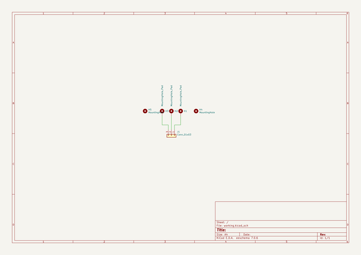
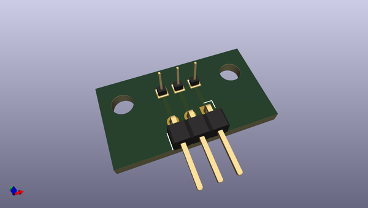
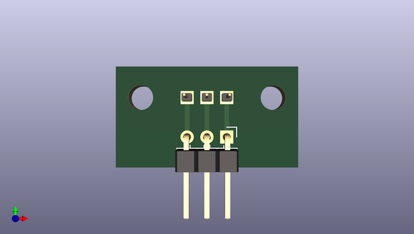
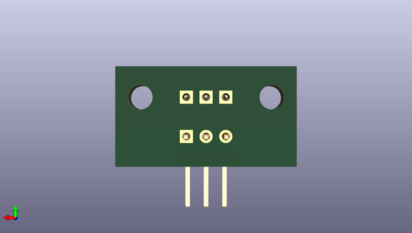

# buspirate5_hardware
 
## summary 
* id: dangerousprototypes_buspirate5_hardware_programming_pin_mount_v1_0
* user: dangerousprototypes
* name: buspirate5_hardware
* board: programming_pin_mount_v1_0
* repo: https://github.com/DangerousPrototypes/BusPirate5-hardware
* src_file_repo_kicad_pcb: debug-station/programming_pin_mount.v1.0.kicad_pcb
* src_file_repo_kicad_pcb_link: https://github.com/DangerousPrototypes/BusPirate5-hardware/tree/main/debug-station/programming_pin_mount.v1.0.kicad_pcb

* src_file_repo_sch: debug-station/programming_pin_mount.v1.0.sch
* src_file_repo_sch_link: https://github.com/DangerousPrototypes/BusPirate5-hardware/tree/main/debug-station/programming_pin_mount.v1.0.sch
* full details link: https://github.com/oomlout/oomlout_oomp_project_bot_v_2/tree/main/projects/dangerousprototypes_buspirate5_hardware_programming_pin_mount_v1_0/current_version/working  

## schematic  
  
[schematic (pdf)](working_schematic.pdf) 

## pcb  
 
  
  
  
[board (pdf)](working.pdf)  

## working_bom
| Id | Designator | Footprint | Quantity | Designation | Supplier and ref |  | None | 
| --- | --- | --- | --- | --- | --- | --- | --- | 
| 1 | H1,H2,H3 | PinHeader_1x01_P1.00mm_Vertical | 3 | MountingHole_Pad |  |  | [''] | 
| 2 | J1 | PinHeader_1x03_P2.54mm_Horizontal | 1 | Conn_01x03 |  |  | [''] | 

## bom_schematic
| Ref | Qnty | Value | Cmp name | Footprint | Description | Vendor | DNP | 
| --- | --- | --- | --- | --- | --- | --- | --- | 
| H1, H2, H3 | 3 | MountingHole_Pad | MountingHole_Pad | Connector_PinHeader_1.00mm:PinHeader_1x01_P1.00mm_Vertical | Mounting Hole with connection |  |  | 
| H4, H5 | 2 | MountingHole | MountingHole | MountingHole:MountingHole_3.2mm_M3 | Mounting Hole without connection |  |  | 
| J1 | 1 | Conn_01x03 | Conn_01x03 | Connector_PinHeader_2.54mm:PinHeader_1x03_P2.54mm_Horizontal | Generic connector, single row, 01x03, script generated (kicad-library-utils/schlib/autogen/connector/) |  |  | 

