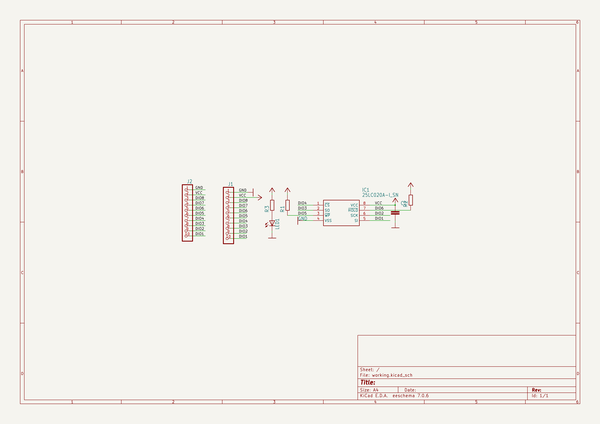
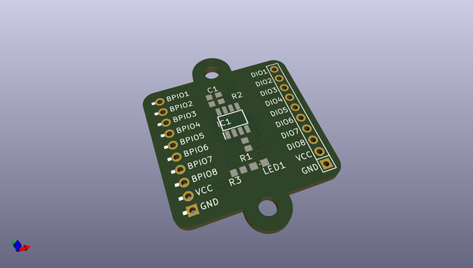
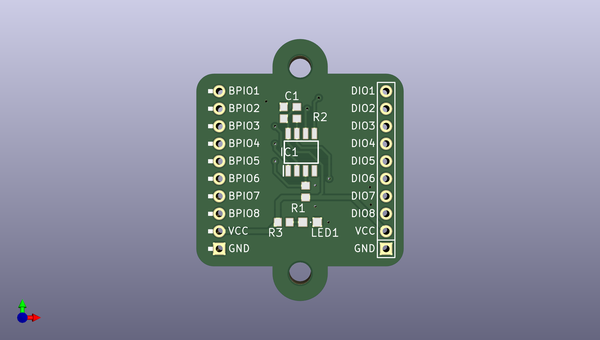
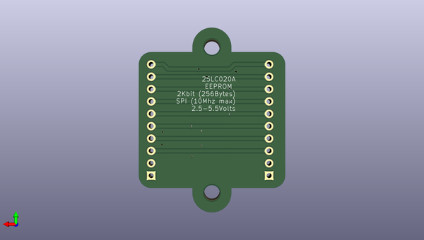

# buspirateultrahardware
 
## summary 
* id: dangerousprototypes_buspirateultrahardware_25lc020a
* user: dangerousprototypes
* name: buspirateultrahardware
* board: 25lc020a
* repo: https://github.com/DangerousPrototypes/BusPirateUltraHardware

* src_file_repo_sch: 
* src_file_repo_sch_link: https://github.com/DangerousPrototypes/BusPirateUltraHardware/tree/master/
* full details link: https://github.com/oomlout/oomlout_oomp_project_bot_v_2/tree/main/projects/dangerousprototypes_buspirateultrahardware_25lc020a/current_version/working  

## schematic  
  
[schematic (pdf)](working_schematic.pdf)  

## pcb  
 
  
  
  
[board (pdf)](working.pdf)  

## working_bom
| Id | Designator | Footprint | Quantity | Designation | Supplier and ref |  | None | 
| --- | --- | --- | --- | --- | --- | --- | --- | 
| 1 | R3,R2,R1 | R603 | 3 |  |  |  | [''] | 
| 2 | J1 | M1X10_FEMALE_RIGHT_ANGLED_PTH | 1 | CON_HEADER_1X10-RIGHT_ANGLED_PTH |  |  | [''] | 
| 3 | LED1 | LED-805 | 1 |  |  |  | [''] | 
| 4 | @HOLE0,@HOLE1 |  | 2 |  |  |  | [''] | 
| 5 | C1 | C603 | 1 |  |  |  | [''] | 
| 6 | J2 | M1X10 | 1 | CON_HEADER_1X10-PTH |  |  | [''] | 
| 7 | IC1 | SOIC127P600X175-8N | 1 | 25LC020A |  |  | [''] | 

## bom_schematic
| Ref | Qnty | Value | Cmp name | Footprint | Description | Vendor | DNP | 
| --- | --- | --- | --- | --- | --- | --- | --- | 
| C1 | 1 | CAPACITOR_NPOL-0603 | CAPACITOR_NPOL-0603 | working:C603 |  |  |  | 
| IC1 | 1 | 25LC020A-I_SN | 25LC020A-I_SN | working:SOIC127P600X175-8N |  |  |  | 
| J1 | 1 | CON_HEADER_1X10-RIGHT_ANGLED_PTH | CON_HEADER_1X10-RIGHT_ANGLED_PTH | working:M1X10_FEMALE_RIGHT_ANGLED_PTH |  |  |  | 
| J2 | 1 | CON_HEADER_1X10-PTH | CON_HEADER_1X10-PTH | working:M1X10 |  |  |  | 
| LED1 | 1 | LED-0805 | LED-0805 | working:LED-805 |  |  |  | 
| R1, R2, R3 | 3 | RESISTOR-0603 | RESISTOR-0603 | working:R603 |  |  |  | 

