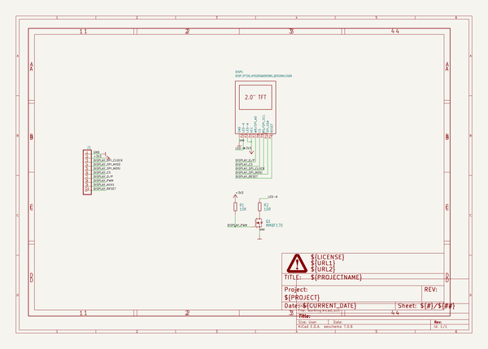
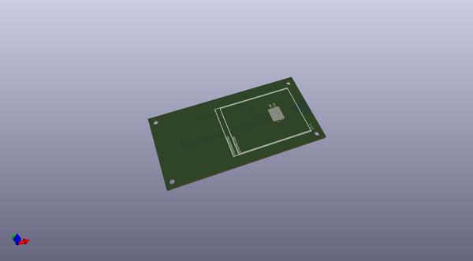
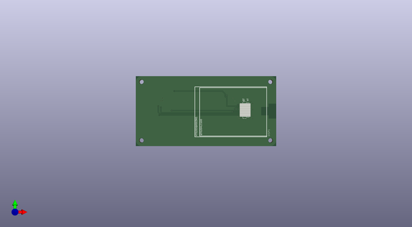
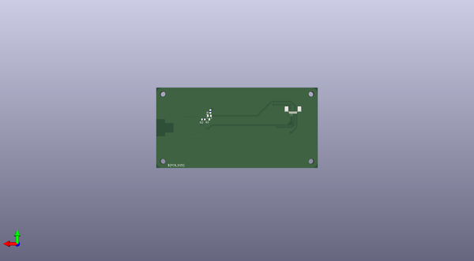

# buspirateultrahardware
 
## summary 
* id: dangerousprototypes_buspirateultrahardware_bpu_display
* user: dangerousprototypes
* name: buspirateultrahardware
* board: bpu_display
* repo: https://github.com/DangerousPrototypes/BusPirateUltraHardware

* src_file_repo_sch: 
* src_file_repo_sch_link: https://github.com/DangerousPrototypes/BusPirateUltraHardware/tree/master/
* full details link: https://github.com/oomlout/oomlout_oomp_project_bot_v_2/tree/main/projects/dangerousprototypes_buspirateultrahardware_bpu_display/current_version/working  

## schematic  
  
[schematic (pdf)](working_schematic.pdf) 

## pcb  
 
  
  
  
[board (pdf)](working.pdf)  

## working_bom
| Id | Designator | Footprint | Quantity | Designation | Supplier and ref |  | None | 
| --- | --- | --- | --- | --- | --- | --- | --- | 
| 1 | DISP1 | HT020SQV003NS_QT020HLCG00 | 1 | DISP_TFT20_HT020SQV003NS_QT020HLCG00 |  |  | [''] | 
| 2 | @HOLE1,@HOLE3,@HOLE2,@HOLE0 |  | 4 |  |  |  | [''] | 
| 3 | PAGE1 | DP_LOGO | 1 | FRAME_DINA4_L |  |  | [''] | 
| 4 | J1 | X05B20L10T | 1 | CON-FPC_X05B20L10T |  |  | [''] | 
| 5 | R2 | R0603 | 1 | 10R |  |  | [''] | 
| 6 | R1 | R0603 | 1 | 10K |  |  | [''] | 
| 7 | Q1 | SOT-23 | 1 | MMBF170 |  |  | [''] | 

## bom_schematic
| Ref | Qnty | Value | Cmp name | Footprint | Description | Vendor | DNP | 
| --- | --- | --- | --- | --- | --- | --- | --- | 
| DISP1 | 1 | DISP_TFT20_HT020SQV003NS_QT020HLCG00 | DISP_TFT20_HT020SQV003NS_QT020HLCG00 | working:HT020SQV003NS_QT020HLCG00 |  |  |  | 
| J1 | 1 | CON-FPC_X05B20L10T | CON-FPC_X05B20L10T | working:X05B20L10T |  |  |  | 
| PAGE1 | 1 | FRAME_DINA4_L | FRAME_DINA4_L | working:DP_LOGO |  |  |  | 
| Q1 | 1 | MMBF170 | TRANSISTOR_FET_BS170-SOT-23 | working:SOT-23 |  |  |  | 
| R1 | 1 | 10K | R-EU_R0603 | working:R0603 |  |  |  | 
| R2 | 1 | 10R | R-EU_R0603 | working:R0603 |  |  |  | 

