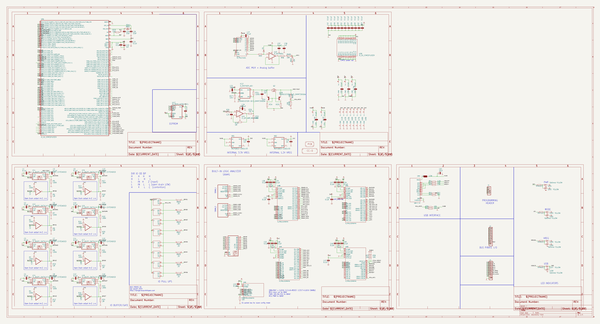

# buspirateultrahardware
 
## summary 
* id: dangerousprototypes_buspirateultrahardware_buspirate_lcd_v0a
* user: dangerousprototypes
* name: buspirateultrahardware
* board: buspirate_lcd_v0a
* repo: https://github.com/DangerousPrototypes/BusPirateUltraHardware

* src_file_repo_sch: 
* src_file_repo_sch_link: https://github.com/DangerousPrototypes/BusPirateUltraHardware/tree/master/
* full details link: https://github.com/oomlout/oomlout_oomp_project_bot_v_2/tree/main/projects/dangerousprototypes_buspirateultrahardware_buspirate_lcd_v0a/current_version/working  

## schematic  
  
[schematic (pdf)](working_schematic.pdf)  

## pcb  
 
  
  
  
[board (pdf)](working.pdf)  

## bom_schematic
| Ref | Qnty | Value | Cmp name | Footprint | Description | Vendor | DNP | 
| --- | --- | --- | --- | --- | --- | --- | --- | 
| C1, C2, C3, C4, C5, C6, C7, C8, C9, C10, C11, C12, C13, C14, C15, C16 | 16 | 0.1uF | resistor_C-EUC0402 | working:C0402 |  |  |  | 
| C17, C21, C22, C25, C26, C27, C30, C31, C33, C34, C35, C37, C40, C41, C42, C43, C44, C45, C46, C47, C48, C49, C50, C51, C52, C53, C54, C55, C56, C57, C58, C60, C61, C62, C63 | 35 | 0.1uF | rcl_C-EUC0603 | working:C0603 |  |  |  | 
| C18, C20 | 2 | 22pF | rcl_C-EUC0603 | working:C0603 |  |  |  | 
| C19 | 1 | 1uF | CPOL-EUSMCA | working:SMC_A |  |  |  | 
| C23 | 1 | 10uF | CAPACITOR_NPOL-0603 | working:C603 |  |  |  | 
| C24 | 1 | C-EUC0603 | rcl_C-EUC0603 | working:C0603 |  |  |  | 
| C28, C39 | 2 | 1uf | rcl_C-EUC0603 | working:C0603 |  |  |  | 
| C29 | 1 | 1uF | CAPACITOR_NPOL-0603 | working:C603 |  |  |  | 
| C32, C36, C59 | 3 | 0.1uF | CAPACITOR_NPOL-0402 | working:C402 |  |  |  | 
| C38 | 1 | 1uF | rcl_C-EUC0603 | working:C0603 |  |  |  | 
| C64 | 1 | 10uF | CPOL-EUSMCA | working:SMC_A |  |  |  | 
| CON1 | 1 | USB-C-12 | USB-C-12 | working:C-31-M-12 |  |  |  | 
| D1 | 1 | DIODE-SOD-123 | DIODE-SOD-123 | working:SOD-123 |  |  |  | 
| IC1, IC2, IC3, IC4, IC5, IC6, IC7, IC8 | 8 | IC_BUFF_SN74LVC1T45DBV-EXTENDED | IC_BUFF_SN74LVC1T45DBV-EXTENDED | working:SC-70-6_EXTENDED_PADS |  |  |  | 
| IC9, IC10 | 2 | IC_MEM_23LC1024 | IC_MEM_23LC1024 | working:SOIC-8 |  |  |  | 
| IC11 | 1 | IC_74HCT4051 | IC_74HCT4051 | working:TSSOP-16 |  |  |  | 
| IC12 | 1 | IC_MCP1824_ADJ | IC_MCP1824_ADJ | working:SOT-23-5 |  |  |  | 
| J1 | 1 | CON_HEADER_1X04 | CON_HEADER_1X04 | working:M1X4 |  |  |  | 
| J2 | 1 | CON_HEADER_1X10-RIGHT_ANGLED_PTH_SHROUDED | CON_HEADER_1X10-RIGHT_ANGLED_PTH_SHROUDED | working:M1X10_MALE_RIGHT_ANGLES_PTH_SHROUDED |  |  |  | 
| J3 | 1 | CON_MOLEX_MALE_SMT_SH_1.25 | CON_MOLEX_MALE_SMT_SH_1.25 | working:MOLEX_533980771 |  |  |  | 
| L1 | 1 | 1.5A | WE-KIL_0805 | working:WE-KI_0805_B |  |  |  | 
| LED1, LED4, LED6, LED8 | 4 | Optional YELLOW | LED-0805 | working:LED-805 |  |  |  | 
| LED2, LED3, LED5, LED7 | 4 | YELLOW | LED-0805 | working:LED-805 |  |  |  | 
| LOGO1 | 1 | LOGO_CC-0 | LOGO_CC-0 | working:LOGO_CC-0 |  |  |  | 
| PCB1 | 1 | PCB_DP_RECTANGLE-50X100 | PCB_DP_RECTANGLE-50X100 | working:DP10050_V1 |  |  |  | 
| Q1 | 1 | TRANSISTOR-BJT_DMMT3906W | TRANSISTOR-BJT_DMMT3906W | working:SOT-363 |  |  |  | 
| Q2 | 1 | TRANSISTOR_FET_TSM2301CX | TRANSISTOR_FET_TSM2301CX | working:SOT-23 |  |  |  | 
| R1, R2, R3, R4, R5, R7, R9, R11, R13, R14, R15, R16, R17, R19, R21, R23 | 16 | 100K | resistor_R-EU_R0402 | working:R0402 |  |  |  | 
| R6, R8, R10, R12, R18, R20, R22, R24 | 8 | 1M | resistor_R-EU_R0402 | working:R0402 |  |  |  | 
| R25, R27 | 2 | 10K | dp_devices.v6_RESISTOR-0603 | working:R603 |  |  |  | 
| R26, R33, R36 | 3 | R-EU_R0603 | resistor_R-EU_R0603 | working:R0603 |  |  |  | 
| R28 | 1 | 0R | dp_devices.v6_RESISTOR-0603 | working:R603 |  |  |  | 
| R29, R37, R38, R39, R40 | 5 | 10K | resistor_R-EU_R0603 | working:R0603 |  |  |  | 
| R30 | 1 | 78.7K | dp_devices.v6_RESISTOR-0603 | working:R603 |  |  |  | 
| R31 | 1 | 100K | dp_devices.v6_RESISTOR-0603 | working:R603 |  |  |  | 
| R32 | 1 | 50K | dp_devices.v6_RESISTOR-0603 | working:R603 |  |  |  | 
| R34, R35 | 2 | RESISTOR-0603 | dp_devices.v6_RESISTOR-0603 | working:R603 |  |  |  | 
| R41 | 1 | 1.5K | rcl_R-EU_R0603 | working:R0603 |  |  |  | 
| R42, R43 | 2 | 22R | rcl_R-EU_R0603 | working:R0603 |  |  |  | 
| R44, R45 | 2 | 5K1 | rcl_R-EU_R0603 | working:R0603 |  |  |  | 
| R46, R47, R48, R49 | 4 | 1K1 | RESISTOR-0603 | working:R603 |  |  |  | 
| RN1, RN2 | 2 | 2K | RNETWORK | working:RN8P-4R-CRA06S |  |  |  | 
| RN3 | 1 | 10K | RNETWORK | working:RN8P-4R-CRA06S |  |  |  | 
| U1, U2, U3, U4, U6, U7, U8, U9 | 8 | IC_BUFF_74LVC1G07-EXTENDED | IC_BUFF_74LVC1G07-EXTENDED | working:SC-70-5_EXTENDED_PADS |  |  |  | 
| U5 | 1 | IC_UC_STM32F103ZX | IC_UC_STM32F103ZX | working:TQFP-144 |  |  |  | 
| U10, U11 | 2 | IC_74HCT4066PW | IC_74HCT4066PW | working:TSSOP-14 |  |  |  | 
| U12 | 1 | IC_MEM_W25X40CL | IC_MEM_W25X40CL | working:SOIC-8 |  |  |  | 
| U13 | 1 | IC_BUFF_74LVC245A-TSSOP20 | IC_BUFF_74LVC245A-TSSOP20 | working:TSSOP-20 |  |  |  | 
| U14 | 1 | IC_OP-AMP_MCP6001 | IC_OP-AMP_MCP6001 | working:SOT-23-5 |  |  |  | 
| U15 | 1 | IC_MCP6001 | IC_MCP6001 | working:SOT-23-5 |  |  |  | 
| U16 | 1 | IC_FPGA_ICE40HX4K | IC_FPGA_ICE40HX4K | working:TQFP-144 |  |  |  | 
| VR1 | 1 | MCP1801T-3302I/OT | MIC5205 | working:SOT-23-5@1 |  |  |  | 
| VR2 | 1 | MCP1801T-1202I/OT | MIC5205 | working:SOT-23-5@1 |  |  |  | 
| XTAL1 | 1 | 8Mhz | OSC-XTAL-12M | working:XTAL_4X6 |  |  |  | 

