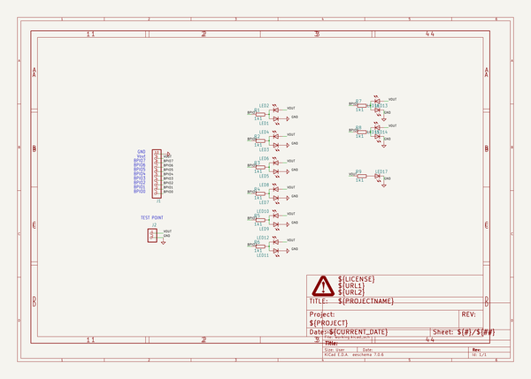

# buspirateultrahardware
 
## summary 
* id: dangerousprototypes_buspirateultrahardware_buspirate_ultra_testboard_v1_0
* user: dangerousprototypes
* name: buspirateultrahardware
* board: buspirate_ultra_testboard_v1_0
* repo: https://github.com/DangerousPrototypes/BusPirateUltraHardware

* src_file_repo_sch: 
* src_file_repo_sch_link: https://github.com/DangerousPrototypes/BusPirateUltraHardware/tree/master/
* full details link: https://github.com/oomlout/oomlout_oomp_project_bot_v_2/tree/main/projects/dangerousprototypes_buspirateultrahardware_buspirate_ultra_testboard_v1_0/current_version/working  

## schematic  
  
[schematic (pdf)](working_schematic.pdf) 

## pcb  
 
  
  
  
[board (pdf)](working.pdf)  

## working_bom
| Id | Designator | Footprint | Quantity | Designation | Supplier and ref |  | None | 
| --- | --- | --- | --- | --- | --- | --- | --- | 
| 1 | LED10,LED1,LED4,LED16,LED15,LED9,LED7,LED8,LED17,LED14,LED5,LED3,LED12,LED11,LED13,LED2,LED6 | LED-805 | 17 |  |  |  | [''] | 
| 2 | PAGE1 | DP_LOGO | 1 | FRAME_DINA4_L |  |  | [''] | 
| 3 | J2 | M1X2 | 1 | CON_HEADER_1X02-PTH |  |  | [''] | 
| 4 | R9,R8,R4,R1,R5,R2,R6,R7,R3 | R603 | 9 | 1k1 |  |  | [''] | 
| 5 | J1 | M1X10_FEMALE_RIGHT_ANGLED_PTH | 1 | CON_HEADER_1X10-RIGHT_ANGLED_PTH |  |  | [''] | 

## bom_schematic
| Ref | Qnty | Value | Cmp name | Footprint | Description | Vendor | DNP | 
| --- | --- | --- | --- | --- | --- | --- | --- | 
| J1 | 1 | CON_HEADER_1X10-RIGHT_ANGLED_PTH | CON_HEADER_1X10-RIGHT_ANGLED_PTH | working:M1X10_FEMALE_RIGHT_ANGLED_PTH |  |  |  | 
| J2 | 1 | CON_HEADER_1X02-PTH | CON_HEADER_1X02-PTH | working:M1X2 |  |  |  | 
| LED1, LED2, LED3, LED4, LED5, LED6, LED7, LED8, LED9, LED10, LED11, LED12, LED13, LED14, LED15, LED16, LED17 | 17 | LED-0805 | LED-0805 | working:LED-805 |  |  |  | 
| PAGE1 | 1 | FRAME_DINA4_L | FRAME_DINA4_L | working:DP_LOGO |  |  |  | 
| R1, R2, R3, R4, R5, R6, R7, R8, R9 | 9 | 1k1 | RESISTOR-0603 | working:R603 |  |  |  | 

