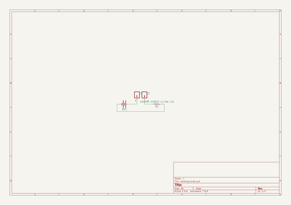
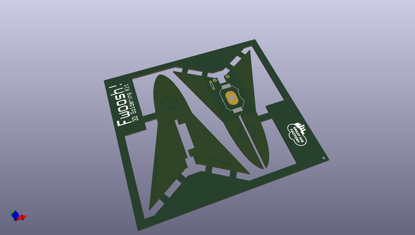
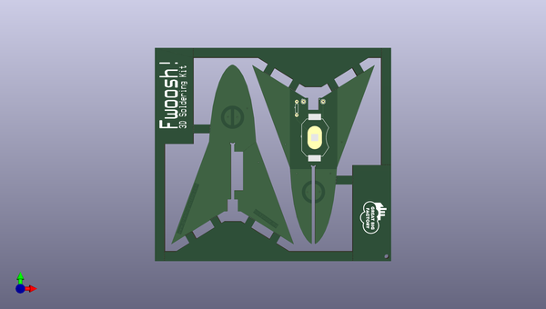
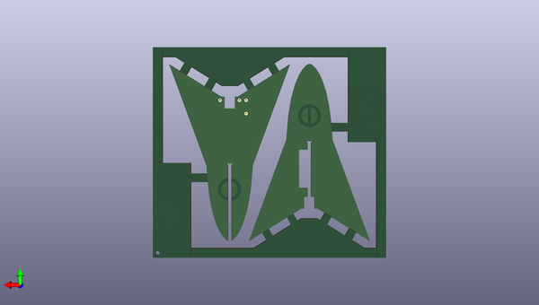

# 3d_soldering_kits
 
## summary 
* id: npoole_3d_soldering_kits_rocket_pane_v3l
* user: npoole
* name: 3d_soldering_kits
* board: rocket_pane_v3l
* repo: https://github.com/NPoole/3D-Soldering-Kits

* src_file_repo_sch: 
* src_file_repo_sch_link: https://github.com/NPoole/3D-Soldering-Kits/tree/master/
* full details link: https://github.com/oomlout/oomlout_oomp_project_bot_v_2/tree/main/projects/npoole_3d_soldering_kits_rocket_pane_v3l/current_version/working  

## schematic  
  
[schematic (pdf)](working_schematic.pdf) 

## pcb  
 
  
  
  
[board (pdf)](working.pdf)  

## working_bom
| Id | Designator | Footprint | Quantity | Designation | Supplier and ref |  | None | 
| --- | --- | --- | --- | --- | --- | --- | --- | 
| 1 | @HOLE72,@HOLE63,@HOLE25,@HOLE85,@HOLE20,@HOLE17,@HOLE7,@HOLE42,@HOLE31,@HOLE70,@HOLE1,@HOLE32,@HOLE18,@HOLE49,@HOLE12,@HOLE64,@HOLE8,@HOLE89,@HOLE59,@HOLE4,@HOLE30,@HOLE29,@HOLE9,@HOLE80,@HOLE23,@HOLE83,@HOLE2,@HOLE33,@HOLE60,@HOLE41,@HOLE82,@HOLE56,@HOLE0,@HOLE90,@HOLE77,@HOLE19,@HOLE10,@HOLE43,@HOLE22,@HOLE15,@HOLE62,@HOLE58,@HOLE73,@HOLE57,@HOLE36,@HOLE27,@HOLE75,@HOLE66,@HOLE92,@HOLE45,@HOLE13,@HOLE94,@HOLE81,@HOLE68,@HOLE44,@HOLE3,@HOLE87,@HOLE24,@HOLE38,@HOLE61,@HOLE35,@HOLE88,@HOLE34,@HOLE76,@HOLE37,@HOLE11,@HOLE71,@HOLE5,@HOLE78,@HOLE53,@HOLE93,@HOLE28,@HOLE6,@HOLE54,@HOLE48,@HOLE51,@HOLE50,@HOLE79,@HOLE69,@HOLE84,@HOLE52,@HOLE91,@HOLE39,@HOLE47,@HOLE74,@HOLE21,@HOLE14,@HOLE65,@HOLE67,@HOLE16,@HOLE55,@HOLE40,@HOLE46,@HOLE86,@HOLE26 |  | 95 |  |  |  | [''] | 
| 2 | J1,J2 | 1X01 | 2 |  |  |  | [''] | 
| 3 | U$1 | TEXT1466#PNG | 1 |  |  |  | [''] | 
| 4 | U$2 | GREATBIGFACTORYCLOUDLOGO#PNG | 1 |  |  |  | [''] | 
| 5 | R1 | AXIAL-0.3 | 1 | 1k |  |  | [''] | 
| 6 | BT1 | BATTCON_20MM_4LEGS | 1 |  |  |  | [''] | 

## bom_schematic
| Ref | Qnty | Value | Cmp name | Footprint | Description | Vendor | DNP | 
| --- | --- | --- | --- | --- | --- | --- | --- | 
| BT1 | 1 | BATTERY-20MM_SMD_4LEGS | BATTERY-20MM_SMD_4LEGS | working:BATTCON_20MM_4LEGS |  |  |  | 
| J1, J2 | 2 | CONN_01 | CONN_01 | working:1X01 |  |  |  | 
| R1 | 1 | 1KOHM-HORIZ-1/4W-1% | 1KOHM-HORIZ-1/4W-1% | working:AXIAL-0.3 |  |  |  | 

