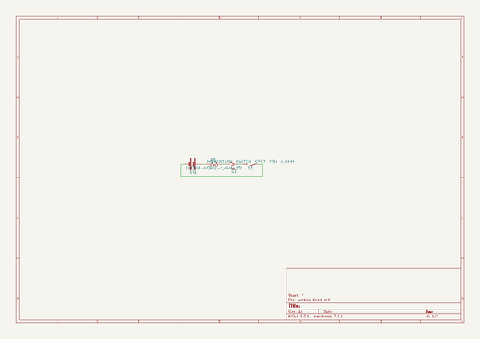
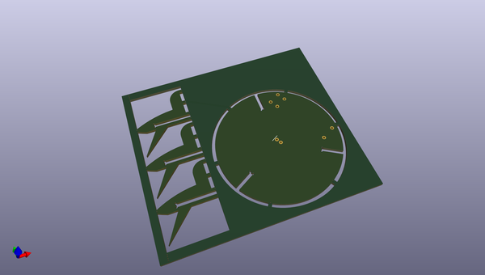
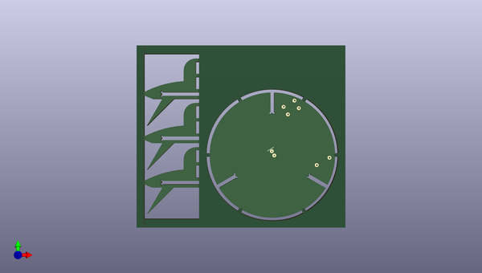
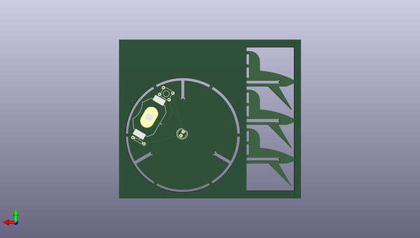

# 3d_soldering_kits
 
## summary 
* id: npoole_3d_soldering_kits_v1
* user: npoole
* name: 3d_soldering_kits
* board: v1
* repo: https://github.com/NPoole/3D-Soldering-Kits

* src_file_repo_sch: 
* src_file_repo_sch_link: https://github.com/NPoole/3D-Soldering-Kits/tree/master/
* full details link: https://github.com/oomlout/oomlout_oomp_project_bot_v_2/tree/main/projects/npoole_3d_soldering_kits_v1/current_version/working  

## schematic  
  
[schematic (pdf)](working_schematic.pdf) 

## pcb  
 
  
  
  
[board (pdf)](working.pdf)  

## working_bom
| Id | Designator | Footprint | Quantity | Designation | Supplier and ref |  | None | 
| --- | --- | --- | --- | --- | --- | --- | --- | 
| 1 | @HOLE23,@HOLE17,@HOLE12,@HOLE29,@HOLE19,@HOLE13,@HOLE5,@HOLE38,@HOLE14,@HOLE3,@HOLE24,@HOLE22,@HOLE34,@HOLE37,@HOLE21,@HOLE36,@HOLE39,@HOLE4,@HOLE11,@HOLE33,@HOLE25,@HOLE28,@HOLE27,@HOLE10,@HOLE15,@HOLE1,@HOLE30,@HOLE2,@HOLE35,@HOLE0,@HOLE32,@HOLE31,@HOLE8,@HOLE7,@HOLE9,@HOLE18,@HOLE40,@HOLE6,@HOLE16,@HOLE20,@HOLE26 |  | 41 |  |  |  | [''] | 
| 2 | BT1 | BATTCON_20MM_4LEGS | 1 |  |  |  | [''] | 
| 3 | R1 | AXIAL-0.3 | 1 | 1k |  |  | [''] | 
| 4 | D1 | LED_5MM | 1 |  |  |  | [''] | 
| 5 | S1 | TACTILE_SWITCH_PTH_6.0MM | 1 | MOMENTARY-SWITCH-SPST-PTH-6.0MM |  |  | [''] | 

## bom_schematic
| Ref | Qnty | Value | Cmp name | Footprint | Description | Vendor | DNP | 
| --- | --- | --- | --- | --- | --- | --- | --- | 
| BT1 | 1 | BATTERY-20MM_SMD_4LEGS | BATTERY-20MM_SMD_4LEGS | working:BATTCON_20MM_4LEGS |  |  |  | 
| D1 | 1 | LED5MM | LED5MM | working:LED_5MM |  |  |  | 
| R1 | 1 | 1KOHM-HORIZ-1/4W-1% | 1KOHM-HORIZ-1/4W-1% | working:AXIAL-0.3 |  |  |  | 
| S1 | 1 | MOMENTARY-SWITCH-SPST-PTH-6.0MM | MOMENTARY-SWITCH-SPST-PTH-6.0MM | working:TACTILE_SWITCH_PTH_6.0MM |  |  |  | 

