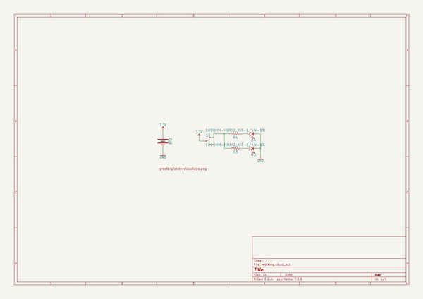

# 3d_soldering_kits
 
## summary 
* id: npoole_3d_soldering_kits_v3
* user: npoole
* name: 3d_soldering_kits
* board: v3
* repo: https://github.com/NPoole/3D-Soldering-Kits

* src_file_repo_sch: 
* src_file_repo_sch_link: https://github.com/NPoole/3D-Soldering-Kits/tree/master/
* full details link: https://github.com/oomlout/oomlout_oomp_project_bot_v_2/tree/main/projects/npoole_3d_soldering_kits_v3/current_version/working  

## schematic  
  
[schematic (pdf)](working_schematic.pdf) 

## pcb  
 
  
  
  
[board (pdf)](working.pdf)  

## working_bom
| Id | Designator | Footprint | Quantity | Designation | Supplier and ref |  | None | 
| --- | --- | --- | --- | --- | --- | --- | --- | 
| 1 | @HOLE198,@HOLE122,@HOLE124,@HOLE74,@HOLE68,@HOLE293,@HOLE29,@HOLE268,@HOLE221,@HOLE226,@HOLE330,@HOLE295,@HOLE11,@HOLE0,@HOLE292,@HOLE49,@HOLE169,@HOLE306,@HOLE328,@HOLE65,@HOLE195,@HOLE93,@HOLE17,@HOLE213,@HOLE69,@HOLE199,@HOLE212,@HOLE339,@HOLE319,@HOLE321,@HOLE345,@HOLE323,@HOLE96,@HOLE190,@HOLE119,@HOLE149,@HOLE239,@HOLE55,@HOLE252,@HOLE281,@HOLE249,@HOLE51,@HOLE137,@HOLE34,@HOLE223,@HOLE6,@HOLE318,@HOLE114,@HOLE154,@HOLE176,@HOLE66,@HOLE23,@HOLE151,@HOLE141,@HOLE348,@HOLE121,@HOLE326,@HOLE184,@HOLE274,@HOLE225,@HOLE344,@HOLE165,@HOLE88,@HOLE83,@HOLE217,@HOLE276,@HOLE110,@HOLE234,@HOLE331,@HOLE204,@HOLE336,@HOLE316,@HOLE286,@HOLE75,@HOLE16,@HOLE76,@HOLE206,@HOLE220,@HOLE258,@HOLE333,@HOLE216,@HOLE174,@HOLE25,@HOLE7,@HOLE296,@HOLE56,@HOLE39,@HOLE235,@HOLE73,@HOLE192,@HOLE191,@HOLE325,@HOLE92,@HOLE297,@HOLE134,@HOLE289,@HOLE143,@HOLE243,@HOLE130,@HOLE131,@HOLE311,@HOLE236,@HOLE257,@HOLE32,@HOLE324,@HOLE327,@HOLE218,@HOLE335,@HOLE260,@HOLE85,@HOLE123,@HOLE244,@HOLE248,@HOLE167,@HOLE26,@HOLE282,@HOLE41,@HOLE105,@HOLE44,@HOLE322,@HOLE70,@HOLE147,@HOLE175,@HOLE80,@HOLE156,@HOLE181,@HOLE253,@HOLE47,@HOLE72,@HOLE201,@HOLE37,@HOLE126,@HOLE273,@HOLE15,@HOLE270,@HOLE298,@HOLE310,@HOLE1,@HOLE22,@HOLE303,@HOLE254,@HOLE67,@HOLE351,@HOLE132,@HOLE307,@HOLE205,@HOLE152,@HOLE118,@HOLE317,@HOLE62,@HOLE84,@HOLE271,@HOLE78,@HOLE247,@HOLE64,@HOLE229,@HOLE101,@HOLE30,@HOLE280,@HOLE340,@HOLE211,@HOLE179,@HOLE71,@HOLE54,@HOLE3,@HOLE230,@HOLE48,@HOLE86,@HOLE278,@HOLE99,@HOLE103,@HOLE180,@HOLE28,@HOLE309,@HOLE133,@HOLE148,@HOLE238,@HOLE104,@HOLE46,@HOLE241,@HOLE50,@HOLE97,@HOLE102,@HOLE188,@HOLE337,@HOLE117,@HOLE285,@HOLE136,@HOLE266,@HOLE43,@HOLE269,@HOLE5,@HOLE246,@HOLE82,@HOLE349,@HOLE170,@HOLE187,@HOLE145,@HOLE129,@HOLE203,@HOLE263,@HOLE178,@HOLE305,@HOLE304,@HOLE127,@HOLE262,@HOLE272,@HOLE341,@HOLE125,@HOLE202,@HOLE163,@HOLE287,@HOLE251,@HOLE87,@HOLE312,@HOLE231,@HOLE94,@HOLE291,@HOLE222,@HOLE294,@HOLE31,@HOLE95,@HOLE33,@HOLE320,@HOLE106,@HOLE259,@HOLE255,@HOLE347,@HOLE208,@HOLE290,@HOLE210,@HOLE140,@HOLE334,@HOLE207,@HOLE302,@HOLE279,@HOLE250,@HOLE45,@HOLE177,@HOLE314,@HOLE267,@HOLE40,@HOLE299,@HOLE135,@HOLE57,@HOLE91,@HOLE242,@HOLE18,@HOLE313,@HOLE162,@HOLE52,@HOLE35,@HOLE265,@HOLE329,@HOLE301,@HOLE21,@HOLE308,@HOLE160,@HOLE100,@HOLE115,@HOLE107,@HOLE338,@HOLE300,@HOLE108,@HOLE90,@HOLE166,@HOLE197,@HOLE142,@HOLE79,@HOLE228,@HOLE81,@HOLE10,@HOLE193,@HOLE346,@HOLE168,@HOLE315,@HOLE27,@HOLE158,@HOLE240,@HOLE350,@HOLE264,@HOLE98,@HOLE36,@HOLE342,@HOLE144,@HOLE111,@HOLE128,@HOLE164,@HOLE12,@HOLE61,@HOLE185,@HOLE58,@HOLE209,@HOLE138,@HOLE146,@HOLE237,@HOLE2,@HOLE277,@HOLE60,@HOLE113,@HOLE13,@HOLE8,@HOLE63,@HOLE183,@HOLE283,@HOLE4,@HOLE196,@HOLE9,@HOLE214,@HOLE219,@HOLE89,@HOLE172,@HOLE150,@HOLE288,@HOLE224,@HOLE186,@HOLE53,@HOLE59,@HOLE256,@HOLE284,@HOLE157,@HOLE332,@HOLE24,@HOLE227,@HOLE20,@HOLE112,@HOLE171,@HOLE116,@HOLE14,@HOLE38,@HOLE194,@HOLE161,@HOLE109,@HOLE159,@HOLE120,@HOLE233,@HOLE215,@HOLE200,@HOLE343,@HOLE42,@HOLE261,@HOLE275,@HOLE189,@HOLE77,@HOLE153,@HOLE139,@HOLE182,@HOLE155,@HOLE173,@HOLE19,@HOLE232,@HOLE245 |  | 352 |  |  |  | [''] | 
| 2 | U$2 | RECT1468#PNG | 1 |  |  |  | [''] | 
| 3 | U$1 | GREATBIGFACTORYCLOUDLOGO#PNG | 1 | GREATBIGFACTORYCLOUDLOGO#PNG |  |  | [''] | 
| 4 | D3,D4 | LED_5MM | 2 |  |  |  | [''] | 
| 5 | S2 | SWITCH_SPDT_PTH_11.6X4.0MM_KIT | 1 |  |  |  | [''] | 
| 6 | R4,R3 | AXIAL-0.3EZ | 2 | 100 |  |  | [''] | 
| 7 | BT2 | BATTCOM_20MM_PTH_KIT | 1 |  |  |  | [''] | 

## bom_schematic
| Ref | Qnty | Value | Cmp name | Footprint | Description | Vendor | DNP | 
| --- | --- | --- | --- | --- | --- | --- | --- | 
| BT2 | 1 | BATTERY-20MM_PTH_KIT | BATTERY-20MM_PTH_KIT | working:BATTCOM_20MM_PTH_KIT |  |  |  | 
| D3, D4 | 2 | LED5MM | LED5MM | working:LED_5MM |  |  |  | 
| R3, R4 | 2 | 100OHM-HORIZ_KIT-1/4W-1% | 100OHM-HORIZ_KIT-1/4W-1% | working:AXIAL-0.3EZ |  |  |  | 
| S2 | 1 | SWITCH-SPDT-PTH-11.6X4.0MM-KIT | SWITCH-SPDT-PTH-11.6X4.0MM-KIT | working:SWITCH_SPDT_PTH_11.6X4.0MM_KIT |  |  |  | 
| U$1 | 1 | GREATBIGFACTORYCLOUDLOGO#PNG | GREATBIGFACTORYCLOUDLOGO#PNG | working:GREATBIGFACTORYCLOUDLOGO#PNG |  |  |  | 

