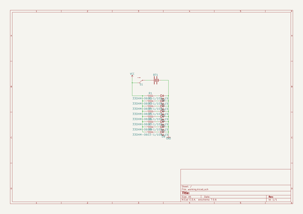
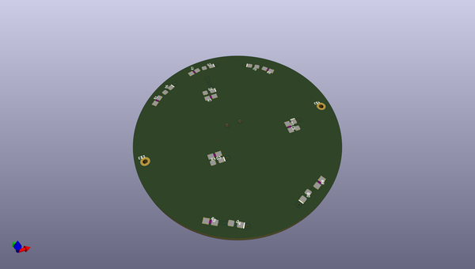
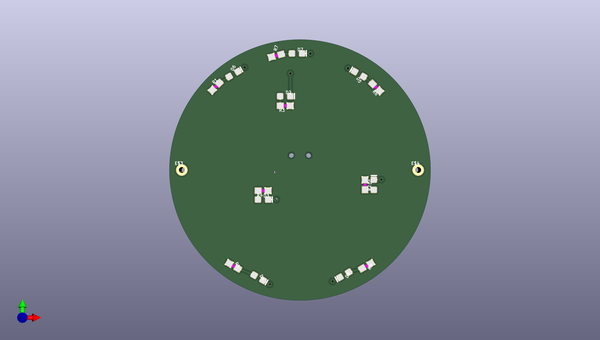
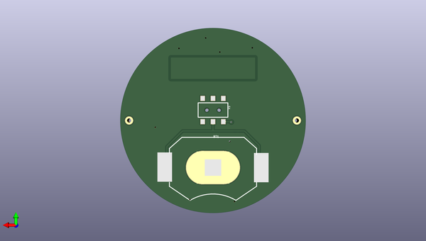

# antifa_led_badge
 
## summary 
* id: npoole_antifa_led_badge_anti1_bot
* user: npoole
* name: antifa_led_badge
* board: anti1_bot
* repo: https://github.com/NPoole/Antifa_LED_Badge

* src_file_repo_sch: 
* src_file_repo_sch_link: https://github.com/NPoole/Antifa_LED_Badge/tree/master/
* full details link: https://github.com/oomlout/oomlout_oomp_project_bot_v_2/tree/main/projects/npoole_antifa_led_badge_anti1_bot/current_version/working  

## schematic  
  
[schematic (pdf)](working_schematic.pdf) 

## pcb  
 
  
  
  
[board (pdf)](working.pdf)  

## working_bom
| Id | Designator | Footprint | Quantity | Designation | Supplier and ref |  | None | 
| --- | --- | --- | --- | --- | --- | --- | --- | 
| 1 | D8,D7,D4,D3,D2,D1,D5,D6 | LED-0603 | 8 |  |  |  | [''] | 
| 2 | R5,R4,R6,R2,R8,R3,R7,R1 | 0603 | 8 | 33 |  |  | [''] | 
| 3 | E$3,E$4 | 1X01_NO_SILK | 2 |  |  |  | [''] | 
| 4 | S1 | SWITCH_DPDT_SMD_AYZ0202 | 1 |  |  |  | [''] | 
| 5 | BT1 | BATTCON_20MM_4LEGS | 1 |  |  |  | [''] | 

## bom_schematic
| Ref | Qnty | Value | Cmp name | Footprint | Description | Vendor | DNP | 
| --- | --- | --- | --- | --- | --- | --- | --- | 
| BT1 | 1 | BATTERY-20MM_SMD_4LEGS | BATTERY-20MM_SMD_4LEGS | working:BATTCON_20MM_4LEGS |  |  |  | 
| D1, D2, D3, D4, D5, D6, D7, D8 | 8 | LED0603 | LED0603 | working:LED-0603 |  |  |  | 
| R1, R2, R3, R4, R5, R6, R7, R8 | 8 | 33OHM-0603-1/10W-1% | 33OHM-0603-1/10W-1% | working:0603 |  |  |  | 
| S1 | 1 | SWITCH-SPDT-SMD-AYZ0202 | SWITCH-SPDT-SMD-AYZ0202 | working:SWITCH_DPDT_SMD_AYZ0202 |  |  |  | 

