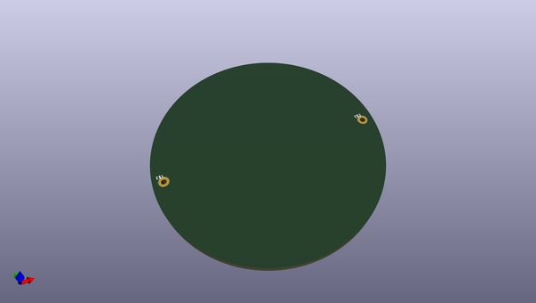
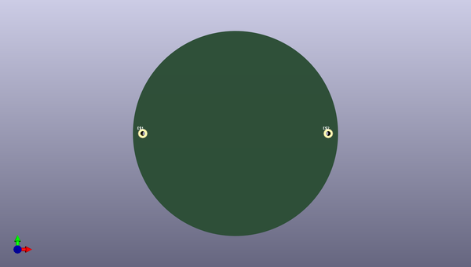
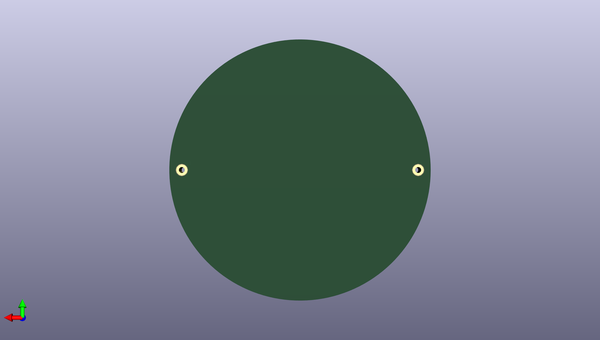

# antifa_led_badge
 
## summary 
* id: npoole_antifa_led_badge_anti1_top
* user: npoole
* name: antifa_led_badge
* board: anti1_top
* repo: https://github.com/NPoole/Antifa_LED_Badge

* src_file_repo_sch: 
* src_file_repo_sch_link: https://github.com/NPoole/Antifa_LED_Badge/tree/master/
* full details link: https://github.com/oomlout/oomlout_oomp_project_bot_v_2/tree/main/projects/npoole_antifa_led_badge_anti1_top/current_version/working  

## pcb  
 
  
  
  
[board (pdf)](working.pdf)  

## working_bom
| Id | Designator | Footprint | Quantity | Designation | Supplier and ref |  | None | 
| --- | --- | --- | --- | --- | --- | --- | --- | 
| 1 | E$1,E$2 | 1X01_NO_SILK | 2 |  |  |  | [''] | 

