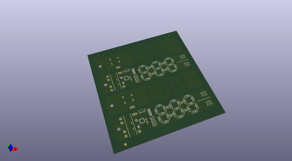
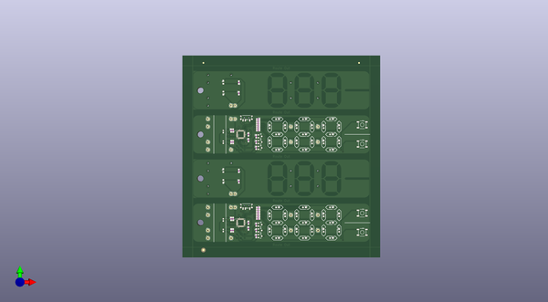
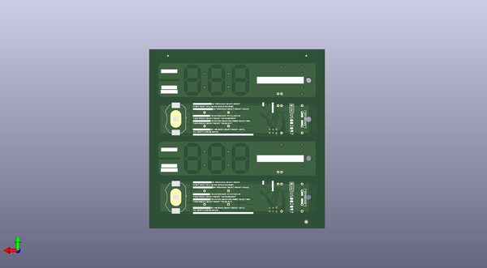

# beancounter
 
## summary 
* id: npoole_beancounter_beancounter_panel_for_3dm
* user: npoole
* name: beancounter
* board: beancounter_panel_for_3dm
* repo: https://github.com/NPoole/BeanCounter

* src_file_repo_sch: 
* src_file_repo_sch_link: https://github.com/NPoole/BeanCounter/tree/main/
* full details link: https://github.com/oomlout/oomlout_oomp_project_bot_v_2/tree/main/projects/npoole_beancounter_beancounter_panel_for_3dm/current_version/working  

## pcb  
 
  
  
  
[board (pdf)](working.pdf)  

## working_bom
| Id | Designator | Footprint | Quantity | Designation | Supplier and ref |  | None | 
| --- | --- | --- | --- | --- | --- | --- | --- | 
| 1 | J22,J5,J6,J20,J4,J11,J8,J18,J23,J3,J16,J17,J7,J10,J21,J19,J9,J15 | 1X01 | 18 |  |  |  | [''] | 
| 2 | J2,J12,J14,J24 | 1X02 | 4 |  |  |  | [''] | 
| 3 | R20,R5,R19,R2,R4,R21,R7,R3,R6,R22,R8,R16,R17,R18 | 0603 | 14 | 33 |  |  | [''] | 
| 4 | U$63,U$64,U$31,U$32 | HARVATEK_DETECTOR | 4 | B19H1PT |  |  | [''] | 
| 5 | S4,S5,S1,S2 | TACTILE_SWITCH_SMD_5.2MM | 4 | MOMENTARY-SWITCH-SPST-SMD-5.2MM-TALL |  |  | [''] | 
| 6 | E$5,E$6 | FIDUCIAL-1.5X3 | 2 |  |  |  | [''] | 
| 7 | @HOLE0,@HOLE2,@HOLE3,@HOLE1 |  | 4 |  |  |  | [''] | 
| 8 | D2S12,D3S6,D3S12,D1S4,D3S4,D2S11,D3S1,D2S9,D1S7,D2S5,D2S1,D2S13,D3S11,D2S8,D1S12,D1S5,D3S7,D3S14,D3S13,D2S7,D3S2,D3S10,D2S14,D1S1,D1S9,D3S5,D2S6,D2S3,D3S3,D2S10,DIS3,D1S10,D1S3,D3S9,D2S2,D1S8,D2S4,D1S2,D1S11,DIS1,D1S6,D3S8 | LED-0603 | 42 |  |  |  | [''] | 
| 9 | C1,C2,C5,C6,C3,C4 | 0603 | 6 | 0.1uF |  |  | [''] | 
| 10 | Q3,Q4,Q5,Q6,Q2,Q1 | SOT23-3 | 6 | 220mA/50V/3.5Ω |  |  | [''] | 
| 11 | R13,R24,R30,R25,R23,R27,R28,R1,R14,R12,R11,R26,R29,R15,R10,R9 | 0603 | 16 | 1k |  |  | [''] | 
| 12 | E$3,E$1,E$2,E$4 | FIDUCIAL-1X2 | 4 |  |  |  | [''] | 
| 13 | S3,S6 | SWITCH_SPST_SMD_A | 2 |  |  |  | [''] | 
| 14 | D3,D1,D2,D4 | LED-0603 | 4 | IR LED |  |  | [''] | 
| 15 | U2,U1 | 32M1-A_ATM | 2 | ATTINY861V-10MU |  |  | [''] | 
| 16 | U$42,U$2 | EXTERN_PWR0 | 2 |  |  |  | [''] | 
| 17 | U$1,U$41 | OSHWBC#SVG0 | 2 |  |  |  | [''] | 
| 18 | U$20,U$36 | 40 | 2 |  |  |  | [''] | 
| 19 | U$10,U$45 | FIRST_DIGIT_WILL_BLINK_WHILE_PAUSED#_0 | 2 |  |  |  | [''] | 
| 20 | U$49,U$4 | #PRESS_SETUP_X1#0 | 2 |  |  |  | [''] | 
| 21 | U$6,U$33 | #_3V#0 | 2 |  |  |  | [''] | 
| 22 | U$60,U$28 | #RESET#0 | 2 |  |  |  | [''] | 
| 23 | U$26,U$58 | #COMPLETE_DOCS_AT_GITHUB#COM#NPOOLE#BEANCOUNTER#0 | 2 |  |  |  | [''] | 
| 24 | U$53,U$16 | TO_ENTER_COUNTING_MODE_SELECTION0 | 2 |  |  |  | [''] | 
| 25 | U$44,U$9 | BY_PRESSING_COUNT#RESET0 | 2 |  |  |  | [''] | 
| 26 | U$19,U$56 | BY_HOLDING_COUNT#RESET_UNTIL0 | 2 |  |  |  | [''] | 
| 27 | U$25,U$57 | ALL_DIGITS_ARE_BLINKING0 | 2 |  |  |  | [''] | 
| 28 | U$30,U$62 | LOGO#SVG0 | 2 |  |  |  | [''] | 
| 29 | U$5,U$35 | 00 | 2 |  |  |  | [''] | 
| 30 | U$40,U$24 | #OFF#EXT#0 | 2 |  |  |  | [''] | 
| 31 | U$29,U$61 | #SETUP#0 | 2 |  |  |  | [''] | 
| 32 | U$12,U$47 | #RESUME_COUNTING#0 | 2 |  |  |  | [''] | 
| 33 | U$3,U$43 | #PAUSE_COUNTING#0 | 2 |  |  |  | [''] | 
| 34 | U$27,U$59 | #COUNT#0 | 2 |  |  |  | [''] | 
| 35 | BT2,BT1 | BATTCON_20MM_4LEGS_OVERPASTE_INNER | 2 |  |  |  | [''] | 
| 36 | U$13,U$48 | BY_PRESSING_COUNT#RESET_AGAIN0 | 2 |  |  |  | [''] | 
| 37 | U$50,U$14 | TO_ENTER_PART_PITCH_SETUP0 | 2 |  |  |  | [''] | 
| 38 | U$51,U$8 | THEN_PRESS_COUNT#RESET_TO_INCREMENT0 | 2 |  |  |  | [''] | 
| 39 | J1,J13 | 2X3_TEST_POINTS | 2 | AVR_SPI_PROG_3X2TESTPOINTS |  |  | [''] | 
| 40 | U$46,U$11 | #_0 | 2 |  |  |  | [''] | 
| 41 | U$15,U$52 | #PRESS_SETUP_X2#0 | 2 |  |  |  | [''] | 
| 42 | U$34,U$7 | #_GND#0 | 2 |  |  |  | [''] | 
| 43 | U$21,U$37 | 120 | 2 |  |  |  | [''] | 
| 44 | U$22,U$38 | 160 | 2 |  |  |  | [''] | 
| 45 | U$55,U$18 | #RESET_COUNTER#0 | 2 |  |  |  | [''] | 
| 46 | U$23,U$39 | #ON#0 | 2 |  |  |  | [''] | 
| 47 | U$54,U$17 | THEN_PRESS_COUNT#RESET_TO_SELECT0 | 2 |  |  |  | [''] | 

