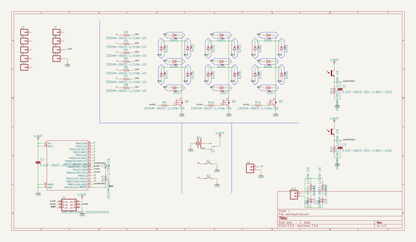
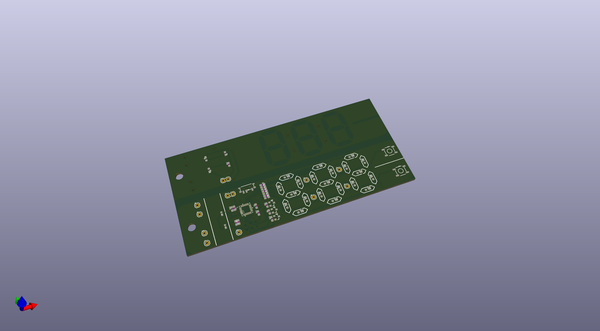
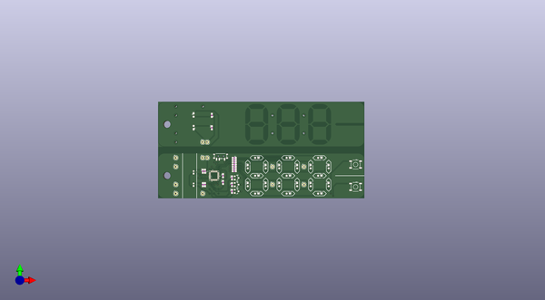
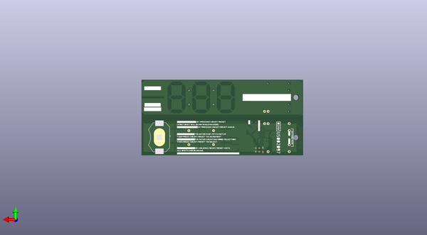

# beancounter
 
## summary 
* id: npoole_beancounter_beancounter_v10
* user: npoole
* name: beancounter
* board: beancounter_v10
* repo: https://github.com/NPoole/BeanCounter

* src_file_repo_sch: 
* src_file_repo_sch_link: https://github.com/NPoole/BeanCounter/tree/main/
* full details link: https://github.com/oomlout/oomlout_oomp_project_bot_v_2/tree/main/projects/npoole_beancounter_beancounter_v10/current_version/working  

## schematic  
  
[schematic (pdf)](working_schematic.pdf) 

## pcb  
 
  
  
  
[board (pdf)](working.pdf)  

## working_bom
| Id | Designator | Footprint | Quantity | Designation | Supplier and ref |  | None | 
| --- | --- | --- | --- | --- | --- | --- | --- | 
| 1 | J5,J11,J8,J10,J7,J3,J9,J6,J4 | 1X01 | 9 |  |  |  | [''] | 
| 2 | D3S2,D3S1,D2S3,D2S5,D2S4,D1S2,D3S4,D3S7,D2S2,D1S7,D3S6,D1S1,D3S5,D1S6,D2S7,D1S5,DIS3,D2S1,D1S4,D3S3,D2S6 | LED-0603 | 21 |  |  |  | [''] | 
| 3 | R10,R12,R13,R11,R9,R15,R14,R1 | 0603 | 8 | 1k |  |  | [''] | 
| 4 | C1,C2,C3 | 0603 | 3 | 0.1uF |  |  | [''] | 
| 5 | R3,R4,R6,R5,R2,R7,R8 | 0603 | 7 | 33 |  |  | [''] | 
| 6 | D3,D1 | LED-0603 | 2 | IR LED |  |  | [''] | 
| 7 | @HOLE1,@HOLE0 |  | 2 |  |  |  | [''] | 
| 8 | S3 | SWITCH_SPST_SMD_A | 1 |  |  |  | [''] | 
| 9 | U$31,U$32 | HARVATEK_DETECTOR | 2 | B19H1PT |  |  | [''] | 
| 10 | U1 | 32M1-A_ATM | 1 | ATTINY861V-10MU |  |  | [''] | 
| 11 | Q2,Q1,Q3 | SOT23-3 | 3 | 220mA/50V/3.5Ω |  |  | [''] | 
| 12 | S2,S1 | TACTILE_SWITCH_SMD_5.2MM | 2 | MOMENTARY-SWITCH-SPST-SMD-5.2MM-TALL |  |  | [''] | 
| 13 | J2,J12 | 1X02 | 2 |  |  |  | [''] | 
| 14 | U$17 | THEN_PRESS_COUNT#RESET_TO_SELECT0 | 1 |  |  |  | [''] | 
| 15 | U$4 | #PRESS_SETUP_X1#0 | 1 |  |  |  | [''] | 
| 16 | U$5 | 00 | 1 |  |  |  | [''] | 
| 17 | U$29 | #SETUP#0 | 1 |  |  |  | [''] | 
| 18 | U$6 | #_3V#0 | 1 |  |  |  | [''] | 
| 19 | J1 | 2X3_TEST_POINTS | 1 | AVR_SPI_PROG_3X2TESTPOINTS |  |  | [''] | 
| 20 | U$21 | 120 | 1 |  |  |  | [''] | 
| 21 | U$15 | #PRESS_SETUP_X2#0 | 1 |  |  |  | [''] | 
| 22 | U$14 | TO_ENTER_PART_PITCH_SETUP0 | 1 |  |  |  | [''] | 
| 23 | U$27 | #COUNT#0 | 1 |  |  |  | [''] | 
| 24 | U$25 | ALL_DIGITS_ARE_BLINKING0 | 1 |  |  |  | [''] | 
| 25 | U$28 | #RESET#0 | 1 |  |  |  | [''] | 
| 26 | U$30 | LOGO#SVG0 | 1 |  |  |  | [''] | 
| 27 | U$12 | #RESUME_COUNTING#0 | 1 |  |  |  | [''] | 
| 28 | U$18 | #RESET_COUNTER#0 | 1 |  |  |  | [''] | 
| 29 | U$24 | #OFF#EXT#0 | 1 |  |  |  | [''] | 
| 30 | U$16 | TO_ENTER_COUNTING_MODE_SELECTION0 | 1 |  |  |  | [''] | 
| 31 | U$19 | BY_HOLDING_COUNT#RESET_UNTIL0 | 1 |  |  |  | [''] | 
| 32 | U$22 | 160 | 1 |  |  |  | [''] | 
| 33 | U$20 | 40 | 1 |  |  |  | [''] | 
| 34 | U$23 | #ON#0 | 1 |  |  |  | [''] | 
| 35 | U$10 | FIRST_DIGIT_WILL_BLINK_WHILE_PAUSED#_0 | 1 |  |  |  | [''] | 
| 36 | BT1 | BATTCON_20MM_4LEGS_OVERPASTE_INNER | 1 |  |  |  | [''] | 
| 37 | U$1 | OSHWBC#SVG0 | 1 |  |  |  | [''] | 
| 38 | U$7 | #_GND#0 | 1 |  |  |  | [''] | 
| 39 | U$13 | BY_PRESSING_COUNT#RESET_AGAIN0 | 1 |  |  |  | [''] | 
| 40 | U$3 | #PAUSE_COUNTING#0 | 1 |  |  |  | [''] | 
| 41 | U$8 | THEN_PRESS_COUNT#RESET_TO_INCREMENT0 | 1 |  |  |  | [''] | 
| 42 | U$26 | #COMPLETE_DOCS_AT_GITHUB#COM#NPOOLE#BEANCOUNTER#0 | 1 |  |  |  | [''] | 
| 43 | U$11 | #_0 | 1 |  |  |  | [''] | 
| 44 | U$2 | EXTERN_PWR0 | 1 |  |  |  | [''] | 
| 45 | U$9 | BY_PRESSING_COUNT#RESET0 | 1 |  |  |  | [''] | 

## bom_schematic
| Ref | Qnty | Value | Cmp name | Footprint | Description | Vendor | DNP | 
| --- | --- | --- | --- | --- | --- | --- | --- | 
| BT1 | 1 | BATTERY-20MM_SMD_4LEGS_OVERPASTE_INNER | BATTERY-20MM_SMD_4LEGS_OVERPASTE_INNER | working:BATTCON_20MM_4LEGS_OVERPASTE_INNER |  |  |  | 
| C1, C2, C3 | 3 | 0.1UF-0603-25V-(+80/-20%) | 0.1UF-0603-25V-(+80/-20%) | working:0603 |  |  |  | 
| D1, D3 | 2 | LED-IR0603 | LED-IR0603 | working:LED-0603 |  |  |  | 
| D1S1, D1S2, D1S4, D1S5, D1S6, D1S7 | 6 | LED0603 | LED0603 | working:LED-0603 |  |  |  | 
| D2S1, D2S2, D2S3, D2S4, D2S5, D2S6, D2S7 | 7 | LED0603 | LED0603 | working:LED-0603 |  |  |  | 
| D3S1, D3S2, D3S3, D3S4, D3S5, D3S6, D3S7 | 7 | LED0603 | LED0603 | working:LED-0603 |  |  |  | 
| DIS3 | 1 | LED0603 | LED0603 | working:LED-0603 |  |  |  | 
| J1 | 1 | AVR_SPI_PROG_3X2TESTPOINTS | AVR_SPI_PROG_3X2TESTPOINTS | working:2X3_TEST_POINTS |  |  |  | 
| J2, J12 | 2 | CONN_02 | CONN_02 | working:1X02 |  |  |  | 
| J3, J4, J5, J6, J7, J8, J9, J10, J11 | 9 | CONN_01 | CONN_01 | working:1X01 |  |  |  | 
| Q1, Q2, Q3 | 3 | MOSFET-NCH-BSS138 | MOSFET-NCH-BSS138 | working:SOT23-3 |  |  |  | 
| R1, R9, R10, R11, R12, R13, R14, R15 | 8 | 1KOHM-0603-1/10W-1% | 1KOHM-0603-1/10W-1% | working:0603 |  |  |  | 
| R2, R3, R4, R5, R6, R7, R8 | 7 | 33OHM-0603-1/10W-1% | 33OHM-0603-1/10W-1% | working:0603 |  |  |  | 
| S1, S2 | 2 | MOMENTARY-SWITCH-SPST-SMD-5.2MM-TALL | MOMENTARY-SWITCH-SPST-SMD-5.2MM-TALL | working:TACTILE_SWITCH_SMD_5.2MM |  |  |  | 
| S3 | 1 | SWITCH-SPDT-SMD-RIGHT-ANGLE | SWITCH-SPDT-SMD-RIGHT-ANGLE | working:SWITCH_SPST_SMD_A |  |  |  | 
| U1 | 1 | ATTINY861V-10MU | ATTINY861V-10MU | working:32M1-A_ATM |  |  |  | 
| U$31, U$32 | 2 | B19H1PT | B19H1PT | working:HARVATEK_DETECTOR |  |  |  | 

