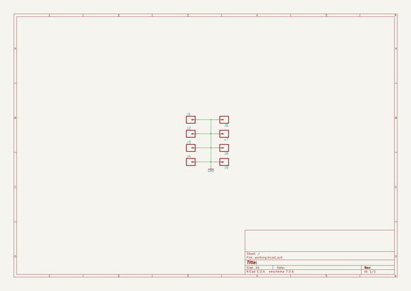
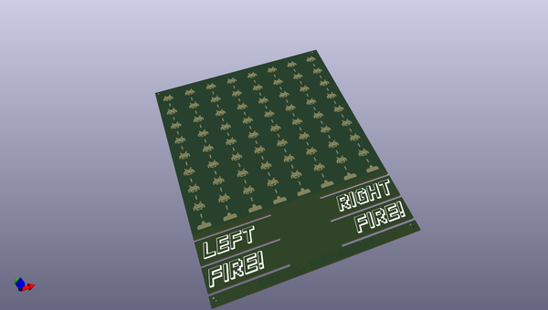
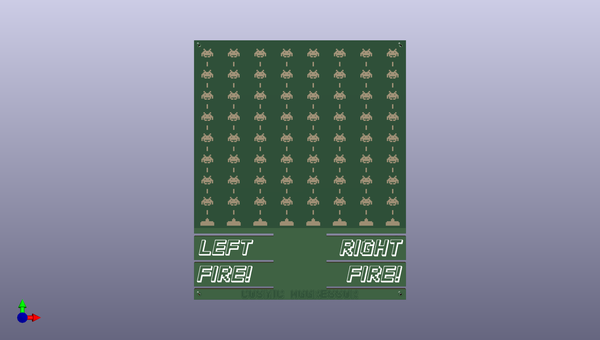
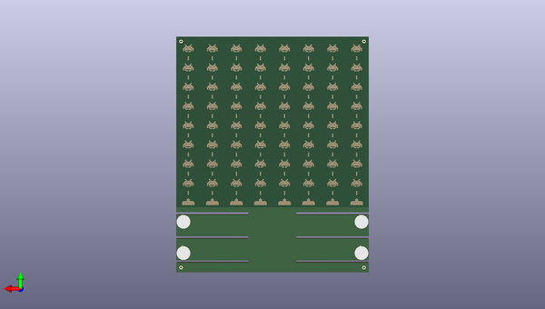

# cosmicaggressor
 
## summary 
* id: npoole_cosmicaggressor_invader_topplate
* user: npoole
* name: cosmicaggressor
* board: invader_topplate
* repo: https://github.com/NPoole/CosmicAggressor

* src_file_repo_sch: 
* src_file_repo_sch_link: https://github.com/NPoole/CosmicAggressor/tree/master/
* full details link: https://github.com/oomlout/oomlout_oomp_project_bot_v_2/tree/main/projects/npoole_cosmicaggressor_invader_topplate/current_version/working  

## schematic  
  
[schematic (pdf)](working_schematic.pdf) 

## pcb  
 
  
  
  
[board (pdf)](working.pdf)  

## working_bom
| Id | Designator | Footprint | Quantity | Designation | Supplier and ref |  | None | 
| --- | --- | --- | --- | --- | --- | --- | --- | 
| 1 | U$43,U$129,U$31,U$32,U$92,U$127,U$60,U$33,U$125,U$59,U$95,U$45,U$75,U$64,U$77,U$93,U$19,U$27,U$128,U$123,U$28,U$14,U$76,U$79,U$12,U$65,U$17,U$15,U$81,U$78,U$124,U$111,U$26,U$62,U$126,U$48,U$112,U$74,U$44,U$16,U$80,U$107,U$108,U$97,U$63,U$42,U$18,U$113,U$91,U$110,U$94,U$47,U$46,U$30,U$49,U$13,U$96,U$61,U$106,U$122,U$109,U$90,U$29,U$58 | BEAM_SMALL | 64 |  |  |  | [''] | 
| 2 | J8,J9,J6,J7 | 1X01NS_KIT | 4 |  |  |  | [''] | 
| 3 | U$10,U$1,U$105,U$5,U$86,U$36,U$117,U$115,U$57,U$55,U$20,U$7,U$120,U$34,U$83,U$98,U$6,U$121,U$66,U$52,U$88,U$102,U$9,U$51,U$8,U$35,U$119,U$37,U$40,U$69,U$3,U$56,U$118,U$50,U$41,U$104,U$71,U$84,U$85,U$82,U$4,U$25,U$22,U$100,U$89,U$87,U$38,U$99,U$23,U$54,U$39,U$103,U$67,U$21,U$24,U$70,U$101,U$73,U$11,U$116,U$72,U$68,U$53,U$114 | INVADER_SMALL | 64 |  |  |  | [''] | 
| 4 | U$136,U$135,U$137,U$133,U$131,U$134,U$130,U$132 | BLASTER_SMALL | 8 |  |  |  | [''] | 
| 5 | U$141 | TITLE#PNG | 1 |  |  |  | [''] | 
| 6 | U$139 | LEFT#PNG | 1 |  |  |  | [''] | 
| 7 | U$138,U$2 | FIRE#PNG | 2 |  |  |  | [''] | 
| 8 | U$140 | RIGHT#PNG | 1 |  |  |  | [''] | 
| 9 | J3,J4,J2,J1 | SPRING-CONNECTOR | 4 |  |  |  | [''] | 

## bom_schematic
| Ref | Qnty | Value | Cmp name | Footprint | Description | Vendor | DNP | 
| --- | --- | --- | --- | --- | --- | --- | --- | 
| J1, J2, J3, J4 | 4 | CONN_01SPRING-CONN | CONN_01SPRING-CONN | working:SPRING-CONNECTOR |  |  |  | 
| J6, J7, J8, J9 | 4 | CONN_01PTH_NO_SILK_KIT | CONN_01PTH_NO_SILK_KIT | working:1X01NS_KIT |  |  |  | 

