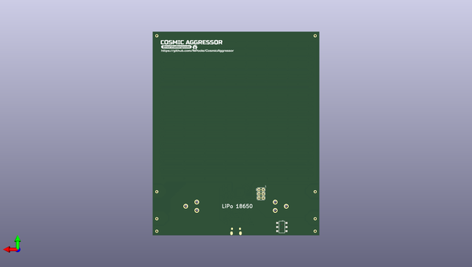

# cosmicaggressor
 
## summary 
* id: npoole_cosmicaggressor_invaders
* user: npoole
* name: cosmicaggressor
* board: invaders
* repo: https://github.com/NPoole/CosmicAggressor

* src_file_repo_sch: 
* src_file_repo_sch_link: https://github.com/NPoole/CosmicAggressor/tree/master/
* full details link: https://github.com/oomlout/oomlout_oomp_project_bot_v_2/tree/main/projects/npoole_cosmicaggressor_invaders/current_version/working  

## schematic  
  
[schematic (pdf)](working_schematic.pdf) 

## pcb  
 
  
  
  
[board (pdf)](working.pdf)  

## working_bom
| Id | Designator | Footprint | Quantity | Designation | Supplier and ref |  | None | 
| --- | --- | --- | --- | --- | --- | --- | --- | 
| 1 | D72,D84,D8,D46,D67,D22,D29,D92,D126,D20,D68,D66,D52,D87,D108,D99,D95,D2,D57,D100,D127,D120,D117,D38,D102,D137,D31,D61,D17,D3,D65,D121,D37,D30,D85,D103,D98,D33,D140,D79,D41,D1,D81,D77,D40,D11,D75,D19,D47,D74,D62,D49,D93,D128,D109,D141,D143,D42,D56,D54,D71,D115,D78,D111,D124,D114,D110,D50,D144,D24,D26,D5,D107,D35,D4,D76,D43,D28,D7,D104,D45,D101,D63,D90,D122,D60,D51,D15,D55,D16,D116,D48,D39,D80,D34,D23,D32,D123,D112,D12,D96,D105,D10,D142,D58,D113,D9,D25,D125,D106,D94,D53,D86,D139,D36,D118,D18,D44,D13,D64,D73,D59,D138,D69,D21,D6,D27,D82,D70,D119,D91,D89,D97,D88,D83,D14 | APA102-2020 | 136 | APA102-2020 |  |  | [''] | 
| 2 | C9,C10 | 0603 | 2 | 4.7uF |  |  | [''] | 
| 3 | U2 | SOT23-5 | 1 | MCP73831 |  |  | [''] | 
| 4 | R3,R2 | 0603@1 | 2 | 22 |  |  | [''] | 
| 5 | Y1 | CRYSTAL-SMD-5X3.2-4PAD | 1 | 16MHz |  |  | [''] | 
| 6 | R1 | 0603@1 | 1 | 10k |  |  | [''] | 
| 7 | BT1 | BATTERY_18650-HOLDER | 1 |  |  |  | [''] | 
| 8 | J9,J6,J5,J8,J4,J7,J2,J3 | 1X01NS_KIT | 8 |  |  |  | [''] | 
| 9 | D131,D130 | SMA-DIODE | 2 | 3A/40V/500mV |  |  | [''] | 
| 10 | C2,C3 | 0603 | 2 | 1.0uF |  |  | [''] | 
| 11 | C8,C6,C7 | 0805 | 3 | 22uF |  |  | [''] | 
| 12 | C4,C5 | 0603 | 2 | 18pF |  |  | [''] | 
| 13 | R6,R4 | 0603 | 2 | 750K |  |  | [''] | 
| 14 | RPROG0 | 0603 | 1 | 2.0k |  |  | [''] | 
| 15 | R5 | 0603 | 1 | 100k |  |  | [''] | 
| 16 | C1 | 0603 | 1 | 0.1uF |  |  | [''] | 
| 17 | U3 | MSOP8 | 1 | PAM2401 |  |  | [''] | 
| 18 | L1 | INDUCTOR_4X4MM | 1 | 2.2UH3A |  |  | [''] | 
| 19 | J1 | USB-MICROB-PTH-MILL | 1 |  |  |  | [''] | 
| 20 | U1 | QFN-44-NOPAD_1_1-LESS_PASTE | 1 | 32U4 |  |  | [''] | 
| 21 | S2 | SWITCH_DPDT_SMD_AYZ0202 | 1 |  |  |  | [''] | 
| 22 | U$1 | COSMIC_AGGRESSOR0 | 1 |  |  |  | [''] | 
| 23 | J10 | 2X3 | 1 | AVR_SPI_PROG_3X2PTH |  |  | [''] | 
| 24 | U$2 | #NORTHALLENPOOLE1 | 1 |  |  |  | [''] | 
| 25 | U$4 | OSHW-LOGO-S | 1 |  |  |  | [''] | 
| 26 | U$3 | HTTPS###GITHUB#COM#NPOOLE#COSMICAGGRESSOR2 | 1 |  |  |  | [''] | 

## bom_schematic
| Ref | Qnty | Value | Cmp name | Footprint | Description | Vendor | DNP | 
| --- | --- | --- | --- | --- | --- | --- | --- | 
| BT1 | 1 | BATTERY-18650 | BATTERY-18650 | working:BATTERY_18650-HOLDER |  |  |  | 
| C1 | 1 | 0.1UF-0603-25V-(+80/-20%) | 0.1UF-0603-25V-(+80/-20%) | working:0603 |  |  |  | 
| C2, C3 | 2 | 1.0UF-0603-16V-10% | 1.0UF-0603-16V-10% | working:0603 |  |  |  | 
| C4, C5 | 2 | 18PF-0603-50V-5% | 18PF-0603-50V-5% | working:0603 |  |  |  | 
| C6, C7, C8 | 3 | 22UF-0805-6.3V-20% | 22UF-0805-6.3V-20% | working:0805 |  |  |  | 
| C9, C10 | 2 | 4.7UF0603 | 4.7UF0603 | working:0603 |  |  |  | 
| D1, D2, D3, D4, D5, D6, D7, D8, D9, D10, D11, D12, D13, D14, D15, D16, D17, D18, D19, D20, D21, D22, D23, D24, D25, D26, D27, D28, D29, D30, D31, D32, D33, D34, D35, D36, D37, D38, D39, D40, D41, D42, D43, D44, D45, D46, D47, D48, D49, D50, D51, D52, D53, D54, D55, D56, D57, D58, D59, D60, D61, D62, D63, D64, D65, D66, D67, D68, D69, D70, D71, D72, D73, D74, D75, D76, D77, D78, D79, D80, D81, D82, D83, D84, D85, D86, D87, D88, D89, D90, D91, D92, D93, D94, D95, D96, D97, D98, D99, D100, D101, D102, D103, D104, D105, D106, D107, D108, D109, D110, D111, D112, D113, D114, D115, D116, D117, D118, D119, D120, D121, D122, D123, D124, D125, D126, D127, D128, D137, D138, D139, D140, D141, D142, D143, D144 | 136 | APA102-2020 | APA102-2020 | working:APA102-2020 |  |  |  | 
| D130, D131 | 2 | DIODE-SCHOTTKY-B340A | DIODE-SCHOTTKY-B340A | working:SMA-DIODE |  |  |  | 
| J1 | 1 | USB_MICRO-B_HALF_PTH_MILL | USB_MICRO-B_HALF_PTH_MILL | working:USB-MICROB-PTH-MILL |  |  |  | 
| J2, J3, J4, J5, J6, J7, J8, J9 | 8 | CONN_01PTH_NO_SILK_KIT | CONN_01PTH_NO_SILK_KIT | working:1X01NS_KIT |  |  |  | 
| J10 | 1 | AVR_SPI_PROG_3X2PTH | AVR_SPI_PROG_3X2PTH | working:2X3 |  |  |  | 
| L1 | 1 | INDUCTOR-IFSC1515AHER2R2M01 | INDUCTOR-IFSC1515AHER2R2M01 | working:INDUCTOR_4X4MM |  |  |  | 
| R1 | 1 | 10KOHM-0603-1/10W-1% | 10KOHM-0603-1/10W-1% | working:0603@1 |  |  |  | 
| R2, R3 | 2 | 22OHM-0603-1/10W-1% | 22OHM-0603-1/10W-1% | working:0603@1 |  |  |  | 
| R4, R6 | 2 | 750KOHM-0603-1/10W-1% | 750KOHM-0603-1/10W-1% | working:0603 |  |  |  | 
| R5 | 1 | 100KOHM-0603-1/10W-1% | 100KOHM-0603-1/10W-1% | working:0603 |  |  |  | 
| RPROG0 | 1 | 2.0KOHM-0603-1/10W-5% | 2.0KOHM-0603-1/10W-5% | working:0603 |  |  |  | 
| S2 | 1 | SWITCH-DPDT-SMD-AYZ0202 | SWITCH-DPDT-SMD-AYZ0202 | working:SWITCH_DPDT_SMD_AYZ0202 |  |  |  | 
| U1 | 1 | ATMEGA32U41:1-LESS_PASTE | ATMEGA32U41{colon}1-LESS_PASTE | working:QFN-44-NOPAD_1_1-LESS_PASTE |  |  |  | 
| U2 | 1 | MCP73831 | MCP73831 | working:SOT23-5 |  |  |  | 
| U3 | 1 | PAM2401 | PAM2401 | working:MSOP8 |  |  |  | 
| Y1 | 1 | 16MHz | CRYSTAL-16MHZSMD-5X3.2 | working:CRYSTAL-SMD-5X3.2-4PAD |  |  |  | 

