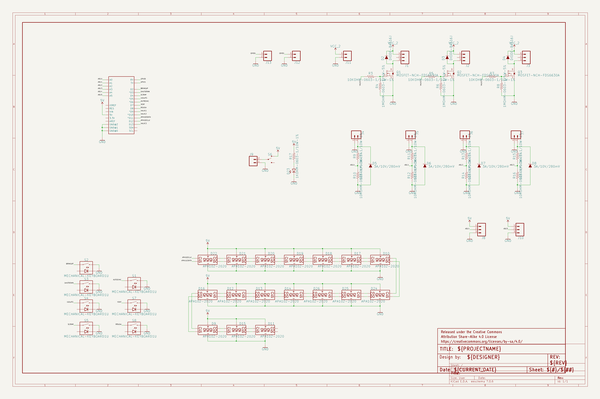
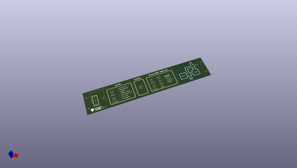
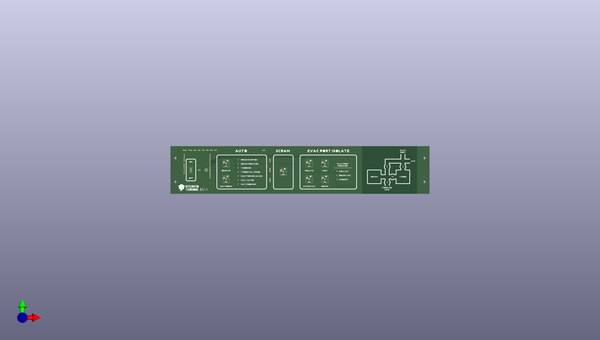
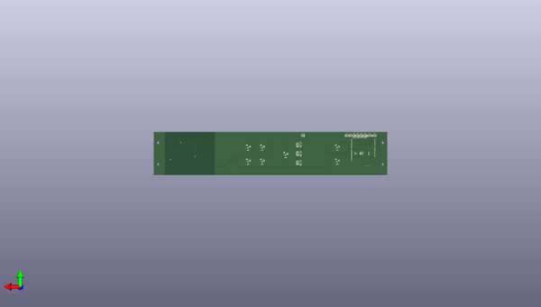

# evacuation_bench_controller
 
## summary 
* id: npoole_evacuation_bench_controller_bench_controller
* user: npoole
* name: evacuation_bench_controller
* board: bench_controller
* repo: https://github.com/NPoole/Evacuation_Bench_Controller

* src_file_repo_sch: 
* src_file_repo_sch_link: https://github.com/NPoole/Evacuation_Bench_Controller/tree/main/
* full details link: https://github.com/oomlout/oomlout_oomp_project_bot_v_2/tree/main/projects/npoole_evacuation_bench_controller_bench_controller/current_version/working  

## schematic  
  
[schematic (pdf)](working_schematic.pdf) 

## pcb  
 
  
  
  
[board (pdf)](working.pdf)  

## working_bom
| Id | Designator | Footprint | Quantity | Designation | Supplier and ref |  | None | 
| --- | --- | --- | --- | --- | --- | --- | --- | 
| 1 | U$23 | AUTO_EVAC0 | 1 |  |  |  | [''] | 
| 2 | D17,D18,D26,D13,D25,D19,D12,D10,D14,D22,D15,D24,D20,D21,D11,D16,D9 | APA102-2020 | 17 | APA102-2020 |  |  | [''] | 
| 3 | U$26 | EVAC_PORT0 | 1 |  |  |  | [''] | 
| 4 | S4,S5,S3,S8,S2,S7,S1 | CHERRY-MX-LED-1U | 7 | MECHANICAL-KEYBOARD1U |  |  | [''] | 
| 5 | U$18 | ROUGH_PUMP_ON0 | 1 |  |  |  | [''] | 
| 6 | U$27 | PRESSURE0 | 1 |  |  |  | [''] | 
| 7 | U$14 | EVAC_PORT_ISOLATE0 | 1 |  |  |  | [''] | 
| 8 | U$17 | TURBO_ON0 | 1 |  |  |  | [''] | 
| 9 | U$7 | AUX0 | 1 |  |  |  | [''] | 
| 10 | U$25,U$1 | ROUGH0 | 2 |  |  |  | [''] | 
| 11 | U$6 | PORT0 | 1 |  |  |  | [''] | 
| 12 | J13,J9,J11,J12,J4,J6,J5,J7 | 1X02_NO_SILK | 8 |  |  |  | [''] | 
| 13 | FRAME1 | CREATIVE_COMMONS | 1 | FRAME-LEDGER |  |  | [''] | 
| 14 | U$2 | TURBO0 | 1 |  |  |  | [''] | 
| 15 | U$50 | INTEG#SVG0 | 1 |  |  |  | [''] | 
| 16 | U$24,U$4 | VENT0 | 2 |  |  |  | [''] | 
| 17 | U$15 | FULL_VAC_OK0 | 1 |  |  |  | [''] | 
| 18 | U$29 | ROUGH_VAC0 | 1 |  |  |  | [''] | 
| 19 | U$10 | AUTO0 | 1 |  |  |  | [''] | 
| 20 | U$8 | ON0 | 1 |  |  |  | [''] | 
| 21 | U$20 | WATCHDOG_OK0 | 1 |  |  |  | [''] | 
| 22 | S6 | SWITCH_SPDT_PTH_11.6X4.0MM | 1 |  |  |  | [''] | 
| 23 | J10,J8,J2,J1,J3 | 1X03_NO_SILK | 5 |  |  |  | [''] | 
| 24 | U$12 | SHUT_DOWN0 | 1 |  |  |  | [''] | 
| 25 | U$28 | HIGH_VAC0 | 1 |  |  |  | [''] | 
| 26 | U$22 | ISOLATE0 | 1 |  |  |  | [''] | 
| 27 | D23 | LED_5MM | 1 |  |  |  | [''] | 
| 28 | U$11 | BRING_UP0 | 1 |  |  |  | [''] | 
| 29 | U$21 | WAIT_FOR_ION_GAUGE0 | 1 |  |  |  | [''] | 
| 30 | U$19 | TURBO_FULL_SPEED0 | 1 |  |  |  | [''] | 
| 31 | U$13 | SCRAM0 | 1 |  |  |  | [''] | 
| 32 | U$51 | EC#10 | 1 |  |  |  | [''] | 
| 33 | U$5 | EVAC0 | 1 |  |  |  | [''] | 
| 34 | U$16 | ROUGH_PRESSURE0 | 1 |  |  |  | [''] | 
| 35 | @HOLE0,@HOLE2,@HOLE1,@HOLE3 |  | 4 |  |  |  | [''] | 
| 36 | U$30 | AMBIENT0 | 1 |  |  |  | [''] | 
| 37 | U$3 | FORELINE0 | 1 |  |  |  | [''] | 
| 38 | U$9 | OFF0 | 1 |  |  |  | [''] | 
| 39 | U$33 | ADC30 | 1 |  |  |  | [''] | 
| 40 | R14,R7,R12,R15,R16,R9,R11,R5,R3,R13,R10 | 0603 | 11 | 10k |  |  | [''] | 
| 41 | D7,D6,D5,D8 | SOD-323 | 4 | 3A/10V/280mV |  |  | [''] | 
| 42 | Q2,Q1,Q3 | SO08 | 3 | 6.5A/30V/38mΩ |  |  | [''] | 
| 43 | U$42,U$44,U$43,U$45 | _##10V##_0 | 4 |  |  |  | [''] | 
| 44 | U$36 | ADC00 | 1 |  |  |  | [''] | 
| 45 | R6,R8,R4 | 0603 | 3 | 1M |  |  | [''] | 
| 46 | U$34 | ADC20 | 1 |  |  |  | [''] | 
| 47 | U$31 | ADC50 | 1 |  |  |  | [''] | 
| 48 | D3,D4,D2 | SOD-323 | 3 | 250mA/100V |  |  | [''] | 
| 49 | U$49 | VALVE30 | 1 |  |  |  | [''] | 
| 50 | U$35 | ADC10 | 1 |  |  |  | [''] | 
| 51 | U$37 | GPIO00 | 1 |  |  |  | [''] | 
| 52 | B1 | UNO_R3_SHIELD_NOLABELS | 1 | ARDUINO_UNO_R3_SHIELDNOLABELS |  |  | [''] | 
| 53 | U$46 | 24VDC_IN0 | 1 |  |  |  | [''] | 
| 54 | R17 | 0603 | 1 | 1k |  |  | [''] | 
| 55 | U$39 | 5VDC_IN0 | 1 |  |  |  | [''] | 
| 56 | U$32 | ADC40 | 1 |  |  |  | [''] | 
| 57 | U$38 | GPIO10 | 1 |  |  |  | [''] | 
| 58 | U$48 | VALVE20 | 1 |  |  |  | [''] | 
| 59 | U$41,U$40 | _##5V##_0 | 2 |  |  |  | [''] | 
| 60 | U$47 | VALVE10 | 1 |  |  |  | [''] | 

## bom_schematic
| Ref | Qnty | Value | Cmp name | Footprint | Description | Vendor | DNP | 
| --- | --- | --- | --- | --- | --- | --- | --- | 
| B1 | 1 | ARDUINO_UNO_R3_SHIELDNOLABELS | ARDUINO_UNO_R3_SHIELDNOLABELS | working:UNO_R3_SHIELD_NOLABELS |  |  |  | 
| D2, D3, D4 | 3 | DIODE-BAS16J | DIODE-BAS16J | working:SOD-323 |  |  |  | 
| D5, D6, D7, D8 | 4 | 3A/10V/280mV | DIODE-SCHOTTKY-BAT60A | working:SOD-323 |  |  |  | 
| D9, D10, D11, D12, D13, D14, D15, D16, D17, D18, D19, D20, D21, D22, D24, D25, D26 | 17 | APA102-2020 | APA102-2020 | working:APA102-2020 |  |  |  | 
| D23 | 1 | LED5MM | LED5MM | working:LED_5MM |  |  |  | 
| FRAME1 | 1 | FRAME-LEDGER | FRAME-LEDGER | working:CREATIVE_COMMONS |  |  |  | 
| J1, J2, J3, J8, J10 | 5 | CONN_031X03_NO_SILK | CONN_031X03_NO_SILK | working:1X03_NO_SILK |  |  |  | 
| J4, J5, J6, J7, J9, J11, J12, J13 | 8 | CONN_021X02_NO_SILK | CONN_021X02_NO_SILK | working:1X02_NO_SILK |  |  |  | 
| Q1, Q2, Q3 | 3 | MOSFET-NCH-FDS6630A | MOSFET-NCH-FDS6630A | working:SO08 |  |  |  | 
| R3, R5, R7, R9, R10, R11, R12, R13, R14, R15, R16 | 11 | 10KOHM-0603-1/10W-1% | 10KOHM-0603-1/10W-1% | working:0603 |  |  |  | 
| R4, R6, R8 | 3 | 1MOHM-0603-1/4W-5% | 1MOHM-0603-1/4W-5% | working:0603 |  |  |  | 
| R17 | 1 | 1KOHM-0603-1/10W-1% | 1KOHM-0603-1/10W-1% | working:0603 |  |  |  | 
| S1, S2, S3, S4, S5, S7, S8 | 7 | MECHANICAL-KEYBOARD1U | MECHANICAL-KEYBOARD1U | working:CHERRY-MX-LED-1U |  |  |  | 
| S6 | 1 | SWITCH-SPDT-PTH-11.6X4.0MM | SWITCH-SPDT-PTH-11.6X4.0MM | working:SWITCH_SPDT_PTH_11.6X4.0MM |  |  |  | 

