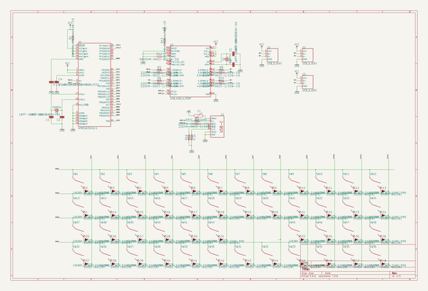
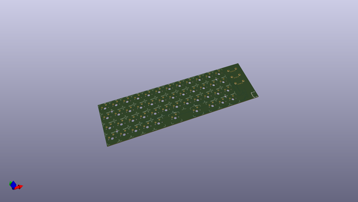
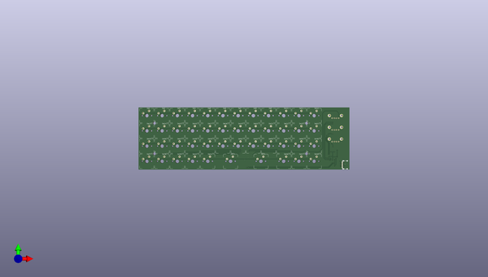

# hub40
 
## summary 
* id: npoole_hub40_hub40
* user: npoole
* name: hub40
* board: hub40
* repo: https://github.com/NPoole/HUB40

* src_file_repo_sch: 
* src_file_repo_sch_link: https://github.com/NPoole/HUB40/tree/master/
* full details link: https://github.com/oomlout/oomlout_oomp_project_bot_v_2/tree/main/projects/npoole_hub40_hub40/current_version/working  

## schematic  
  
[schematic (pdf)](working_schematic.pdf) 

## pcb  
 
  
  
  
[board (pdf)](working.pdf)  

## working_bom
| Id | Designator | Footprint | Quantity | Designation | Supplier and ref |  | None | 
| --- | --- | --- | --- | --- | --- | --- | --- | 
| 1 | SW37,SW31,SW19,SW24,SW6,SW15,SW25,SW18,SW5,SW23,SW46,SW39,SW30,SW22,SW26,SW38,SW48,SW43,SW8,SW28,SW33,SW16,SW35,SW17,SW4,SW20,SW10,SW34,SW29,SW21,SW41,SW13,SW40,SW11,SW7,SW2,SW14,SW36,SW12,SW32,SW47,SW1,SW45,SW3,SW9,SW27 | MX1A-XXNW | 46 |  |  |  | [''] | 
| 2 | G1,G3,G2 | USB_A_VERT | 3 | USB_A_VERT |  |  | [''] | 
| 3 | U$3,U$1,U$4,U$2 | STAND-OFF | 4 |  |  |  | [''] | 
| 4 | J2 | USB-C-16P | 1 |  |  |  | [''] | 
| 5 | D12,D21,D37,D26,D2,D34,D22,D45,D5,D15,D36,D29,D39,D19,D47,D17,D10,D8,D44,D1,D23,D42,D18,D48,D9,D27,D16,D20,D43,D24,D3,D41,D6,D13,D38,D25,D28,D40,D4,D35,D11,D31,D46,D7,D14,D33 | SOD-323 | 46 | 250mA/100V |  |  | [''] | 
| 6 | R7,R8,R3,R2,R10,R5,R4,R6,R11,R9 | 0603 | 10 | 22 |  |  | [''] | 
| 7 | R1,R13 | 0603 | 2 | 10k |  |  | [''] | 
| 8 | U2 | QFN-28-5MM-1_1 | 1 | USB_HUB_4_PORT |  |  | [''] | 
| 9 | R16,R15 | 0603 | 2 | 5.1k |  |  | [''] | 
| 10 | C2,C6,C1,C5 | 0603 | 4 | 18pF |  |  | [''] | 
| 11 | U1 | QFN-44-NOPAD_1_1 | 1 | 32U4 |  |  | [''] | 
| 12 | Y2 | CRYSTAL-SMD-5X3.2-4PAD | 1 | 12MHz |  |  | [''] | 
| 13 | R12 | 0603 | 1 | 649 |  |  | [''] | 
| 14 | F1 | 1206 | 1 | 6V/0.5A |  |  | [''] | 
| 15 | Y1 | CRYSTAL-SMD-5X3.2-4PAD | 1 | 16MHz |  |  | [''] | 
| 16 | C4 | 0603 | 1 | 1.0uF |  |  | [''] | 
| 17 | C3 | 0603 | 1 | 0.1uF |  |  | [''] | 
| 18 | U$5 | HUB400 | 1 |  |  |  | [''] | 

## bom_schematic
| Ref | Qnty | Value | Cmp name | Footprint | Description | Vendor | DNP | 
| --- | --- | --- | --- | --- | --- | --- | --- | 
| C1, C2, C5, C6 | 4 | 18PF-0603-50V-5% | 18PF-0603-50V-5% | working:0603 |  |  |  | 
| C3 | 1 | 0.1UF-0603-25V-(+80/-20%) | 0.1UF-0603-25V-(+80/-20%) | working:0603 |  |  |  | 
| C4 | 1 | 1.0UF-0603-16V-10% | 1.0UF-0603-16V-10% | working:0603 |  |  |  | 
| D1, D2, D3, D4, D5, D6, D7, D8, D9, D10, D11, D12, D13, D14, D15, D16, D17, D18, D19, D20, D21, D22, D23, D24, D25, D26, D27, D28, D29, D31, D33, D34, D35, D36, D37, D38, D39, D40, D41, D42, D43, D44, D45, D46, D47, D48 | 46 | DIODE-BAS16J | DIODE-BAS16J | working:SOD-323 |  |  |  | 
| F1 | 1 | PPTC_6V500MA-2 | PPTC_6V500MA-2 | working:1206 |  |  |  | 
| G1, G2, G3 | 3 | USB_A_VERT | USB_A_VERT | working:USB_A_VERT |  |  |  | 
| J2 | 1 | USB_C2-LAYER | USB_C2-LAYER | working:USB-C-16P |  |  |  | 
| R1, R13 | 2 | 10KOHM-0603-1/10W-1% | 10KOHM-0603-1/10W-1% | working:0603 |  |  |  | 
| R2, R3, R4, R5, R6, R7, R8, R9, R10, R11 | 10 | 22OHM-0603-1/10W-1% | 22OHM-0603-1/10W-1% | working:0603 |  |  |  | 
| R12 | 1 | 680OHM-0603-1/10W-5% | 680OHM-0603-1/10W-5% | working:0603 |  |  |  | 
| R15, R16 | 2 | 5.1k | 5.1KOHM5.1KOHM-0603-1/10W-1% | working:0603 |  |  |  | 
| SW1, SW2, SW3, SW4, SW5, SW6, SW7, SW8, SW9, SW10, SW11, SW12, SW13, SW14, SW15, SW16, SW17, SW18, SW19, SW20, SW21, SW22, SW23, SW24, SW25, SW26, SW27, SW28, SW29, SW30, SW31, SW32, SW33, SW34, SW35, SW36, SW37, SW38, SW39, SW40, SW41, SW43, SW45, SW46, SW47, SW48 | 46 | CHERRY_MX_WITH_FIXING_PINS | CHERRY_MX_WITH_FIXING_PINS | working:MX1A-XXNW |  |  |  | 
| U1 | 1 | ATMEGA32U41:1 | ATMEGA32U41{colon}1 | working:QFN-44-NOPAD_1_1 |  |  |  | 
| U2 | 1 | USB_HUB_4_PORT | USB_HUB_4_PORT | working:QFN-28-5MM-1_1 |  |  |  | 
| Y1 | 1 | 16MHz | CRYSTAL-16MHZSMD-5X3.2 | working:CRYSTAL-SMD-5X3.2-4PAD |  |  |  | 
| Y2 | 1 | 12MHz | CRYSTAL-12MHZ{dblquote} | working:CRYSTAL-SMD-5X3.2-4PAD |  |  |  | 

