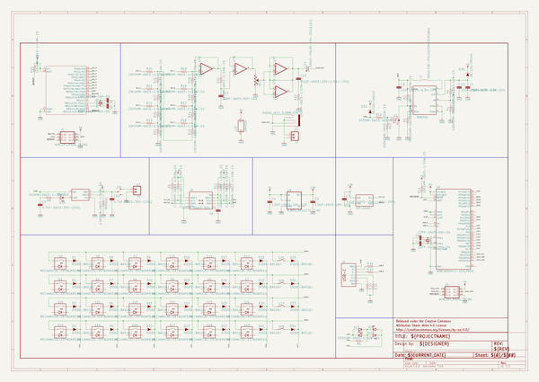
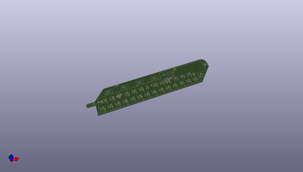
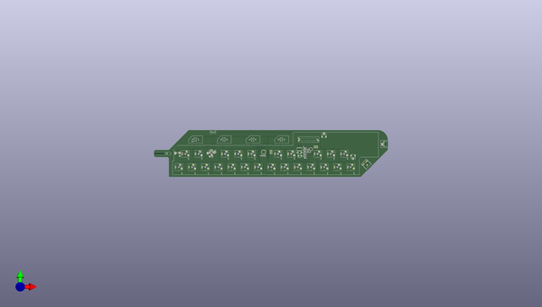
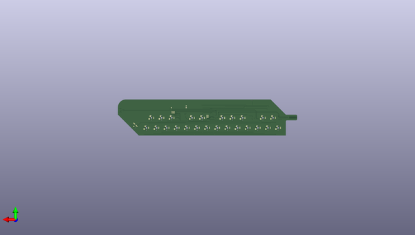

# mldca201
 
## summary 
* id: npoole_mldca201_mldca201_mid
* user: npoole
* name: mldca201
* board: mldca201_mid
* repo: https://github.com/NPoole/MLDCA201

* src_file_repo_sch: 
* src_file_repo_sch_link: https://github.com/NPoole/MLDCA201/tree/main/
* full details link: https://github.com/oomlout/oomlout_oomp_project_bot_v_2/tree/main/projects/npoole_mldca201_mldca201_mid/current_version/working  

## schematic  
  
[schematic (pdf)](working_schematic.pdf) 

## pcb  
 
  
  
  
[board (pdf)](working.pdf)  

## working_bom
| Id | Designator | Footprint | Quantity | Designation | Supplier and ref |  | None | 
| --- | --- | --- | --- | --- | --- | --- | --- | 
| 1 | C13,C7 | 0603 | 2 | 0.1uF |  |  | [''] | 
| 2 | U1 | SOT23-5 | 1 | MCP73831 |  |  | [''] | 
| 3 | R2,R4 | 0603 | 2 | 750K |  |  | [''] | 
| 4 | S26,S25,S27,S28 | TACTILE_SWITCH_SMD_5.2MM | 4 | MOMENTARY-SWITCH-SPST-SMD-5.2MM-TALL |  |  | [''] | 
| 5 | S3,S15,S19,S21,S18,S16,S17,S10,S11,S13,S1,S23,S20,S6,S24,S2,S8,S12,S5,S22,S7,S14,S9,S4 | CHERRY-MX-LED-1U | 24 | MECHANICAL-KEYBOARD1U |  |  | [''] | 
| 6 | C11,C15,C16,C8 | 0603 | 4 | 22pF |  |  | [''] | 
| 7 | R29,R28,R27,R25,R14,R30,R24,R31,R26,R15 | 0603 | 10 | 10k |  |  | [''] | 
| 8 | D18,D10,D16,D34,D4,D14,D12,D15,D33,D11,D5,D19,D32,D24,D17,D29,D3,D13,D9,D1,D7,D23,D2,D6,D20,D21,D8,D22 | SOD-323@1 | 28 | 250mA/100V |  |  | [''] | 
| 9 | R10,R5,R8,R7 | 0603 | 4 | 2.2k |  |  | [''] | 
| 10 | R32,R9,R12 | 0603 | 3 | 1k |  |  | [''] | 
| 11 | C12 | 0603 | 1 | 10nF |  |  | [''] | 
| 12 | R3,R1,R13 | 0603 | 3 | 100k |  |  | [''] | 
| 13 | J2,J4 | JST-2-SMD | 2 | JST |  |  | [''] | 
| 14 | RPROG0 | 0603 | 1 | 2.0k |  |  | [''] | 
| 15 | R17,R16,R21,R19,R22,R23,R18,R20 | 0603 | 8 | 20k |  |  | [''] | 
| 16 | C1,C2,C3 | 0805 | 3 | 22uF |  |  | [''] | 
| 17 | FRAME1 | CREATIVE_COMMONS | 1 | FRAME-LEDGER |  |  | [''] | 
| 18 | R33 | 0603 | 1 | 10 |  |  | [''] | 
| 19 | J7 | AUDIO-JACK | 1 | AUDIO_JACK_3.5MM_PTH |  |  | [''] | 
| 20 | S31 | SWITCH_SPST_SMD_A | 1 |  |  |  | [''] | 
| 21 | C6 | 0603 | 1 | 100pF |  |  | [''] | 
| 22 | U6 | 32M1-A_ATM | 1 | ATTINY861V-10MU |  |  | [''] | 
| 23 | U5 | QFN-44-NOPAD_1_1-LESS_PASTE | 1 | 32U4 |  |  | [''] | 
| 24 | U4 | VSSOP_8PIN | 1 |  |  |  | [''] | 
| 25 | @HOLE0 |  | 1 |  |  |  | [''] | 
| 26 | R37,R35,R36,R34 | 0603 | 4 | 5.1k |  |  | [''] | 
| 27 | U2 | MSOP8 | 1 | PAM2401 |  |  | [''] | 
| 28 | Q1 | SOT-416FL | 1 | 100mA/20V/3.8Ω |  |  | [''] | 
| 29 | U3 | SOT23-5 | 1 | AP2127K-1.8V |  |  | [''] | 
| 30 | C5,C4 | 0603 | 2 | 1.0uF |  |  | [''] | 
| 31 | C9,C10 | 0603 | 2 | 4.7uF |  |  | [''] | 
| 32 | Y1,Y2 | CRYSTAL-SMD-2.0X1.6MM | 2 | 16MHz |  |  | [''] | 
| 33 | D27,D28,D25,D26 | LED-0603@1 | 4 | RED |  |  | [''] | 
| 34 | D31,D35 | SOD-323 | 2 | 3A/10V/280mV |  |  | [''] | 
| 35 | D30 | LED-0603@1 | 1 | BLUE |  |  | [''] | 
| 36 | U$1 | ICP-10101 | 1 | ICP-10101 |  |  | [''] | 
| 37 | R6 | 0603 | 1 | 330 |  |  | [''] | 
| 38 | R11 | 0603 | 1 | 200k |  |  | [''] | 
| 39 | C14 | PANASONIC_D | 1 | 100uF |  |  | [''] | 
| 40 | VR1 | SLIDER-SMALL | 1 | 10k |  |  | [''] | 
| 41 | J6 | USB-C-16P-2LAYER-PADS | 1 |  |  |  | [''] | 
| 42 | L1 | INDUCTOR_4X4MM | 1 | 2.2UH3A |  |  | [''] | 
| 43 | U7 | SO14 | 1 | LMV324 |  |  | [''] | 
| 44 | J5,J3 | 2X3-NS | 2 | AVR_SPI_PROG_3X2NS |  |  | [''] | 

## bom_schematic
| Ref | Qnty | Value | Cmp name | Footprint | Description | Vendor | DNP | 
| --- | --- | --- | --- | --- | --- | --- | --- | 
| C1, C2, C3 | 3 | 22UF-0805-6.3V-20% | 22UF-0805-6.3V-20% | working:0805 |  |  |  | 
| C4, C5 | 2 | 1.0UF-0603-16V-10% | 1.0UF-0603-16V-10% | working:0603 |  |  |  | 
| C6 | 1 | 100PF-0603-50V-5% | 100PF-0603-50V-5% | working:0603 |  |  |  | 
| C7, C13 | 2 | 0.1UF-0603-25V-(+80/-20%) | 0.1UF-0603-25V-(+80/-20%) | working:0603 |  |  |  | 
| C8, C11, C15, C16 | 4 | 22PF-0603-50V-5% | 22PF-0603-50V-5% | working:0603 |  |  |  | 
| C9, C10 | 2 | 4.7UF-0603-35V-(20%) | 4.7UF-0603-35V-(20%) | working:0603 |  |  |  | 
| C12 | 1 | 10NF-0603-50V-10% | 10NF-0603-50V-10% | working:0603 |  |  |  | 
| C14 | 1 | 100UF-POLAR-25V-20%(ELEC) | 100UF-POLAR-25V-20%(ELEC) | working:PANASONIC_D |  |  |  | 
| D1, D2, D3, D4, D5, D6, D7, D8, D9, D10, D11, D12, D13, D14, D15, D16, D17, D18, D19, D20, D21, D22, D23, D24, D29, D32, D33, D34 | 28 | DIODE-BAS16J | DIODE-BAS16J | working:SOD-323@1 |  |  |  | 
| D25, D26, D27, D28 | 4 | RED | LED-RED0603 | working:LED-0603@1 |  |  |  | 
| D30 | 1 | BLUE | LED-BLUE0603 | working:LED-0603@1 |  |  |  | 
| D31, D35 | 2 | 3A/10V/280mV | DIODE-SCHOTTKY-BAT60A | working:SOD-323 |  |  |  | 
| FRAME1 | 1 | FRAME-LEDGER | FRAME-LEDGER | working:CREATIVE_COMMONS |  |  |  | 
| J2, J4 | 2 | JST | CONN_02-JST-2MM-SMT | working:JST-2-SMD |  |  |  | 
| J3, J5 | 2 | AVR_SPI_PROG_3X2NS | AVR_SPI_PROG_3X2NS | working:2X3-NS |  |  |  | 
| J6 | 1 | USB_C_2-LAYER_PADS | USB_C_2-LAYER_PADS | working:USB-C-16P-2LAYER-PADS |  |  |  | 
| J7 | 1 | AUDIO_JACK_3.5MM_PTH | AUDIO_JACK_3.5MM_PTH | working:AUDIO-JACK |  |  |  | 
| L1 | 1 | INDUCTOR-IFSC1515AHER2R2M01 | INDUCTOR-IFSC1515AHER2R2M01 | working:INDUCTOR_4X4MM |  |  |  | 
| Q1 | 1 | MOSFET_PCH-RE1C001ZPTL | MOSFET_PCH-RE1C001ZPTL | working:SOT-416FL |  |  |  | 
| R1, R3, R13 | 3 | 100KOHM-0603-1/10W-1% | 100KOHM-0603-1/10W-1% | working:0603 |  |  |  | 
| R2, R4 | 2 | 750KOHM-0603-1/10W-1% | 750KOHM-0603-1/10W-1% | working:0603 |  |  |  | 
| R5, R7, R8, R10 | 4 | 2.2KOHM-0603-1/10W-1% | 2.2KOHM-0603-1/10W-1% | working:0603 |  |  |  | 
| R6 | 1 | 330OHM-0603-1/10W-1% | 330OHM-0603-1/10W-1% | working:0603 |  |  |  | 
| R9, R12, R32 | 3 | 1KOHM-0603-1/10W-1% | 1KOHM-0603-1/10W-1% | working:0603 |  |  |  | 
| R11 | 1 | 200KOHM-0603-1/10W-1% | 200KOHM-0603-1/10W-1% | working:0603 |  |  |  | 
| R14, R15, R24, R25, R26, R27, R28, R29, R30, R31 | 10 | 10KOHM-0603-1/10W-1% | 10KOHM-0603-1/10W-1% | working:0603 |  |  |  | 
| R16, R17, R18, R19, R20, R21, R22, R23 | 8 | 20KOHM-0603-1/10W-1% | 20KOHM-0603-1/10W-1% | working:0603 |  |  |  | 
| R33 | 1 | 10OHM-0603-1/10W-1% | 10OHM-0603-1/10W-1% | working:0603 |  |  |  | 
| R34, R35, R36, R37 | 4 | 5.1k | 5.1KOHM5.1KOHM-0603-1/10W-1% | working:0603 |  |  |  | 
| RPROG0 | 1 | 2.0KOHM-0603-1/10W-5% | 2.0KOHM-0603-1/10W-5% | working:0603 |  |  |  | 
| S1, S2, S3, S4, S5, S6, S7, S8, S9, S10, S11, S12, S13, S14, S15, S16, S17, S18, S19, S20, S21, S22, S23, S24 | 24 | MECHANICAL-KEYBOARD1U | MECHANICAL-KEYBOARD1U | working:CHERRY-MX-LED-1U |  |  |  | 
| S25, S26, S27, S28 | 4 | MOMENTARY-SWITCH-SPST-SMD-5.2MM-TALL | MOMENTARY-SWITCH-SPST-SMD-5.2MM-TALL | working:TACTILE_SWITCH_SMD_5.2MM |  |  |  | 
| S31 | 1 | SWITCH-SPDT-SMD-RIGHT-ANGLE | SWITCH-SPDT-SMD-RIGHT-ANGLE | working:SWITCH_SPST_SMD_A |  |  |  | 
| U1 | 1 | MCP73831 | MCP73831 | working:SOT23-5 |  |  |  | 
| U2 | 1 | PAM2401 | PAM2401 | working:MSOP8 |  |  |  | 
| U3 | 1 | V_REG_AP2127K-1.8V | V_REG_AP2127K-1.8V | working:SOT23-5 |  |  |  | 
| U4 | 1 | PCA9306VSSOP_8PIN | PCA9306VSSOP_8PIN | working:VSSOP_8PIN |  |  |  | 
| U5 | 1 | ATMEGA32U41:1-LESS_PASTE | ATMEGA32U41{colon}1-LESS_PASTE | working:QFN-44-NOPAD_1_1-LESS_PASTE |  |  |  | 
| U6 | 1 | ATTINY861V-10MU | ATTINY861V-10MU | working:32M1-A_ATM |  |  |  | 
| U7 | 1 | LMV324 | LMV324 | working:SO14 |  |  |  | 
| U$1 | 1 | ICP-10101 | ICP-10101 | working:ICP-10101 |  |  |  | 
| VR1 | 1 | 10k | POTENTIOMETER_SLIDE-20MM-1/10W-20% | working:SLIDER-SMALL |  |  |  | 
| Y1, Y2 | 2 | 16MHz | CRYSTAL-16MHZSMD-2X1.6 | working:CRYSTAL-SMD-2.0X1.6MM |  |  |  | 

